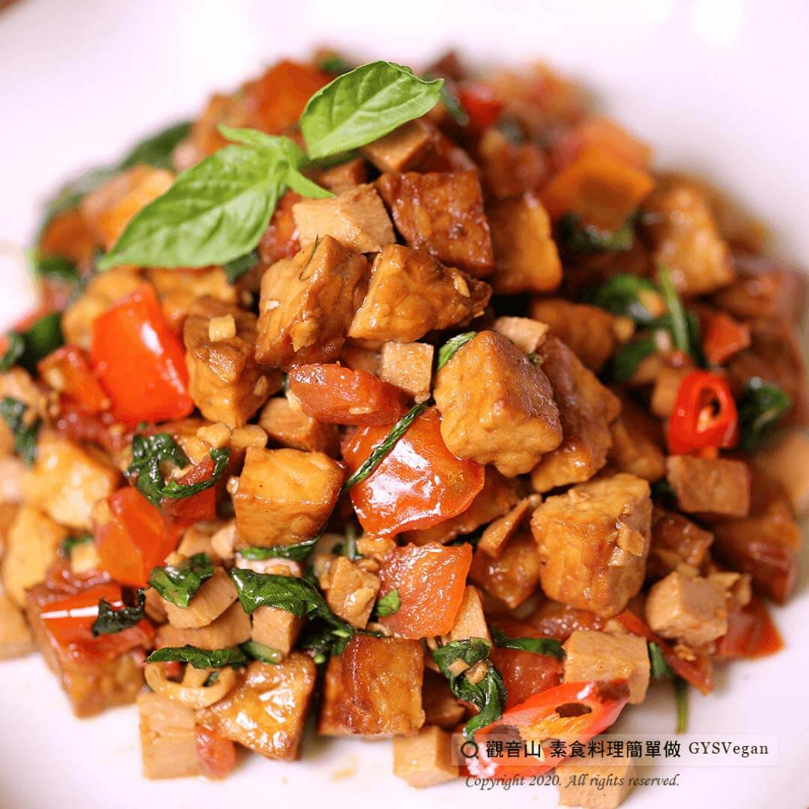

# 打拋天貝

## 📋 基本資訊 / Recipe Overview
- **料理名稱**：打拋天貝
- **原始標題**：打拋天貝｜全素
- **素食流派 / Diet**：全素 Vegan
- **來源平台 / Source**：[觀音山 · 素食料理簡單做](https://vegan.gys.org.tw/tempe20210103/)

## 📖 食譜圖文詳情 (中英雙語對照)

天貝原產於印尼的傳統食品，是真菌發酵的黃豆產品，含豐富的大豆蛋白、膳食纖維、維生素B群等，
好吸收、易消化，吃起來口感綿密扎實！
2021年新的開始，就用天貝取代肉類料理，烹煮出這道健康美味的酸辣打拋天貝吧~
快跟著觀音山主廚，一起素食料理簡單做吧！
?食材及佐料〔Ingredients〕：(4人份)
▪天貝 200克
▪番茄 70克
▪素火腿 50克
▪薑末 30克
▪九層塔 40克
▪辣椒 1條
▪糖 適量
▪胡椒 少許
▪素蠔油 適量
▪檸檬汁 適量
▪鹽 適量
▪醬油 少許
▪油 適量
?烹飪步驟：
1.天貝切0.8公分丁。
2.番茄去籽，切1公分丁。
3.火腿切0.5公分丁。
4.九層塔切粗絲。
5.辣椒切斜。
6.天貝過油至金黃色備用。
7.熱鍋，油炒香薑末，加入番茄略炒，加入炸好的天貝及火腿略炒。
8.加入調味料糖、鹽、胡椒、醬油、素蠔油炒香。
9.最後加入辣椒、九層塔和檸檬汁快速翻炒即可起鍋。
??本食譜提供：台中 觀音山蔬食館​ 主廚 淨雅
✨慈悲的 龍德上師成立「觀音山蔬食館」提倡健康素食、慈悲護生，以”觀音山素食料理簡單做”的理念，提供多款素食食譜，讓您一學就會！?
【recipe】
?  Tempeh is a traditional Indonesian soy product that is made from fermented soybeans. It is rich in soy protein, dietary fiber, vitamin B complex, etc. It’s easy to absorb, digest, and tastes intense with its dense flavor! In a new beginning of 2021, replace meat dishes with tempeh, and cook this healthy and delicious hot and sour Thai flavor dish~ Follow the chef of Guanyinshan, let’s make simple vegetarian dishes!
?Ingredients : (For 4 people)
▪Tempeh 200g
▪Tomato 70g
▪Vegetarian ham 50g
▪Minced ginger 30g
▪Basil 40g
▪A Chili
▪Sugar , adequate amount
▪Pepperr , a little
▪Vegetarian Oyster Sauce , adequate amount
▪Lemon juice , adequate amount
▪Salt , adequate amount
▪Soy sauce , a little
▪Oil , adequate amount
?Cooking steps:
1.Dice tempeh into 0.8 cm wide.
2. Remove the seeds of the tomato and dice into 1 cm wide.
3. Dice vegetarian ham into 0.5 cm wide.
4. Slice basil
5. Cut the pepper on the diagonal.
6. fry the tempeh until golden brown and set aside.
7. In a hot wok, fry minced ginger in oil, add tomatoes and fry for a while, add fried tempeh and ham.
8. Add seasoning: sugar, salt, pepper, soy sauce, vegetarian oyster sauce and stir fry until fragrant.
9. Finally, add the chili, basils and lemon juice and stir fry quickly to dish up.
??This recipe is provided by Taichung #Guanyinshan​ Green Restaurant, Chef: Jing Ya
? 觀音山 素食料理簡單做 ?
Facebook ｜好文按讚
http://www.facebook.com/GYSVegan
​
Instagram ｜料理追蹤
http://www.instagram.com/gysvegan/
​
Youtube ｜加入訂閱
https://reurl.cc/q8VEqy
​
Telegram ｜頻道推薦
https://t.me/GYSVegan
—
? 歡迎轉載，請註明出處： 觀音山 素食料理簡單做 GYSVegan 素食環保愛地球，健康營養無負擔，慈悲護生一起來~?

---
*食譜歸檔時間：2026-08-20 · 來源：觀音山素食料理簡單做 (vegan.gys.org.tw)*