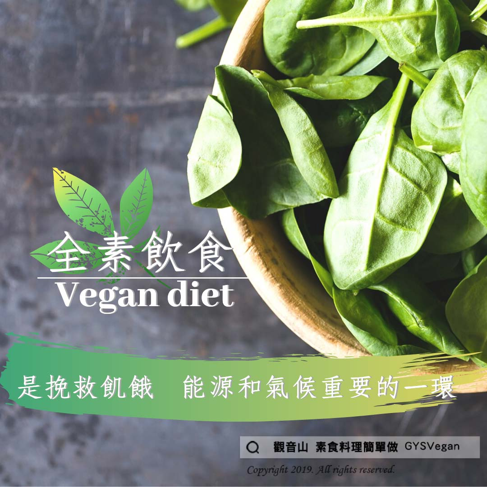

# 挽救世界飢餓

## 📋 基本資訊 / Recipe Overview
- **料理名稱**：挽救世界飢餓
- **原始標題**：挽救世界飢餓
- **素食流派 / Diet**：全素 Vegan
- **來源平台 / Source**：[觀音山 · 素食料理簡單做](https://vegan.gys.org.tw/%e3%80%90%e5%8b%95%e7%89%a9%e5%8f%8b%e5%96%84%e3%80%91%e6%8c%bd%e6%95%91%e4%b8%96%e7%95%8c%e9%a3%a2%e9%a4%93/)

## 📖 食譜圖文詳情 (中英雙語對照)

【#蔬食響應】全球性的 ＃全素飲食 轉移，是挽救世界飢餓、能源危機和氣候變遷至關重要的一環。—聯合國環境署。​
​
依照熱量需求，全世界牛?所吃掉的食物，足以養活87億人口‼​
全世界90%的大豆、50%的穀類和40%遭捕撈的魚都拿來飼養家畜，同時卻有十億人口無法果腹。​
​
每年平均有兩萬名孩童餓死‼​
但用來生產一塊牛排的玉米和大豆，卻足以養活兩個人一整天。​
⭐＃挽救世界飢餓，你該蔬食！​
只要越多人轉 ＃純素 就越能幫助到飢餓人口！​
​
✨慈悲的 龍德上師成立「觀音山蔬食館」提倡健康素食、慈悲護生，以”觀音山素食料理簡單做”的理念，提供多款素食食譜，讓您一學就會！?​
​
​
?觀音山 素食料理簡單做 Follow us?
Facebook ｜好文按讚
http://www.facebook.com/GYSVegan
​
Instagram ｜料理追蹤
http://www.instagram.com/gysvegan/​
Youtube ｜加入訂閱
https://reurl.cc/q8VEqy​
Telegram ｜頻道推薦
https://t.me/GYSVegan​
​
​
—​
? 歡迎轉載，請註明出處： 觀音山 素食料理簡單做 GYSVegan 素食環保愛地球，健康營養無負擔，慈悲護生一起來~?

---
*食譜歸檔時間：2026-08-20 · 來源：觀音山素食料理簡單做 (vegan.gys.org.tw)*