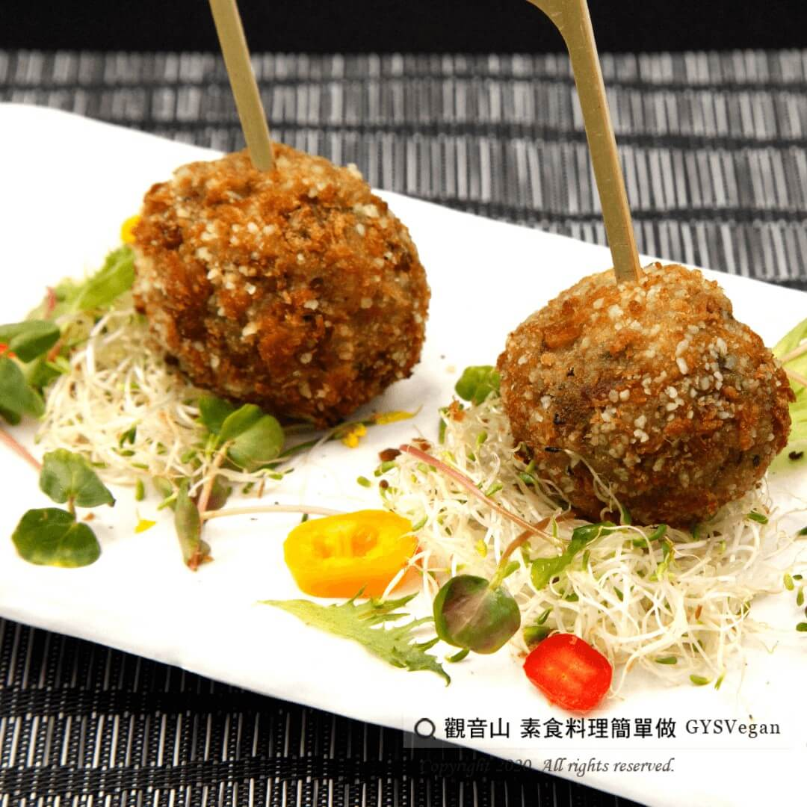

# 新未來肉炸丸子

## 📋 基本資訊 / Recipe Overview
- **料理名稱**：新未來肉炸丸子
- **原始標題**：新未來肉炸丸子｜全素
- **素食流派 / Diet**：全素 Vegan
- **料理分類 / Category**：家常料理
- **來源平台 / Source**：[觀音山 · 素食料理簡單做](https://vegan.gys.org.tw/new-future-meat20201204/)

## 📖 食譜圖文詳情 (中英雙語對照)

未來肉又稱植物基肉，可提供優質蛋白質、豐富膳食纖維、抗發炎及氧化的植化素。​
未來肉是植物性來源，不必擔心攝取到近期熱議的瘦肉精或其他動物用藥殘留問題。​
​
蔬食可以很簡單!!觀音山主廚教大家如何使用未來肉食材，料理出一道好吃又健康的酥炸丸子，​
快跟著觀音山主廚，一起素食料理簡單做吧！?​
​
?食材及佐料〔Ingredients〕：(4人份)​
▪未來肉 1包 ​
▪麵包粉 150克​
▪大白菜 70克​
▪牛奶 50c.c​
▪西洋芹 50克​
▪酥炸粉 100克​
▪地瓜粉 50克​
▪義式香草 少許​
▪黑胡椒粒 適量​
▪鹽 適量​
▪香椿醬 少許​
▪糖 適量​
▪水 適量​
▪油 適量​
​
?烹飪步驟：​
1.大白菜取梗的部位，切1公分丁。​
2.西洋芹切0.5公分丁。​
3.熱鍋炒大白菜、西洋芹，炒軟備用。​
4.麵包粉50克+牛奶50CC混和備用。​
5.未來肉倒入盆中，加入步驟1炒好的蔬菜、泡軟的麵包粉、黑胡椒粒、鹽、糖、香椿醬、香草，充分拌勻。​
6.拌好的餡料，搓成適當大小的丸子狀，放入冷凍庫30分鐘定型。​
7.酥炸粉加入適量的水調成麵糊。麵包粉100克+地瓜粉50克混勻。​
8.取出定型的丸子沾麵糊，再沾乾粉壓實塑型。​
9.油鍋預熱至180度，放入丸子油炸至金黃色即可起鍋。​
​
【特別說明】​
食材亦可以使用新豬肉。​
​
??本食譜提供：台中 #觀音山蔬食館 主廚 淨雅​
​
✨慈悲的 龍德上師成立「觀音山蔬食館」提倡健康素食、慈悲護生，以”觀音山素食料理簡單做”的理念，提供多款素食食譜，讓您一學就會！?​
​
​
【recipe】​
?Future meat is also called plant-based meat, which can provide high-quality protein, rich dietary fiber, anti-inflammatory and oxidative phytochemicals. Future meat is plant based food, so there is no need to worry about clenbuterol intake or any other animal drug residues in food that have been discussed recently. ​
Green foods can be very simple!! Chef Guanyinshan teaches everyone how to use the future meat and beyond meat to cook a delicious and healthy croquettes. Quickly follow Chef Guanyinshan and let’s make vegetarian dishes simple! ​
​
?Ingredients : (For 4 people)​
▪Artificial meat 1​
▪Bread crumb 150g​
▪Chinese cabbage 70g​
▪Milk, 50c.c​
▪Celery, 50g​
▪Crispy powder 100g​
▪Potato starch 50g​
▪Italian vanilla, ​ a little​
▪Black pepper, adequate amount​
▪Salt, adequate amount​
▪Toon sause, a little​
▪Sugar , ​ adequate amount​
▪Water, ​ adequate amount​
▪Oil , ​ adequate amount​
​
?Cooking steps: ​
1. Cut Chinese cabbage stalk into 1 cm lengthwise.​
2. Cut celery into 0.5 cm lengthwise. ​
3. Stir-fry Chinese cabbage and celery in a hot pan, stir-fry until soft and set aside. ​
4. Mix 50 grams of bread flour + 50CC of milk for later use. ​
5. Pour the future meat into a basin, add the fried vegetables in step 1, soaked bread flour, black peppercorns, salt, sugar, toon sauce, vanilla, and mix well. ​
6. After mixing the stuffing, knead it into a ball shape of appropriate size, and put it in the freezer for 30 minutes to shape. ​
7. Add appropriate amount of water to the frying powder to make a batter. Mix 100 grams of bread flour + 50 grams of sweet potato flour. ​
8. Take out the shaped balls and dip them in the batter, then dip them in dry powder to compact the shape. ​
9. Preheat the frying pan to 180 degrees, add the meatballs and fry them until golden brown. 【Special Note】 The ingredients can use Omnipork or future meat.​
​
??This recipe is provided by: Taichung Guanyinshan Green Restaurant, ​ Chef Jing Ya​
​
​
?觀音山 素食料理簡單做 Follow us?​
Facebook ｜好文按讚
http://www.facebook.com/GYSVegan​
Instagram ｜料理追蹤
http://www.instagram.com/gysvegan/​
Youtube ​ ​ ​ ｜加入訂閱
https://reurl.cc/q8VEqy​
Telegram ​ ｜頻道推薦
https://t.me/GYSVegan​
​
​
?歡迎轉載，請註明出處： ​ ​ 觀音山 素食料理簡單做 GYSVegan 素食環保愛地球，健康營養無負擔，慈悲護生一起來~?

---
*食譜歸檔時間：2026-08-20 · 來源：觀音山素食料理簡單做 (vegan.gys.org.tw)*