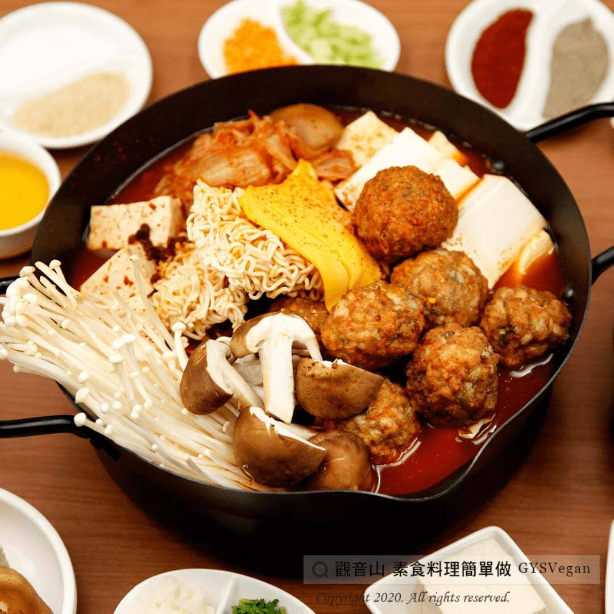

# 新朱肉丸子部隊鍋

## 📋 基本資訊 / Recipe Overview
- **料理名稱**：新朱肉丸子部隊鍋
- **原始標題**：新朱肉丸子部隊鍋｜奶素
- **素食流派 / Diet**：奶素 Lacto-Vegetarian
- **料理分類 / Category**：家常料理
- **來源平台 / Source**：[觀音山 · 素食料理簡單做](https://vegan.gys.org.tw/new-vermilion-meat20210109/)

## 📖 食譜圖文詳情 (中英雙語對照)

部隊鍋是由多種食材，搭配韓國辣椒醬作為湯底的辛辣火鍋，可加入各種喜愛的食材。​
加入植物肉做成的肉丸子，口感扎實、香氣十足，搭配香濃起司、彈牙泡麵，喝上熱熱的辣湯，冷冷的天，特別幸福好滋味！​
趕快起身跟著觀音山主廚，一起素食料理簡單做吧！​
​
?食材及佐料〔Ingredients〕：(4-5人份)​
▪新朱肉 150克​
▪百頁豆腐 150克​
▪紅蘿蔔 100克​
▪中芹 50克​
▪豆薯 100克​
▪麵粉 100克​
▪香菜 30克​
▪起司片 1片​
▪素食泡麵 1包​
▪鮮香菇 2朵​
▪火鍋豆腐 1盒​
▪韓式泡菜 70克​
▪糖、鹽、香油、醬油、油  適量​
▪️五香粉、胡椒粉、韓式辣粉、韓式辣醬  適量​
▪️素蠔油、素高湯  適量​
​
?烹飪步驟：​
1紅蘿蔔切末。​
2.豆薯去皮，切0.8公分丁。​
3.中芹切0.5公分。​
4.香菜切末。​
5.百頁豆腐捏碎，加入新朱肉、紅蘿蔔、豆薯、香菜、芹菜，糖、鹽、胡椒粉、香油、醬油、五香粉，充分拌勻。​
6.將丸子餡料搓成圓球狀，沾麵粉油炸至金黃色。​
7.湯底: 熱鍋，加入油、韓式辣椒粉，小火炒香，加入素高湯、韓式辣醬、糖、鹽、素蠔油。​
8.依序擺入泡菜、鮮香菇、豆腐、新朱肉丸子、泡麵、起司片，充分加熱即可享用！​
​
【特別說明】​
1.可依個人喜好增加食材。​
​
??本食譜提供：台中 #觀音山蔬食館 主廚 淨雅​
​
✨慈悲的 龍德上師成立「觀音山蔬食館」提倡健康素食、慈悲護生，以”觀音山素食料理簡單做”的理念，提供多款素食食譜，讓您一學就會！?​
​
​
【recipe】
​
? The army base stew is a spicy hot pot using Korean chili sauce as the basic sauce with abundant of various ingredients such as cheese, instant noodles along with plant-based balls. It is especially joyful to have a bowl of spicy and cheesy soup on such cold days! Plant-based balls have solid taste and texture. They are not only tasty but reduce our environmental footprints. Let’s follow the chef of Guanyinshan cook simple vegetarian dishes together!​
​
?Ingredients : (For 4-5 people)​
▪Omnipork 150g​
▪Bai ye tofu 150g​
▪Carrot 100g​
▪Celery 50g​
▪Yam bean 100g​
▪Flour 100g​
▪Coriander 30g​
▪A piece of cheese​
▪A pack of vegetarian instant noodles​
▪Two shiitake​
▪A box of hot pot tofu​
▪Kimchi 70g​
▪Sugar , adequate amount​
▪Salt , adequate amount​
▪Sesame oil , adequate amount​
▪Soy sauce , adequate amount​
▪Allspice , adequate amount​
▪Pepper , adequate amount​
▪Korean chili powder , adequate amount​
▪Gochujang , adequate amount​
▪Vegetarian mushroom soy sauce , adequate amount​
▪Vegetable stock , adequate amount​
▪Oil , adequate amount​
​
?Cooking steps:​
1. Mince carrots.​
2. Peel the jicama and cut into 0.8 cm wide. 3. Cut the celery into 0.5 cm wide.​
4. Mince coriander.​
5. Crushed tofu, add Omnipork, carrots, jicama, coriander, celery, sugar, salt, pepper, sesame oil, soy sauce, chinese five spices, and mix well.​
6. Knead the plantball filling into a ball shape, dust in flour and fry until golden brown.​
7. Soup base: Heat the pot, add oil, Korean chili powder, saute over low heat, add vegetarian stock, Korean hot sauce, sugar, salt, and vegetarian soy sauce.​
8. Place kimchi, fresh mushrooms, tofu, plantballs, instant noodles, cheese slices in order, and fully heat up and enjoy!​
​
【Special Note】​
You can substitute the main ingredients per your preference too.​
​
??This recipe is provided by Chef Jing ya,Taichun #Guanyinshan Green Restaurant.​
​
​
? 觀音山 素食料理簡單做 ?
Facebook ｜好文按讚
http://www.facebook.com/GYSVegan​
Instagram ｜料理追蹤
http://www.instagram.com/gysvegan/​
Youtube ｜加入訂閱
https://reurl.cc/q8VEqy​
Telegram ｜頻道推薦
https://t.me/GYSVegan ​
​
​
? 歡迎轉載，請註明出處： 觀音山 素食料理簡單做 GYSVegan 素食環保愛地球，健康營養無負擔，慈悲護生一起來~?

---
*食譜歸檔時間：2026-08-20 · 來源：觀音山素食料理簡單做 (vegan.gys.org.tw)*