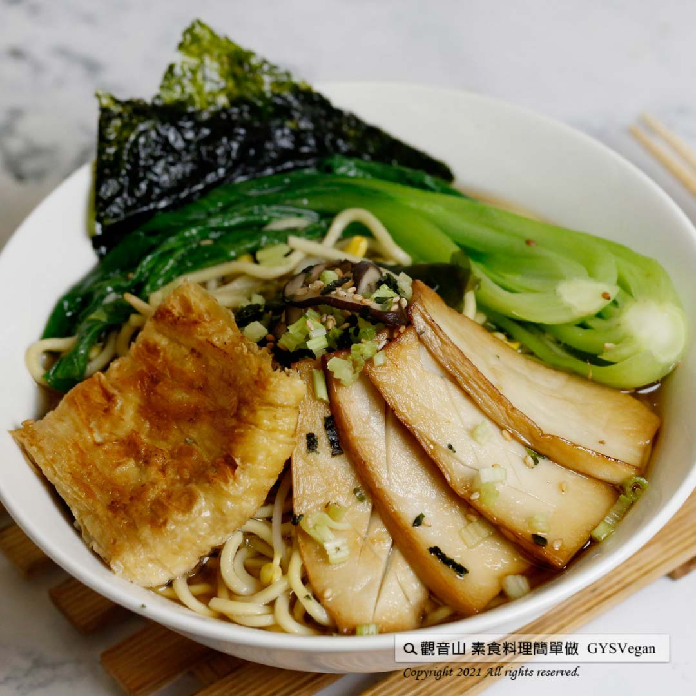

# 日式和風拉麵

## 📋 基本資訊 / Recipe Overview
- **料理名稱**：日式和風拉麵
- **原始標題**：日式料理｜日式和風拉麵 ｜全素
- **素食流派 / Diet**：全素 Vegan
- **料理分類 / Category**：主食種類 / 米麵主食 (Staple Food)
- **來源平台 / Source**：[觀音山 · 素食料理簡單做](https://vegan.gys.org.tw/japanese-style-ramen20211217/)

## 📖 食譜圖文詳情 (中英雙語對照)

香鮮味美的湯頭，由昆布的海味、醬油的鮮味，精心調製。​
絕對是日式拉麵最具代表性的風味，快跟著觀音山主廚，一起素食料理簡單做吧！​
​
?食材及佐料〔Ingredients〕：(1人份)​
▪️拉麵 ​ 1束​
▪️海帶芽（乾）10克 ​ ​ ​
▪️黃豆芽 ​ 20克​
▪️大鮮香菇 ​ 1朵​
▪️豆包 ​ 1片​
▪️杏鮑菇 ​ 1條​
▪️青江菜（綠色蔬菜） 1株​
▪️芹菜、素食味島香鬆、昆布醬油 ​ 適量​
▪️海苔 ​ 2片​
▪️水 ​ 500C.C​
​
?烹飪步驟：​
【刀工/前處理】​
1.鮮香菇切片。​
2.杏鮑菇切長條型片狀，表面畫上菱形紋路。​
3.芹菜切珠，青江菜從中間剖開。​
4.海帶芽泡發，瀝乾水份備用。​
​
【調理作法】​
1.煎豆包至焦脆，杏鮑菇煎上色。​
2.燒一鍋水煮拉麵至8分熟，撈起備用；同一鍋水放入青江菜，汆燙備用。​
3.製作湯底:​
香菇用油爆香，倒入昆布醬油、水，以1：7比例，放入海帶芽、黃豆芽，一起煮滾後轉中小火煮約5分鐘。​
4.取一個大碗，將拉麵擺入，倒入湯底。依序擺上配菜:青江菜、杏鮑菇、豆包、海苔，最後撒上味島香鬆、芹菜。​
​
【特別說明】​
1.素食味島香鬆超市可以購得。​
​
??本食譜提供：台中觀音山蔬食館​
​
✨慈悲的 龍德上師成立「觀音山蔬食館」提倡健康素食、慈悲護生，以”觀音山素食料理簡單做”的理念，提供多款素食食譜，讓您一學就會！?
​
​
★12月18日 無量光佛節日：善惡業增長一百萬倍​
​
✨殊勝功德增長日✨​
觀音山邀請您於12月18日響應素食、廣修供養、戒殺護生、誦經修法、行持諸種善行，獲福無量。​
​
【recipe】​
​
? This moreish Japanese ramen broth can taste the sea flavor in kelp buds and the classic savory soy sauce. It is definitely the most representative flavor of Japanese ramen. Let’s follow the chef of Guanyinshan and make vegetarian dishes together!​
​
?Ingredients : （For 1 people）​
▪️A bunch of ramen​
▪️Kelp bud(dried) ​ ​ 10g ​ ​ ​
▪️Soybean sprouts ​ 20g​
▪️A fresh shiitake mushrooms ​
▪️A beancurd parcel ​ ​
▪️A king oyster mushroom ​ ​
▪️A pak choy(Green vegetable)​
▪️Celery、Vegetarian furikake、Kelp soy sauce ​ ​ , adequate amount​
▪️Two pieces of seaweed​
▪️Water ​ 500C.C​
​
? Instructions:​
【Cutting/ PREP-Ahead】 ​
1. Slice fresh shiitake mushrooms.​
2. Slice King oyster mushroom and cut with a diamond pattern on the surface. ​
3. Cut the celery into beads, and halves the pak choy from the middle. ​
4. Soak kelp sprouts and drainfor later use. ​ ​
​
【Cooking Steps】 ​
1. Fry and brown beancurd parcel (Dou Bao) ​ and slightly fry the king oyster mushroom mushrooms to color. ​
​
2. Bring a pot of water to a boil and cook the ramen to the hardness of medium well, drain and set aside; add kap choy in the same pot of water, and blanch for later use. ​
​
3. Make the broth: Saute the mushrooms, pour in kelp soy sauce and water ​ in a ratio of 1:7. Place in soybean sprouts and kelp buds and bring to a boil, then turn to medium-low heat and cook for about another 5 minutes. ​
​
4. Take a large bowl, put the ramen in, and pour the broth over. Top with the side dishes: pak choy, king oyster mushrooms, beancurd parcel, seaweed, and finally sprinkle with vegetarian furikake and celery. ​ ​
​
[Special notes] ​
1. Vegetarian furikake (Wei tao shiang song) is available at supermarkets.​
​
​
?  觀音山 素食料理簡單做 ?
◎Facebook ｜好文按讚​
http://www.facebook.com/GYSVegan​
​
◎lnstagram ｜料理追蹤​
http://www.instagram.com/gysvegan/​
​
◎Youtube ｜加入訂閱​
https://reurl.cc/q8VEqy​
​◎Telegram ｜頻道推薦​
https://t.me/GYSVegan​
—​
? 歡迎轉載，請註明出處： 觀音山 素食料理簡單做 GYSVegan 素食環保愛地球，健康營養無負擔，慈悲護生一起來~?

---
*食譜歸檔時間：2026-08-20 · 來源：觀音山素食料理簡單做 (vegan.gys.org.tw)*