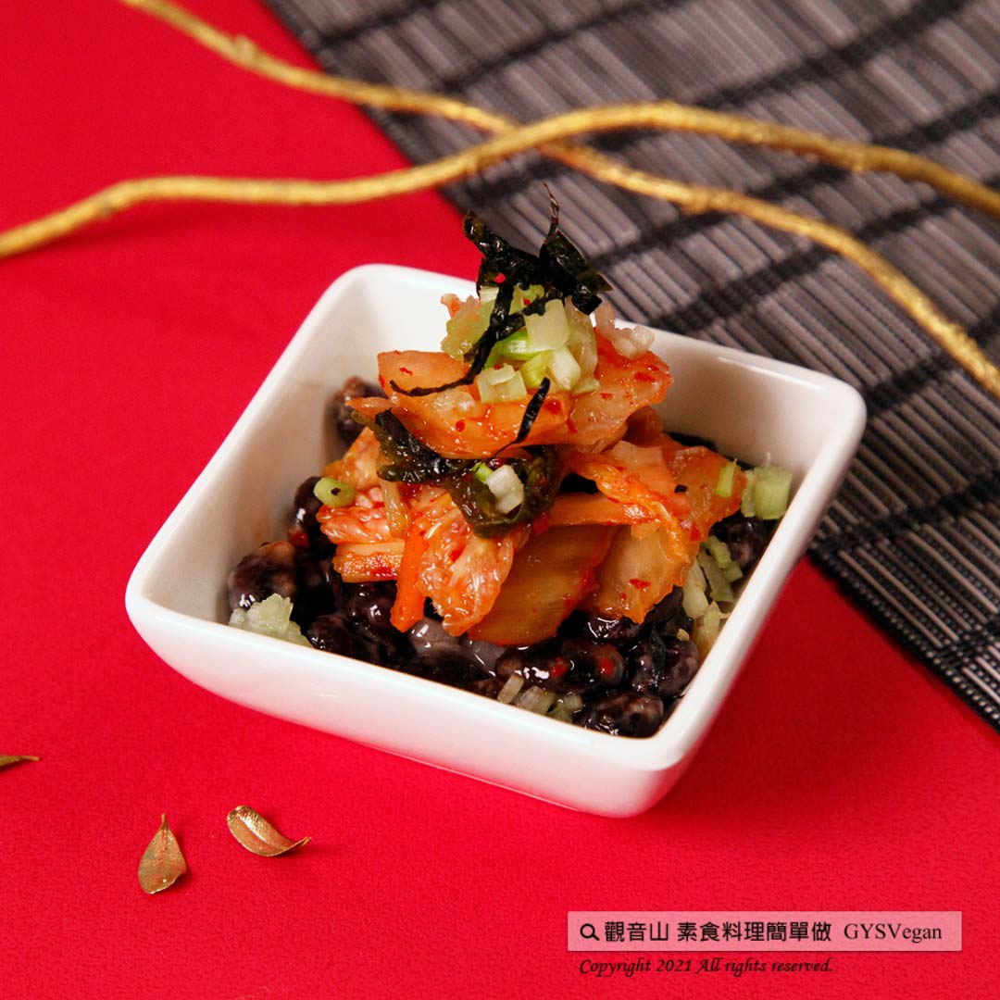

# 日式拼盤特輯  百次爆旦

## 📋 基本資訊 / Recipe Overview
- **料理名稱**：日式拼盤特輯  百次爆旦
- **原始標題**：日式拼盤特輯 ｜百次爆旦｜全素
- **素食流派 / Diet**：全素 Vegan
- **來源平台 / Source**：[觀音山 · 素食料理簡單做](https://vegan.gys.org.tw/explosive20220406/)

## 📖 食譜圖文詳情 (中英雙語對照)

日式拼盤特輯 ✨百次爆旦✨全素
同屬於發酵食物的泡菜與納豆，可做為開胃的前菜，納豆有豐富的營養價值，不吃蛋也可以獲得高優質蛋白質，鋪灑在海苔上，色香味俱全，令人食指大動！一起跟著觀音山素食料理簡單做吧~​
​
◎食材及佐料〔Ingredients〕：(5人份)​
▪️納豆 ​ 1盒​
▪️海苔片 ​ 1片​
▪️芹菜末、泡菜 適量​
​
◎烹飪步驟：​
【刀工/前處理】​
1.海苔切成五等份。​
2.芹菜切末。​
​
【調理作法】​
1.將1匙(約30克)的納豆、30克泡菜、芹菜末攪拌均勻，放到海苔片上，即可享用！​
​
【特別說明】​
1. 可依個人喜好加入蘋果丁。​
2. 建議用韓國泡菜。​
​
◎本食譜提供：台中觀音山蔬食館​
​
✨慈悲的龍德上師 成立「觀音山蔬食館」提倡健康素食、慈悲護生，以”觀音山素食料理簡單做”的理念，提供多款素食食譜，讓您一學就會！🥰​
​
「觀音山 社群樹」一鍵快速前往觀音山 官方相關連結！​
➠
https://fazang.taplink.ws/​
​
​
​
🌱 觀音山 素食料理簡單做 🌱​
◎Facebook ｜好文按讚​
https://www.facebook.com/GYSVegan​
​
◎Instagram ｜料理追蹤​
https://www.instagram.com/gysvegan/​
​
◎Youtube ​ ​ ​ ｜加入訂閱​
https://reurl.cc/q8VEqy​
​
◎官方Blog ​ ​ ｜網站推薦​
https://vegan.gys.org.tw/​
​
​
—​
👑歡迎轉載，請註明出處： 觀音山 素食料理簡單做 GYSVegan 素食環保愛地球，健康營養無負擔，慈悲護生一起來~😊

---
*食譜歸檔時間：2026-08-20 · 來源：觀音山素食料理簡單做 (vegan.gys.org.tw)*