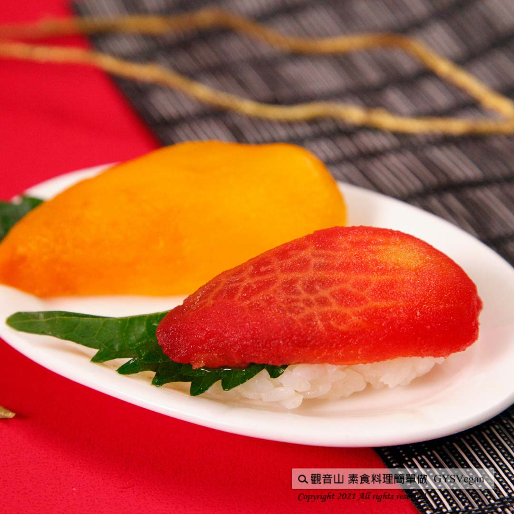

# 日式拼盤特輯 握壽司

## 📋 基本資訊 / Recipe Overview
- **料理名稱**：日式拼盤特輯 握壽司
- **原始標題**：日式拼盤特輯｜握壽司｜全素
- **素食流派 / Diet**：全素 Vegan
- **來源平台 / Source**：[觀音山 · 素食料理簡單做](https://vegan.gys.org.tw/nigiri-sushi20220408/)

## 📖 食譜圖文詳情 (中英雙語對照)

視覺與味覺的精緻饗宴，番茄、彩椒、炙燒杏鮑菇三種握壽司的組合，經精心處理，保留食材的鮮甜，清爽的口感和酸溜的醋飯，絕對是開胃最佳素食料理！​
​
◎食材及佐料〔Ingredients〕：(5人份)​
▪️壽司米 ​ 2杯​
▪️番茄(中等大小)、黃椒 ​ 各1顆​
▪️杏鮑菇 ​ 5片​
▪️工研醋 ​ 120cc​
▪️鹽 ​ 10克​
▪️糖 ​ 80克​
▪️青梅汁、紫蘇葉、沙拉醬、松露醋 ​ 適量​
​
◎烹飪步驟：​
【刀工/前處理】​
1.番茄表面劃十字後，待水滾沸，放入番茄，煮約5分鐘，起鍋自然冷卻、去皮。去皮番茄用青梅汁醃製，可前一天事先備好冷藏，較入味。​
2.黃椒對半剖，去籽。​
​
【調理作法】​
一.番茄握壽司:​
1.將調製好的醋(醋、鹽、糖一起攪拌均勻，約攪拌15分鐘)，倒入白飯拌均勻，靜置15分鐘。​
2.先將飯搓圓，扣上醃製好的番茄片、紫蘇葉，稍微擠壓按壓塑型即可。​
​
二.彩椒握壽司:​
1. 烤彩椒：烤箱預熱200度，烤約15~20分，直接放於烤箱自然冷卻，再取出去皮。​
2.剝掉表面皮，不碰到水，切3等份。​
3.將步驟2的彩椒，倒入適量松露醋醃漬，待入味即可。​
4. 先將飯搓圓，扣上醃製好的彩椒、紫蘇葉，稍微擠壓按壓塑型即可。​
​
三.炙燒杏鮑菇握壽司:​
1.杏鮑菇切薄片後，切成網狀。​
2.擠上沙拉醬灑上白糖，用噴燈炙燒成焦黃即可。​
3.先將飯搓圓，扣上杏鮑菇，稍微擠壓按壓塑型。​
​
【特別說明】​
1.醋飯儘量用乾的木桶攪拌，因木桶可吸收米飯的水份讓醋飯變Q，壽司飯建議自然冷卻，等飯把醋完全收汁再捏。​
2.烘培房有壽司模型可採買。​
​
本食譜提供：台中觀音山蔬食館​
​
慈悲的龍德上師 成立「觀音山蔬食館」提倡健康素食、慈悲護生，以”觀音山素食料理簡單做”的理念，提供多款素食食譜，讓您一學就會！
​
◎觀音山相關連結​
➠
https://www.fazang.org/link/​
​
​
​
​
【recipe】​
​
This plate with three different nigiri sushi is an exquisite feast for the senses. Tomato, bell pepper, and grilled king oyster mushroom all have been carefully processed to preserve the freshness and sweetness of the ingredients. The refreshing taste features the shushi rice that’s definitely the best vegetarian nigiri ever.​
​
◎Ingredients : （For 5 people）​
▪️Two cups of sushi rice ​
▪️A Tomato、Yellow bell pepper ​
▪️Five pieces of king oyster mushroom ​
▪️Rice vinegar ​ 120cc​
▪️Salt ​ 10g​
▪️Sugar ​ 80g​
▪️Greengage juice、Perilla leaf、Salad dressing、Truffle vinegar ​ ​ , adequate amount​
​
◎Instructions:​
【Cutting/ PREP-Ahead】​
1. Cut a cross on the surface of the tomato and cook it in boiling water for about 5 minutes. Remove it from the pot and cool to peel. Marinated peeled tomatoes in green plum juice and refrigerated one day ahead for flavor-dense. ​
2. Cut the yellow pepper in half and remove the seeds. ​ ​
​
【Cooking Steps】 ​
一. Tomato Nigiri: ​
1. Mix the prepared vinegar (mix vinegar, salt and sugar altogether for about 15 minutes), pour in the rice, mix well, and let it stand for 15 minutes. ​
2. Roll the rice into a ball first, top the marinated tomato slices and perilla leaves, squeeze and press slightly to shape. ​
​
二.Bell Pepper Nigiri Sushi:​
1. Roasted peppers: Preheat the oven to 200 degrees, bake for about 15-20 minutes, put them directly in the oven to cool off for removing the skins.​
2. Remove the skin of roasted bell peppers (do not get them wet in water) and cut into 3 equal parts.​
3. Sprinkle a proper amount of truffle vinegar and pickle on the step 2 bell pepper to marinate slightly and wait for the taste.​
4. Roll shushi rice into a ball, top the marinated bell pepper and basil leaves, squeeze and press slightly to shape.​
​
三.Grilled King Oyster Mushroom Nigiri Sushi:​
1. Slice the King oyster mushrooms and cut-side in a diamond pattern​
2. Squeeze salad dressing, sprinkle with sugar, and use a kitchen blowtorch until it browned.​
3. Roll shushi rice into a ball first, top the king oyster mushrooms, squeeze a little to shape.​
​
【Special Notes】​
1. If possible, use a dry wooden barrel to stir the shushi rice. The wooden barrel helps absorbing the excessive moisture of the rice to make the shushi rice springy. Before shaping the rice, please make sure to cool the sushi rice and wait for the vinegar flavor totally blend in.​
2. There are sushi models available in the bakery for shushi rice shaping.​
​
This recipe is provided by: Taichung Guanyinshan Green Restaurant.​
​
—​
歡迎轉載，請註明出處： 觀音山 素食料理簡單做 GYSVegan 素食環保愛地球，健康營養無負擔，慈悲護生一起來~

---
*食譜歸檔時間：2026-08-20 · 來源：觀音山素食料理簡單做 (vegan.gys.org.tw)*