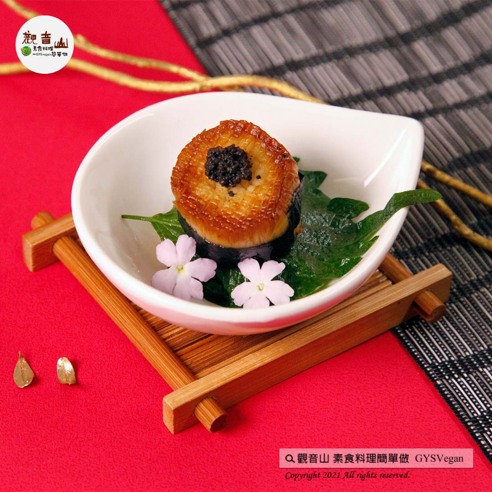

# 日式拼盤特輯 松露干貝

## 📋 基本資訊 / Recipe Overview
- **料理名稱**：日式拼盤特輯 松露干貝
- **原始標題**：日式拼盤特輯｜松露干貝｜全素
- **素食流派 / Diet**：全素 Vegan
- **來源平台 / Source**：[觀音山 · 素食料理簡單做](https://vegan.gys.org.tw/truffle-scallops%e2%80%8b20220405/)

## 📖 食譜圖文詳情 (中英雙語對照)

日式拼盤特輯 ​ ✨松露干貝✨全素​
簡單的料理，吃出食物最精華的味道，杏鮑菇表面切成網狀，煎至金黃色，看起來帶有炙燒的感覺，點上松露醬提味，一入口就感到大滿足，口腔中充滿獨特的香氣，簡單又有點奢華的料理，快跟著觀音山主廚，一起素食料理簡單做吧！​
​
◎食材及佐料〔Ingredients〕：(5人份)​
▪️杏鮑菇(A等級) ​ 2條​
▪️松露醬 ​ 適量​
▪️油 ​ 適量​
​
◎烹飪步驟：​
【刀工/前處理】​
1.杏鮑菇切塊(約5公分厚度)，表面切網狀。​
​
【調理作法】​
1.將杏鮑菇擦拭乾淨，香煎金黃色起鍋。​
2.點上松露醬即可享用。​
​
【特別說明】​
可用生菜或水果擺盤。​
​
◎本食譜提供：台中觀音山蔬食館​
​
​
✨慈悲的龍德上師 成立「觀音山蔬食館」提倡健康素食、慈悲護生，以”觀音山素食料理簡單做”的理念，提供多款素食食譜，讓您一學就會！🥰​
​
​
「觀音山 社群樹」一鍵快速前往觀音山 官方相關連結！​
➠
https://fazang.taplink.ws/​
​
​
▌觀音山近期活動 ▌​
4月9日 三寶總集薈供法會​
①登記「除障祿位」、「超薦蓮位」​
►
https://reurl.cc/Kpgg9R​
②護持「薈供供品」供養三寶·愛心公益​
►
https://reurl.cc/pWEEKr​
​
​
🌱 觀音山 素食料理簡單做 🌱​
◎Facebook ｜好文按讚​
https://www.facebook.com/GYSVegan​
​
◎Instagram ｜料理追蹤​
https://www.instagram.com/gysvegan/​
​
◎Youtube ​ ​ ​ ｜加入訂閱​
https://reurl.cc/q8VEqy​
​
◎官方Blog ​ ​ ｜網站推薦​
https://vegan.gys.org.tw/​
​
—​
👑歡迎轉載，請註明出處： 觀音山 素食料理簡單做 GYSVegan 素食環保愛地球，健康營養無負擔，慈悲護生一起來~😊

---
*食譜歸檔時間：2026-08-20 · 來源：觀音山素食料理簡單做 (vegan.gys.org.tw)*