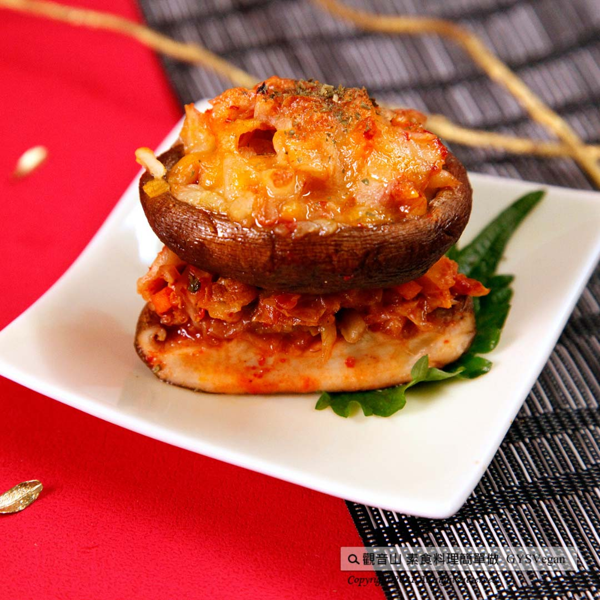

# 日式拼盤特輯 泡菜烤焗羅

## 📋 基本資訊 / Recipe Overview
- **料理名稱**：日式拼盤特輯 泡菜烤焗羅
- **原始標題**：日式拼盤特輯｜泡菜烤焗羅｜奶素
- **素食流派 / Diet**：奶素 Lacto-Vegetarian
- **來源平台 / Source**：[觀音山 · 素食料理簡單做](https://vegan.gys.org.tw/pickle20220407/)

## 📖 食譜圖文詳情 (中英雙語對照)

日式拼盤特輯
❖
泡菜烤焗羅
❖
奶素
大人小孩都愛的焗烤，剛出爐就香味四溢，小巧造型精心別緻，下層是多汁的鮮香菇、上層泡菜與起司綿密交疊，多層次口感豐富，快跟著觀音山主廚，一起素食料理簡單做吧！​
​
◎食材及佐料〔Ingredients〕：(5人份)​
▪️鮮香菇 ​ 5朵​
▪️泡菜 ​ 300克​
▪️起司絲、巴西里(洋香菜) ​ 適量​
​
◎烹飪步驟：​
【刀工/前處理】​
1.擦手紙先擦拭鮮香菇，切掉蒂頭。​
​
【調理作法】​
1.將鮮香菇內側凹洞放上泡菜，再灑上起司絲。​
2.烤箱預熱200度，將食材放入烤箱，烤大約3分鐘。​
3.取出香菇後，灑上巴西里，即可享用。​
​
【特別說明】​
1.鮮香菇可挑大朵、肉質厚實。​
2.烤箱時間到，香菇需立即取出，否則會失去水分太多。​
3.全素者可使用純素起司絲替代。​
​
本食譜提供：台中觀音山蔬食館​
​
​慈悲的龍德上師 成立「觀音山蔬食館」提倡健康素食、慈悲護生，以”觀音山素食料理簡單做”的理念，提供多款素食食譜，讓您一學就會！?​
​
​◎觀音山相關連結​
➠
https://www.fazang.org/link/​
​
​
​
​
—​
歡迎轉載，請註明出處： 觀音山 素食料理簡單做 GYSVegan 素食環保愛地球，健康營養無負擔，慈悲護生一起來~

---
*食譜歸檔時間：2026-08-20 · 來源：觀音山素食料理簡單做 (vegan.gys.org.tw)*