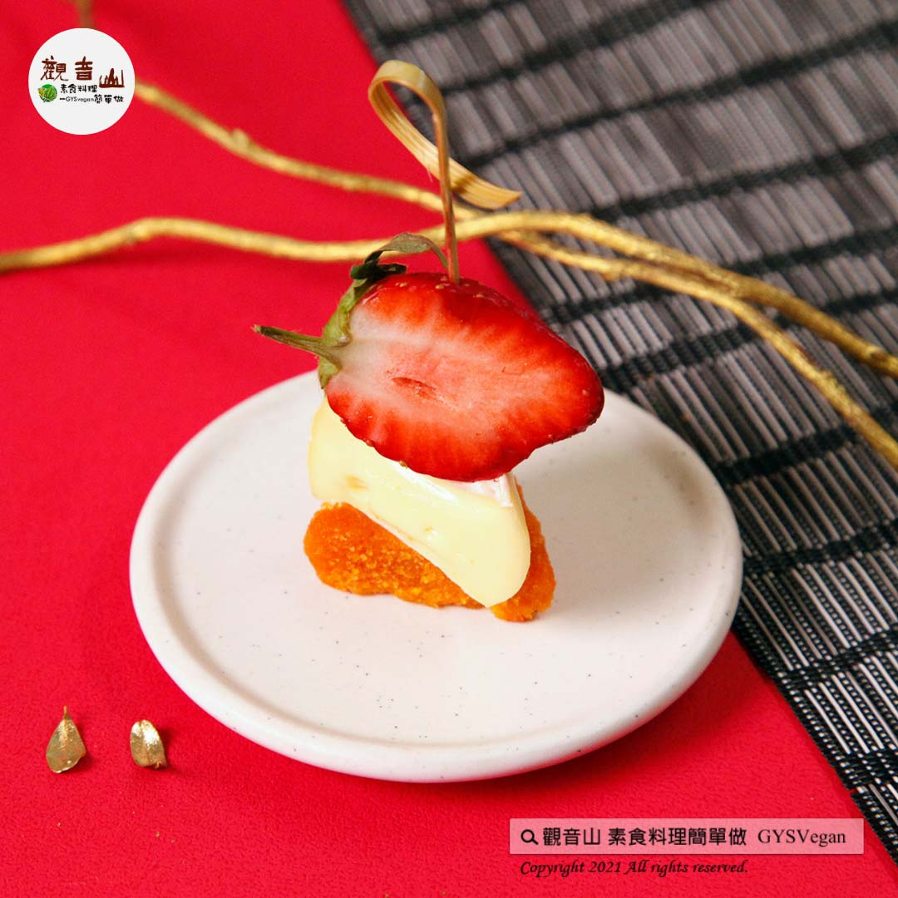

# 日式拼盤特輯 草莓起司烏于子

## 📋 基本資訊 / Recipe Overview
- **料理名稱**：日式拼盤特輯 草莓起司烏于子
- **原始標題**：日式拼盤特輯｜草莓起司烏于子｜奶素
- **素食流派 / Diet**：奶素 Lacto-Vegetarian
- **來源平台 / Source**：[觀音山 · 素食料理簡單做](https://vegan.gys.org.tw/wu-yuzi20220404/)

## 📖 食譜圖文詳情 (中英雙語對照)

精進料理【4/4-4/8 日式拼盤特輯】​
觀音山素食料理簡單做！讓你在家輕鬆做出「日式」宴客菜！​
​
日式料理給人一種精緻嚴謹、講究的感覺，保留食材的自然原味，搭配別具心裁的精緻擺盤，不外乎是日式料理最具指標性的特色。​
​
而日文漢字的【精進料理】代表素食料理，源自於佛教寺廟裡的僧侶餐食，對食材懷抱著感恩心，將調理與進食都視為一項修行，就是精進料理的核心精神。​
​
本周的素食日式拼盤特別推出五道特色料理，草莓起司烏于子、松露干貝、百次爆旦、泡菜烤焗羅、三種握壽司。跟著快跟著觀音山主廚，一起素食料理簡單做吧！​
​
日式拼盤特輯 ✨草莓起司烏于子✨奶素?​
鮮紅具有酸甜滋味的草莓，串上一片烤到恰到好處的烏于子，中間以乾乳酪提升整體層次，絕佳的組合，精美的擺盤，讓你享受視覺、味覺的饗宴！​
​
?食材及佐料〔Ingredients〕：(5人份)​
▪️素烏魚子 ​ 1條​
▪️乾乳酪 ​ 1條​
▪️草莓 ​ 1盒​
​
?烹飪步驟：​
【刀工/前處理】​
1.烏魚子及乾乳酪切塊。​
2.草莓對半切​
​
【調理作法】
1.先將素烏魚子放入平底鍋煎一下(加熱到香氣出來或可用烤箱)，起鍋備用。
2.將切塊素烏魚子、草莓及乾乳酪用竹籤串起來，即可享用!
​
【特別說明】​
全素者可使用純素烏魚子、純素乾乳酪替代。​
​
??本食譜提供：台中觀音山蔬食館​
​
​
✨慈悲的龍德上師 成立「觀音山蔬食館」提倡健康素食、慈悲護生，以”觀音山素食料理簡單做”的理念，提供多款素食食譜，讓您一學就會！?
​
「觀音山 社群樹」一鍵快速前往觀音山 官方相關連結！​
➠
https://fazang.taplink.ws/​
​
​
▌觀音山近期活動 ▌​
?溫馨五月─愛護海洋‧保育放流活動 ​
立即「搶救懷孕的海鱺媽媽」​
►
https://bit.ly/3ucvUMa
​
​
​
?觀音山 素食料理簡單做?
◎Facebook ｜好文按讚​
https://www.facebook.com/GYSVegan​
​
◎Instagram ｜料理追蹤​
https://www.instagram.com/gysvegan/​
​
◎Youtube ​ ​ ​ ｜加入訂閱​
https://reurl.cc/q8VEqy​
​
◎官方Blog ​ ​ ｜網站推薦​
https://vegan.gys.org.tw/​
​
—​
?歡迎轉載，請註明出處： 觀音山 素食料理簡單做 GYSVegan 素食環保愛地球，健康營養無負擔，慈悲護生一起來~?

---
*食譜歸檔時間：2026-08-20 · 來源：觀音山素食料理簡單做 (vegan.gys.org.tw)*