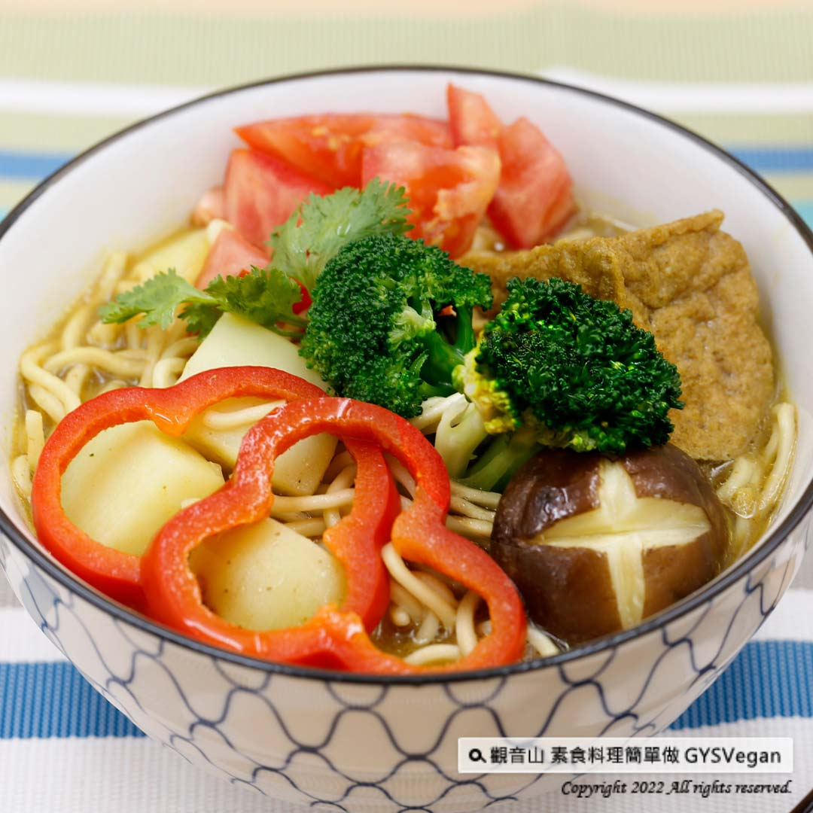

# 日式時蔬咖哩拉麵

## 📋 基本資訊 / Recipe Overview
- **料理名稱**：日式時蔬咖哩拉麵
- **原始標題**：日式料理｜日式時蔬咖哩拉麵｜全素
- **素食流派 / Diet**：全素 Vegan
- **料理分類 / Category**：主食種類
- **來源平台 / Source**：[觀音山 · 素食料理簡單做](https://vegan.gys.org.tw/japanese-vegetable-curry-ramen20220218/)

## 📖 食譜圖文詳情 (中英雙語對照)

微涼的春天，來一碗熱騰騰的日式時蔬咖哩拉麵，一入口就嚐到濃郁的咖哩香氣，搭配各種新鮮的時蔬，吃出蔬果的天然美味，最適合的春季養生料理，快跟著觀音山主廚，一起素食料理簡單做吧！​
?食材及佐料〔Ingredients〕：(1人份)​
▪️拉麵 ​ 1束 ​ ​ ​ ​
▪️紅蘿蔔、紅甜椒 ​ 30克 ​ ​ ​ ​
▪️馬鈴薯、綠花椰 ​ 各50克 ​
▪️鮮香菇 （大） ​ 1朵​
▪️小番茄 ​ 3-5顆 ​ ​ ​ ​ ​ ​
▪️油豆腐 ​ 1塊 ​ ​ ​ ​
▪️水 ​ 500c.c ​ ​ ​
▪️香菜、全素咖哩塊、孜然粉 ​ 適量​
?烹飪步驟：​
【刀工/前處理】​
1.馬鈴薯去皮滾刀塊。​
2.紅蘿蔔切圓片。​
3.紅甜椒去籽切圈。​
​
【調理作法】​
1.燒一鍋水煮拉麵至8分熟，撈起備用。​
2.500cc的冷水放入馬鈴薯，小火煮軟後，加入配菜紅蘿蔔​
、鮮香菇、綠花椰、紅甜椒，燙熟後夾起備用。​
3.製作咖哩湯底:煮洋芋的水，加入咖哩塊、孜然粉調味，放入油豆腐煮約5分鐘。​
4.取一個大碗將拉麵擺入，倒入咖哩湯底，擺上配菜、小番茄、香菜即可享用！​
​
??本食譜提供：台中觀音山蔬食館​
​
✨慈悲的 龍德上師成立「觀音山蔬食館」提倡健康素食、慈悲護生，以”觀音山素食料理簡單做”的理念，提供多款素食食譜，讓您一學就會！?
​
​
★2月19日 觀世音菩薩節日：善惡業增長一千萬倍​
​
✨殊勝功德增長日✨​
觀音山邀請您於2月19日響應素食、廣修供養、戒殺護生、誦經修法、行持諸種善行，獲福無量。​
​
【recipe】​
​
? In the slightly cool spring, having a bowl of hot Japanese-style vegetable curry ramen is such a joy. In this recipe, you can taste the rich curry aroma once the ramen entering your mouth. With a variety of vegetables on top, it’s also fresh and delicious. In this drizzling and damp spring season, warm up your stomach with this healthy raman soup. Follow Chef of Guanyinshan, let’s make simple vegetarian dishes together ​ ​
​
?Ingredients : （For 1 people）​
▪️A bunch of ramen ​ ​ ​ ​
▪️Carrot、Red bell pepper ​ 30g ​ ​ ​
▪️Potato、Broccoli ​ 50g ​
▪️A shiitake mushrooms ​ ​
▪️Three to five cherry tomatoes ​ ​ ​ ​
▪️A piece of fried tofu ​ ​ ​
▪️Water ​ 500c.c ​ ​ ​
▪️Coriander、Curry cubes 、Cumin powder ​ ​ , adequate amount ​ ​
​
? Instructions:​
【Cutting/ PREP-Ahead】​
1. Potato peeled and roll cut.​
2. Cut carrots into round slices. ​
3. Deseed the red bell pepper and cut into rings. ​ ​
​
【Cooking Steps】 ​
1.Bring a pot of water to a boil and cook the ramen noodles for 8 minutes; drain and set aside.​
2.In a 500cc of cold water put potatoes in and cook over low heat until tender. For the side dish, blanch the carrot, fresh shiitake mushrooms, broccoli, red peppers, and set aside. ​
3.Make the curry soup base: using the same water for blanching potato, add the curry cubes and cumin powder to taste. add the fried tofu and cook for about 5 minutes. ​
4.Take a large bowl and put in the ramen; ​ pour over curry soup; top with side dishes, cherry tomatoes & coriander to enjoy!​
​
​
? 觀音山 素食料理簡單做 ?
◎Facebook ｜好文按讚​
http://www.facebook.com/GYSVegan​
​
◎lnstagram ｜料理追蹤​
http://www.instagram.com/gysvegan/​
​
◎Youtube ｜加入訂閱​
https://reurl.cc/q8VEqy​
​
◎Telegram ｜頻道推薦​
https://t.me/GYSVegan​
​
—​
?歡迎轉載，請註明出處： 觀音山 素食料理簡單做 GYSVegan 素食環保愛地球，健康營養無負擔，慈悲護生一起來~?

---
*食譜歸檔時間：2026-08-20 · 來源：觀音山素食料理簡單做 (vegan.gys.org.tw)*