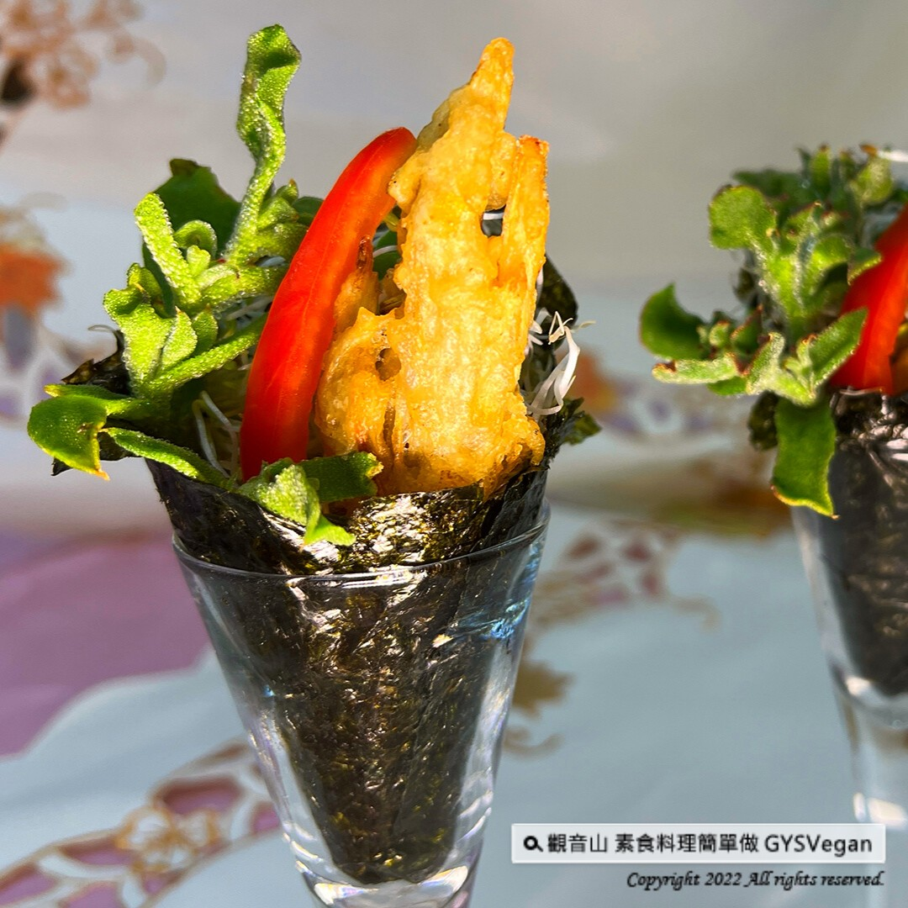

# 日式素炸蟹手捲

## 📋 基本資訊 / Recipe Overview
- **料理名稱**：日式素炸蟹手捲
- **原始標題**：日式料理 ｜日式素炸蟹手捲｜全素
- **素食流派 / Diet**：全素 Vegan
- **來源平台 / Source**：[觀音山 · 素食料理簡單做](https://vegan.gys.org.tw/hand-roll20221111/)

## 📖 食譜圖文詳情 (中英雙語對照)

日式料理 ✼日式素炸蟹手捲✼全素
​
營養美味的海苔片，將酥炸金針菇、冰花、紅甜椒等新鮮食材包覆，一入口吃到酥脆、清爽的搭配，多層次的口感滿足你的味覺，討喜的造型是全家人的最愛，短時間做出餐廳美味，快跟著觀音山主廚，一起素食料理簡單做吧！
​
❒食材及佐料〔Ingredients〕：
▪️海苔(長方形) ​ 3張 ​
▪️金針菇、冰花、苜蓿芽 ​ 各100克 ​ ​ ​ ​ ​ ​ ​ ​ ​ ​ ​
▪️紅甜椒 ​ 50克
▪️酥炸粉、水、 胡椒鹽、純素美乃滋、油 ​ 適量
​
❒烹飪步驟：
【刀工/前處理】
1.金針菇將尾部咖啡色處去掉，剝成小株。
2.冰花、苜蓿芽洗淨瀝乾，備用。
3.紅甜椒去籽切條，備用。
​
【調理作法】
1.酥炸粉加入適量的水，攪拌均勻成麵糊狀備用。
2.備一油鍋加熱至180度，將金針菇裹上麵糊，放入油鍋炸至金黃色，起鍋後灑上胡椒鹽備用。
3.取一張海苔亮面朝外，依序擺入苜蓿芽、冰花、紅 甜椒、炸金針菇、美乃滋，將海苔捲起來成甜筒 狀，即可享用!
​
【特別說明】
1.菇類天然獨特的風味，油炸後會有類似海鮮的效果，可依自己喜好變化菇的種類。
2.冰花也可用其他蔬果替代，例如:蘆筍、小黃瓜等都可以做變化。
​
本食譜提供：澎湖觀音山蔬食館
​
​
✼慈悲的 龍德上師 成立「觀音山蔬食館」提倡健康素食、慈悲護生，以”觀音山素食料理簡單做”的理念，提供多款素食食譜，讓您一學就會！
​
觀音山相關連結
➠
https://www.fazang.org/link/
​
​
▌觀音山近期活動 ▌
觀音山 2022秋季保育放流
➠
https://bit.ly/3AcPMVC
​
​
【recipe】
​
Nutritious and delicious seaweed slices, wrapped with fresh ingredients such as fried enoki mushrooms, ice plant, red bell peppers, etc., once entry the mouth, then the crispy and refreshing combination, the multi-layered satisfies your taste, and the pleasing shape is the favorite of the whole family, make restaurant delicious food in a short time. Follow the chef of Guanyinshan, let’s cook simple vegetarian dishes together
​
❒ Ingredients:
Seaweed (rectangular): 3 sheets
Enoki mushrooms, ice plant, and alfalfa sprouts, each 100g ​ ​ ​ ​ ​ ​ ​ ​
Red bell pepper: 50g
Fried powder, water, salt and pepper, vegan mayonnaise, Oil adequate amount
❒ Instructions:
[Cutting/ PREP-Ahead]
1. Remove the brown part of the tail of emoji mushrooms and peel them into small plants.
2. Wash ice plant and alfalfa sprouts, drain, and set aside.
3. Remove seeds and cut red bell pepper into strips, set aside.
[Cooking Steps]
1. Add appropriate amount of water to the crispy powder, and stir well to form set aside.
2. Prepare an oil pan and heat it to 180 degrees, wrap the enoki mushrooms in the batter, fry them in the oil pan until golden brown, sprinkle with pepper and salt for later use.
3. Take a piece of seaweed with the bright side facing outwards, put alfalfa sprouts, ice plant, red bell pepper, fried enoki mushrooms, and mayonnaise in order, roll the seaweed into a cone shape, and enjoy!
[Special Note]
1. Mushrooms have a natural and unique flavor. After frying, they will have an effect similar to seafood. You can change the type of mushrooms according to your preference.
2. Ice plant can also be replaced by other fruits and vegetables, for example: asparagus, cucumber, etc. can be changed.
This recipe is provided by: Penghu Guanyinshan Green Restaurant
​
​
​
—
♛歡迎轉載，請註明出處： 觀音山素食料理簡單做 GYSVegan 素食環保愛地球，健康營養無負擔，慈悲護生一起

---
*食譜歸檔時間：2026-08-20 · 來源：觀音山素食料理簡單做 (vegan.gys.org.tw)*