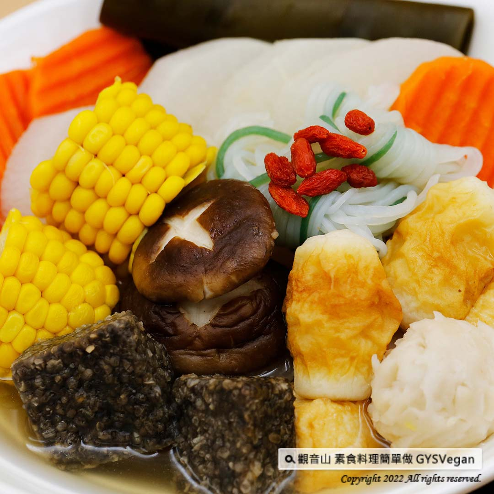

# 日式素食關東煮

## 📋 基本資訊 / Recipe Overview
- **料理名稱**：日式素食關東煮
- **原始標題**：日式料理｜日式素食關東煮 ｜全素
- **素食流派 / Diet**：全素 Vegan
- **料理分類 / Category**：中式料理
- **來源平台 / Source**：[觀音山 · 素食料理簡單做](https://vegan.gys.org.tw/japanese-vegetarian-oden-20220107/)

## 📖 食譜圖文詳情 (中英雙語對照)

冬天來碗暖呼呼的關東煮，嘗出鮮甜、純自然的湯頭，低卡高纖的食材，搭配特製的關東煮沾醬，清新爽口、營養均衡一舉兩得，快跟著觀音山主廚，一起素食料理簡單做吧！​
​
?食材及佐料〔Ingredients〕：(1人份)​
▪️白蘿蔔 ​ 1條 ​ ​ ​ ​ ​ ​
▪️紅蘿蔔 ​ 1/2條 ​ ​ ​ ​
▪️乾香菇（小） ​ 10朵 ​
▪️鮮香菇 （大） ​ 3朵 ​ ​ ​
▪️蒟蒻 ​ 半盒 ​
▪️杏鮑菇 ​ 2條​
▪️海帶 ​ 1片 ​
▪️玉米、素丸子、素竹輪、鹽、水 ​ 適量 ​ ​ ​
▪️枸杞 ​ 1把 ​
▪️薑 ​ 2~3片 ​ ​ ​ ​ ​ ​ ​ ​ ​ ​ ​ ​ ​ ​ ​ ​ ​ ​ ​ ​ ​ ​ ​ ​ ​ ​ ​ ​ ​ ​ ​ ​ ​ ​ ​ ​ ​ ​ ​ ​ ​ ​ ​ ​ ​ ​ ​ ​ ​ ​ ​ ​ ​ ​ ​ ​ ​ ​ ​ ​ ​ ​ ​ ​ ​ ​ ​ ​ ​ ​ ​ ​ ​ ​ ​ ​ ​ ​ ​ ​
▪️細砂糖 ​ 1/2匙​
▪️醬油 ​ 2小匙 ​
▪️細味噌、甜辣醬 ​ 1大匙 ​
▪️香油、太白粉 ​ 1大匙​
​
?烹飪步驟：​
【刀工/前處理】​
1.玉米、白蘿蔔、紅蘿蔔、杏鮑菇切大塊，備用。​
2.海帶、乾香菇洗淨泡水，備用。​
3.鮮香菇洗淨，蒟蒻燙過，備用。​
​
【調理作法】​
1.冷水時放入白蘿蔔、玉米慢煮約15分鐘。 再放入素關東煮素料(鮮菇類、海帶等)以小火慢煮，等3分鐘後入味， 再加入素料丸子等食材，小火煮熟。再將枸杞、薑放入鍋中煮滾，加鹽調味即可。​
​
2.製作關東煮沾醬:​
將細味噌用少許水拌開，放入鍋中與調味料(甜辣醬、砂糖、鹽、醬油、香油、水2大匙)調勻加熱煮沸，再以太白粉、水(1:1.5)勾芡。​
​
【特別說明】​
1.素料可依個人喜好添加2-3種。​
​
??本食譜提供：台中觀音山蔬食館​
​
✨慈悲的 龍德上師 成立「觀音山蔬食館」提倡健康素食、慈悲護生，以”觀音山素食料理簡單做”的理念，提供多款素食食譜，讓您一學就會！?​
​
​
【recipe】​
​
? Winter is the best season to have a bowl of warm oden. The fresh and sweet broth coming up with various ingredients, this really hits the spot. Dipping all these low-calorie and high-fiber ingredients in the special oden sauce, it’s even more fresh and appetizing. This one-pot recipe is easy, nutritious, and delicious. Quickly follow the chef of Guanyinshan, and cook simple vegetarian dishes.​
​
?Ingredients : （For 1 people）​
▪️A white radish ​ ​ ​ ​ ​ ​ ​ ​
▪️Half carrot ​ ​ ​
▪️Ten dried shiitake mushrooms ​ ​
▪️Three shiitake mushrooms ​ ​ ​ ​ ​
▪️Half box of konjac ​ ​
▪️Two king oyster mushrooms ​
▪️A piece of kelp​
▪️Corn、Vegetarian Meatballs、Vegetarian Chikuwa , adequate amount​
▪️Salt、Water , adequate amount ​ ​
▪️Handful of wolfberry​
▪️Two to three slices of ginger ​ ​ ​ ​ ​ ​ ​ ​ ​ ​ ​ ​ ​ ​ ​ ​ ​ ​ ​ ​ ​ ​ ​ ​ ​ ​ ​ ​ ​ ​ ​ ​ ​ ​ ​ ​ ​ ​ ​ ​ ​ ​ ​ ​ ​ ​ ​ ​ ​ ​ ​ ​ ​ ​ ​ ​ ​ ​ ​ ​ ​ ​ ​ ​ ​ ​ ​ ​ ​ ​ ​ ​ ​ ​ ​ ​ ​ ​ ​
▪️Caster sugar ​ 1/2 tbsp​
▪️Soy sauce ​ 2tsp ​
▪️Miso、Sweet chili sauce ​ 1 tbsp ​
▪️Sesame oil、Cassava starch ​ 1 tbsp​
​
?Instructions:​
【Cutting/ PREP-Ahead】​
1. Shuck an ear of corn and cut crosswise into a few sections. Cut the white radish, carrot & king oyster mushrooms into chunks and set aside.​
2. Wash kelp and soak dried shiitake mushrooms in water for later use.​
3. Wash fresh shiitake mushrooms, blanch the konjac, and set aside.​
​
【Cooking Steps】​
1. Add white radish & corn chunks in cold water and cook for about 15 minutes. Then add veggies (fresh mushrooms, kelp, etc.) turn to a low heat and simmer for 3 minutes. Add the vegetarian meatballs and other ingredients, and simmer over a low heat. Put the wolfberry and ginger in and bring to a boil, season with salt.​
2. Make oden dipping sauce:​
Stir miso (fine) with a little water, put it in a saucepan and mix with other seasonings (sweet chili sauce, sugar, salt, soy sauce, sesame oil, 2 tablespoons of water), bring to a boil, and then thicken with cornstarch and water (Ratio 1:1.5).​
​
【Special Notes】 ​
1. 2-3 different vegetarian assortments of fish balls, fish cakes, can be adopted to personal preference.​
​
​
​
? 觀音山 素食料理簡單做 ?​
◎Facebook ｜好文按讚​
http://www.facebook.com/GYSVegan​
​
◎lnstagram ｜料理追蹤​
http://www.instagram.com/gysvegan/​
​
◎Youtube ｜加入訂閱​
https://reurl.cc/q8VEqy​
​
◎Telegram ｜頻道推薦​
https://t.me/GYSVegan​
​
—​
?歡迎轉載，請註明出處： 觀音山 素食料理簡單做 GYSVegan 素食環保愛地球，健康營養無負擔，慈悲護生一起來~?

---
*食譜歸檔時間：2026-08-20 · 來源：觀音山素食料理簡單做 (vegan.gys.org.tw)*