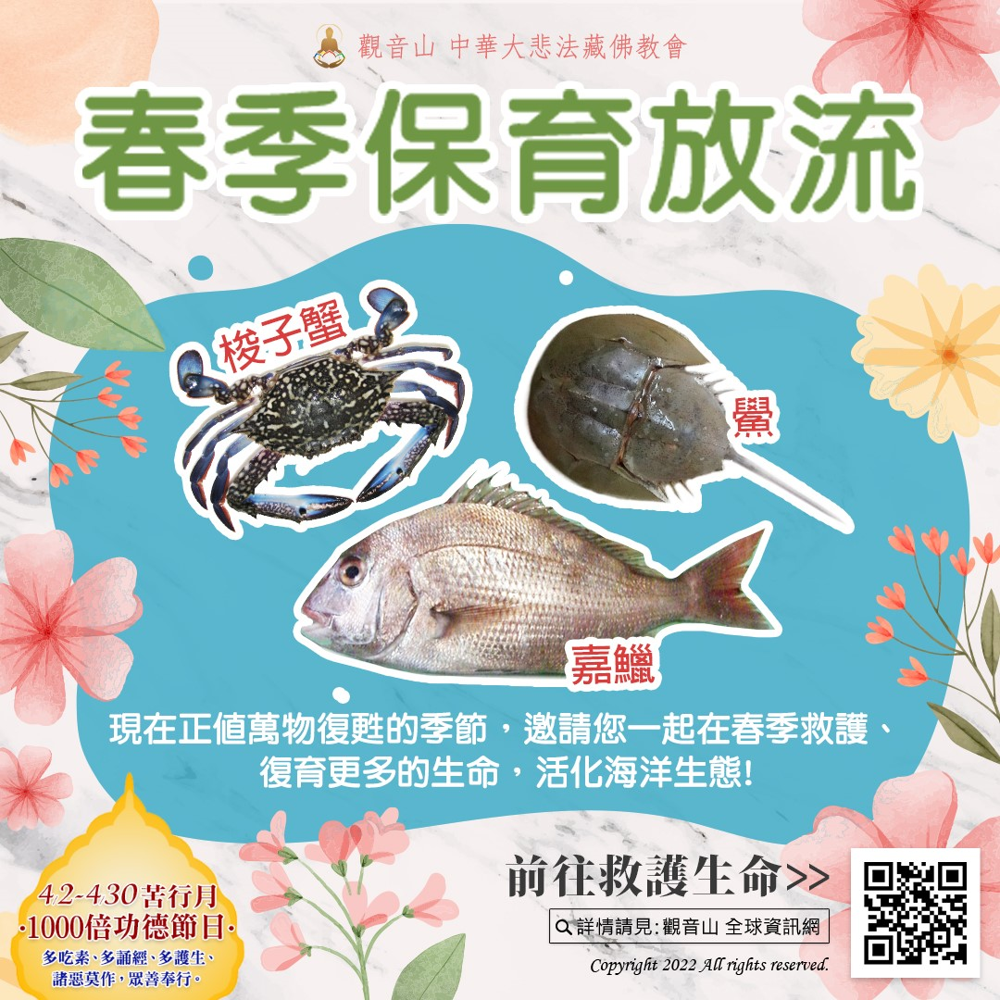

# 春季保育放流  搶救梭子蟹、鱟、嘉鱲

## 📋 基本資訊 / Recipe Overview
- **料理名稱**：春季保育放流  搶救梭子蟹、鱟、嘉鱲
- **原始標題**：【春季保育放流 】搶救梭子蟹、鱟、嘉鱲
- **素食流派 / Diet**：全素 Vegan
- **來源平台 / Source**：[觀音山 · 素食料理簡單做](https://vegan.gys.org.tw/rescue20220407/)

## 📖 食譜圖文詳情 (中英雙語對照)

【春季保育放流 】搶救梭子蟹、鱟、嘉鱲​
前往救護生命►
https://bit.ly/3InbEOQ​
​
人天七德：「種姓高貴、形色端嚴、長壽、無病、緣分優異、財勢富足和智慧廣大。」其中長壽和無病之根即是放生，放生亦是其餘五德之助緣。現在正值萬物復甦的季節，觀音山 邀請您一起在春季救護、復育更多的生命，活化海洋生態，也能懺悔殺業、累積無量功德！​
​
❶ 梭子蟹​
穀雨前後(約四月中旬)的蟹是最豐滿、蟹黃色艷味香，幾乎沒有吃素的人，都吃過蟹之料理。現在有因緣，可以參與施放成蟹與蟹苗，這是懺悔殺業、累積功德最好的機會。由於過度捕撈，導致海洋自然生長的梭子蟹日益減少。​
​
每隻雌蟹在繁殖季節能產2～3次卵，總數約幾十萬至二百萬粒卵者皆有。觀音山透過與水試所配合，將繁殖成功的梭子蟹苗進行海放，讓牠們重回大海的懷抱，自由徜徉在海洋裡。​
​
❷ 鱟​
每年的春夏季便是鱟的繁殖季節，鱟不是魚類，而是海洋底棲的無脊椎動物，外型有點像鋼盔。鱟可以說是探討海岸健康的指標物種之一，除了海洋污染導致牠們無法健康成長；人類為了滿足口腹之慾更是令鱟數量大幅減少的主因。因為受到過度捕撈，數量銳減，被世界自然基金會列為海洋十寶之一。​
​
❸ 嘉鱲​
嘉鱲的成魚可以長至80-100公分，而人類這種追求物以稀為貴的心態導致大海裡的嘉鱲被大量補殺，海洋裡的魚類資源因為過度捕撈，不但使得數量衰減，魚體小型化日益明顯，因為魚類還來不及長大，便會被捕殺。​
​
海洋復育便是依不同魚類的生長環境與條件，而進行魚苗的放流，活化海洋生態。邀請您一起響應觀音山 保育放流，共同拯救萬千生靈！​
​
╍╍╍╍╍╍╍╍╍╍╍╍╍╍╍╍╍╍╍╍╍​
★觀音山的保育放流特點​
一、遵守國家相關政策，經專業機構輔導，進行合法保育放流；同時確保生靈存活率。​
二、除保育放流外，與專業機構合作，共同守護海洋平衡，修復海洋生態系，為海洋生物建造一處幸福園地。​
三、為生靈授以皈依與佛法加持，令其深結佛緣，種下未來世得以學佛修行的種子，脫六道輪迴之苦。​
​
​
✨慈悲的 龍德上師成立「觀音山蔬食館」提倡健康素食、慈悲護生，以”觀音山素食料理簡單做”的理念，提供多款素食食譜，讓您一學就會！🥰
◎觀音山吉祥洲官方部落格​
https://news.gys.org.tw/
​
🌱觀音山 素食料理簡單做🌱
◎Facebook ｜好文按讚​
https://www.facebook.com/GYSVegan​
​
◎Instagram ｜料理追蹤​
https://www.instagram.com/gysvegan/​
​
◎Youtube ​ ​ ​ ｜加入訂閱​
https://reurl.cc/q8VEqy​
​
◎官方Blog ​ ​ ｜網站推薦​
https://vegan.gys.org.tw/​
​
—​
👑歡迎轉載，請註明出處： 觀音山 素食料理簡單做 GYSVegan 素食環保愛地球，健康營養無負擔，慈悲護生一起來~😊

---
*食譜歸檔時間：2026-08-20 · 來源：觀音山素食料理簡單做 (vegan.gys.org.tw)*