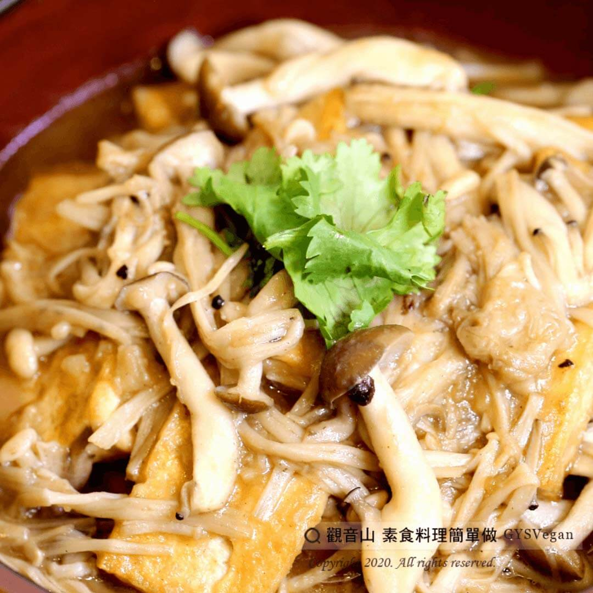

# 時蔬豆腐煲

## 📋 基本資訊 / Recipe Overview
- **料理名稱**：時蔬豆腐煲
- **原始標題**：時蔬豆腐煲｜全素
- **素食流派 / Diet**：全素 Vegan
- **料理分類 / Category**：湯品系列
- **來源平台 / Source**：[觀音山 · 素食料理簡單做](https://vegan.gys.org.tw/tofu-pot20201020/)

## 📖 食譜圖文詳情 (中英雙語對照)

豆腐搭配天然鮮菇，只要簡單調味，就能吃出食材最自然的美味！
觀音山素食團主廚 特別提供這道家常豆腐料理－『時蔬豆腐煲 』，金黃色澤的香煎豆腐、菇類的鮮味，配上吸收醬汁入味鬆軟的馬鈴薯，真是太美味了~~~！！趕快來試試看吧~​
​
準備食材與佐料：(3人份)​
豆腐一大塊切片、馬鈴薯一顆、鴻喜菇一包、金針菇一把、香菜少許、香油少許、素蠔油2匙(20ml)、胡椒粉適量、鹽巴適量，水少許。​
​
#素食料理簡單做，開始：​
1. 將豆腐洗淨切片，放入鍋中煎至黃金色，取出備用。​
2. 馬鈴薯去皮，放入電鍋中蒸熟後搗成泥，備用。​
3. 先將鴻喜菇、金針菇炒香，加入水、素蠔油、胡椒粉、鹽巴進行調味。​
4. 再放入馬鈴薯泥，增加稠度。​
5. 最後放入豆腐，煮5分鐘後，加入香油、香菜，擺盤上桌。​
​
這道簡單又美味的料理就完成了~​
​
本食譜提供：高雄 觀音山蔬食團 主廚 樂熹​
​
✨慈悲的 龍德上師成立「觀音山蔬食館」提倡健康素食、慈悲護生，以”觀音山素食料理簡單做”的理念，提供多款素食食譜，讓您一學就會！
Seasonal vegetable tofu stew｜Vegan
Tofu is paired with natural fresh mushrooms. With simple seasoning, you can enjoy the most natural taste of the ingredients!
The chef of Guanyin Mountain Vegetarian Group specially provides this homemade tofu ingredient – “Seasonal Vegetable Tofu Pot.” The golden pan-fried tofu, the umami of mushrooms, and the soft potatoes that absorb the sauce are so delicious~~~?!! Come and try it now~
​
◎Prepare ingredients and condiments (serves three people)
A large piece of tofu, diced potatoes, a pack of Hongxi mushrooms, a little enoki mushroom, a little coriander, a little sesame oil, two tablespoons of vegetarian oyster sauce (20ml), a little pepper starch, salt starch, and a little water.
​
◎Vegetarian dishes are easy to make, start with:
1. Slice the tofu, fry it in a pan until golden, remove it, and set aside.
2. Peel the potatoes, steam them in an electric pot, and mash them into puree. Set aside.
3. First, stir-fry Hongxi mushrooms and Enoki mushrooms until fragrant, then add water, vegetarian oyster sauce, pepper, and salt to taste.
4. Add mashed potatoes to increase the consistency.
5. Finally, add tofu, cook for 5 minutes, then add sesame oil and coriander, plate and serve.
​
This is a simple and delicious dish~
​
​
​
觀音山素食料理簡單做 ​ Follow us
Facebook ｜好文按讚
http://www.facebook.com/GYSVegan​
Instagram ｜料理追蹤
http://www.instagram.com/gysvegan/​
Youtube ​ ​ ​ ｜加入訂閱
https://reurl.cc/q8VEqy​
Telegram ​ ｜頻道推薦
https://t.me/GYSVegan​
​
​
歡迎轉載，請註明出處： ​ ​ 觀音山 素食料理簡單做GYSVegan按讚、留言設定搶先看! 素食環保愛地球，健康營養無負擔，慈悲護生一起來~

---
*食譜歸檔時間：2026-08-20 · 來源：觀音山素食料理簡單做 (vegan.gys.org.tw)*