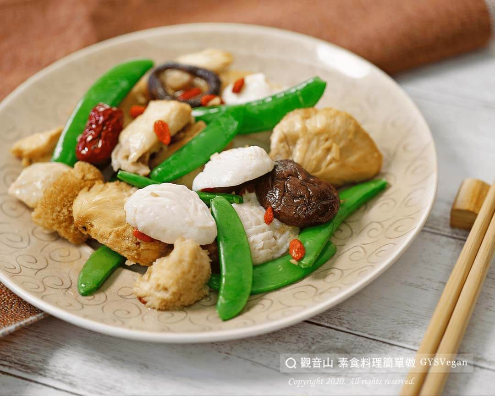

# 暖心猴頭菇素腰花

## 📋 基本資訊 / Recipe Overview
- **料理名稱**：暖心猴頭菇素腰花
- **原始標題**：暖心猴頭菇素腰花｜全素
- **素食流派 / Diet**：全素 Vegan
- **來源平台 / Source**：[觀音山 · 素食料理簡單做](https://vegan.gys.org.tw/409-2/)

## 📖 食譜圖文詳情 (中英雙語對照)

猴頭菇性平味甘，有利五臟、助消化、滋補身體等功效，並增強免疫功能，這道「暖心猴頭菇素腰花料理」，使用麻油猴頭菇料理包，搭配素腰花、甜豆烹煮，簡單易學好上手，健康又美味！
一起跟著「觀音山蔬食館」的主廚，素食料理簡單做吧！​
​
?食材及佐料〔Ingredients〕：(3人份)​
▪麻油猴頭菇料理包 300克​
▪素腰花 200克​
▪甜豆100克​
▪枸杞適量​
▪薑適量​
▪麻油適量​
▪鹽巴適量​
▪白醋適量​
​
?烹飪步驟：​
1.素腰花切半洗淨，熱水加少許白醋，汆燙素腰花，備用。​
2.薑切末，甜豆稍微汆燙冰鎮，備用。​
3.熱鍋，用麻油爆香薑末，加入料理包內猴頭菇、香菇稍微炒香。​
4.加入素腰花、甜豆，適量料理包湯汁略煮。​
5.加入適量鹽巴調味，撒上枸杞，起鍋擺盤，完成！​
​
⭐️特別說明：​
1.湯汁可因個人喜好，選擇盛盤上桌。​
2.麻油猴頭菇料理包，素料行即有販售。​
​
??本食譜提供：台中 #觀音山蔬食館 主廚 樂卿​
​
✨慈悲的 龍德上師成立「觀音山蔬食館」提倡健康素食、慈悲護生，以”觀音山素食料理簡單做”的理念，提供多款素食食譜，讓您一學就會！?​
​
​
?觀音山 素食料理簡單做 ​ Follow us?​
Facebook ｜好文按讚
http://www.facebook.com/GYSVegan​
Instagram ｜料理追蹤
http://www.instagram.com/gysvegan/​
Youtube ​ ​ ​ ｜加入訂閱
https://reurl.cc/q8VEqy​
Telegram ​ ｜頻道推薦
https://t.me/GYSVegan​
​
​
? 歡迎轉載，請註明出處： ​ ​ 觀音山 素食料理簡單做GYSVegan按讚、留言設定搶先看! 素食環保愛地球，健康營養無負擔，慈悲護生一起來~?

---
*食譜歸檔時間：2026-08-20 · 來源：觀音山素食料理簡單做 (vegan.gys.org.tw)*