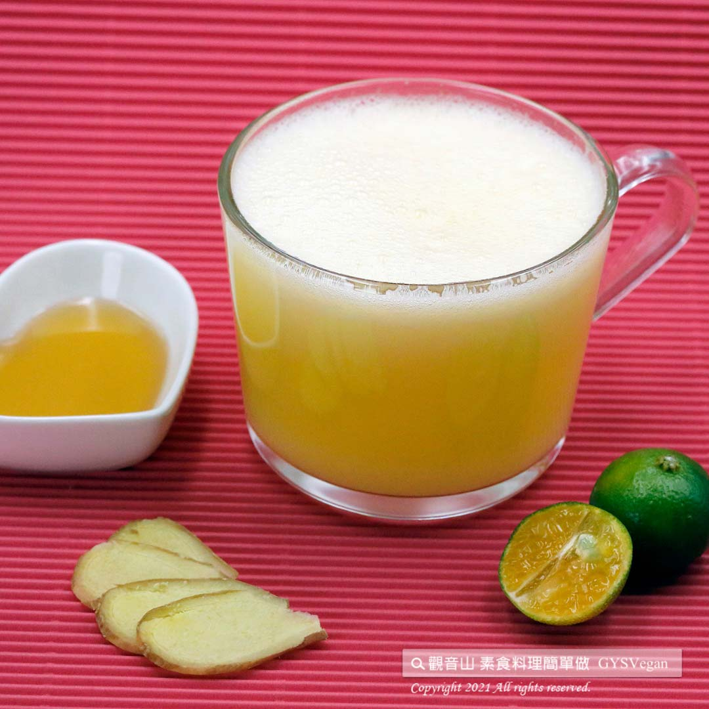

# 暖暖蘋果汁

## 📋 基本資訊 / Recipe Overview
- **料理名稱**：暖暖蘋果汁
- **原始標題**：暖暖蘋果汁｜全素
- **素食流派 / Diet**：全素 Vegan
- **來源平台 / Source**：[觀音山 · 素食料理簡單做](https://vegan.gys.org.tw/apple-juice20211022/)

## 📖 食譜圖文詳情 (中英雙語對照)

早晨一杯暖暖蘋果汁，喝出健康的味道與蜂蜜檸檬的酸甜，搭配活血祛寒的生薑，絕對是秋冬暖心、暖身又防疫的最佳飲品，快跟著觀音山主廚，一起素食料理簡單做吧！​
​
◎食材及佐料〔Ingredients〕：(1人份)​
▪️蘋果 ​ 1顆 ​ ​ ​ ​ ​ ​ ​ ​
▪️蜂蜜 ​ 適量​
▪️檸檬汁 ​ 少許​
▪️薑末 ​ 15克​
▪️飲用水 ​ 150c.c​
​
◎烹飪步驟：​
1.蘋果洗淨去皮切片。​
2.將食材放入果汁機中攪打均勻。​
3.放入杯中即可享用！​
​
【特別說明】​
蜂蜜可用楓糖替代。​
​
本食譜提供：台中觀音山蔬食館 ​
​
✨慈悲的 龍德上師成立「觀音山蔬食館」提倡健康素食、慈悲護生，以”觀音山素食料理簡單做”的理念，提供多款素食食譜，讓您一學就會！
​
​
★10月23日 佛陀天降月．觀世音菩薩節日：善惡業增長10億倍x1千萬倍​
​
✨殊勝功德增長日✨​
觀音山邀請您於10月23日響應素食、廣修供養、戒殺護生、誦經修法、行持諸種善行，獲福無量。​
​
​
【recipe】​
​
In the morning, having cup of this apple ginger juice is healthy and refreshing for the day. This taste of sweet honey, sour lemon blended with slightly spicy ginger promotes blood circulation and alleviates chills. It is definitely the best drink for warming up your body and preventing epidemics in the autumn and winter. Follow the chef of Guanyinshan, let’s make vegetarian dishes easy!​
​
◎Ingredients : （For 1 people）​
▪️An apple ​ ​ ​ ​ ​ ​ ​ ​
▪️Honey ​ , adequate amount​
▪️Lemon juice ​ , a little​
▪️Ginger ​ 15g​
▪️Water ​ 150c.c​
​
◎Cooking steps:​
1. Wash and peel the apples and slice them.​
2. Put all ingredients in a blender and process until smooth.​
3. Pour it over in a glass and enjoy!​
​
[Special notes]​
Maple syrup can be substituted for honey.​
​
This recipe is provided by Guanyinshan Green Restaurant, Taichung.​
​
​
☆觀音山 素食料理簡單做 ☆
◎Facebook ｜好文按讚
https://www.facebook.com/GYSVegan​
◎Instagram ｜料理追蹤
https://www.instagram.com/gysvegan/​
◎Youtube ​ ​ ​ ｜加入訂閱
https://reurl.cc/q8VEqy​
◎官方Blog ​ ​ ｜網站推薦
https://vegan.gys.org.tw/​
​
​
—​
歡迎轉載，請註明出處：觀音山 素食料理簡單做 GYSVegan 素食環保愛地球，健康營養無負擔，慈悲護生一起來~

---
*食譜歸檔時間：2026-08-20 · 來源：觀音山素食料理簡單做 (vegan.gys.org.tw)*