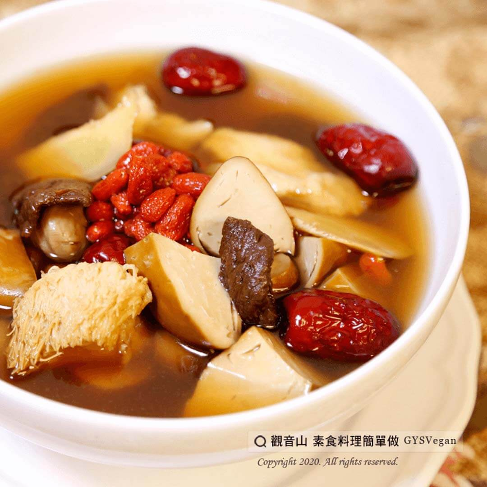

# 栗子菜脯素G湯

## 📋 基本資訊 / Recipe Overview
- **料理名稱**：栗子菜脯素G湯
- **原始標題**：栗子菜脯素G湯｜全素
- **素食流派 / Diet**：全素 Vegan
- **來源平台 / Source**：[觀音山 · 素食料理簡單做](https://vegan.gys.org.tw/preserved-chestnuts-and-vegetables20201020/)

## 📖 食譜圖文詳情 (中英雙語對照)

近日氣溫驟降，明顯地感受到冬天的寒意，這時除了注意早晚保暖外，最幸福的就是來碗熱湯暖暖身子。​
這道溫補去寒、補脾健胃的「 栗子菜脯素G湯」，正是適合最近涼涼的天氣。​
一起跟著「觀音山蔬食館」的主廚，素食料理簡單做吧！​
​
食材及佐料〔Ingredients〕：（4人份）​
▪栗子16顆​
▪紅棗8顆​
▪枸杞8克​
▪豆雞200克​
▪猴頭菇100克​
▪乾香菇適量​
▪薑片5片​
▪老菜脯100克​
▪鹽巴5克​
​
烹飪步驟：​
1.將栗子、薑片、紅棗、老菜脯煮熟，過程約15分鐘。​
2. 利用老菜脯把湯上色的煮湯時間，先把乾香菇爆香，備用。​
3.熱油鍋小火慢炸豆雞，或可買現成炸好的。​
4.處理食材的時間，湯也煮得差不多了。栗子煮熟、湯變色後，把所有食材倒入鍋中。​
5.蓋上鍋蓋，悶煮一會，加入少許鹽調味，完成！​
​
本食譜提供：台中 觀音山蔬食館 主廚 樂卿​
​
✨慈悲的 龍德上師成立「觀音山蔬食館」提倡健康素食、慈悲護生，以”觀音山素食料理簡單做”的理念，提供多款素食食譜，讓您一學就會！​Chestnut and Vegetable Preserved Vegetarian G Soup｜Vegan
The weather has suddenly dropped sharply in recent days, clearly ushering in the winter chill. In addition to keeping warm in the morning and evening, the happiest thing is to warm up with a bowl of hot soup.
This “Chestnut and Vegetable Preserved Vegetable G Soup,” which warms and removes cold, nourishes the spleen, and strengthens the stomach, is just suitable for the recent cool weather.
Let’s follow the chef of “Guanyinshan Vegetable Restaurant” and make vegetarian ingredients simple!
​
◎Ingredients and condiments [Ingredients]: (for four people)
▪ 16 chestnuts
▪ Eight red dates
▪ 8 grams of wolfberry
▪ 200g soy chicken
▪ Hericium erinaceus 100 grams
▪ Dried Shiitake Mushrooms Countertop
▪ Five slices of ginger
▪ 100g preserved vegetables
▪ 5 grams of salt
​
◎Cooking steps:
1. Cook chestnuts, ginger slices, red dates, and vegetables for about 15 minutes.
2. Use the cooking time to use the preserved vegetables to color the soup. Saute the dried mushrooms until fragrant and set aside.
3. Heat the oil in a pan over low heat and fry the bean chicken slowly, or you can buy it freshly fried to make it delicious.
4. In the time it takes to process the ingredients, the soup is almost done. Once the chestnuts are cooked, and the soup has changed color, add any contaminants to the pot.
5. Cover the pot, simmer for a while, add a little salt to taste, and done!
​
觀音山 素食料理簡單做 ​ Follow us
Facebook ｜好文按讚
http://www.facebook.com/GYSVegan
​
Instagram ｜料理追蹤
http://www.instagram.com/gysvegan/​
Youtube ​ ​ ​ ｜加入訂閱
https://reurl.cc/q8VEqy​
Telegram ​ ｜頻道推薦
https://t.me/GYSVegan
​
​
​歡迎轉載，請註明出處： ​ ​ 觀音山 素食料理簡單做GYSVegan按讚、留言設定搶先看! 素食環保愛地球，健康營養無負擔，慈悲護生一起來~?

---
*食譜歸檔時間：2026-08-20 · 來源：觀音山素食料理簡單做 (vegan.gys.org.tw)*