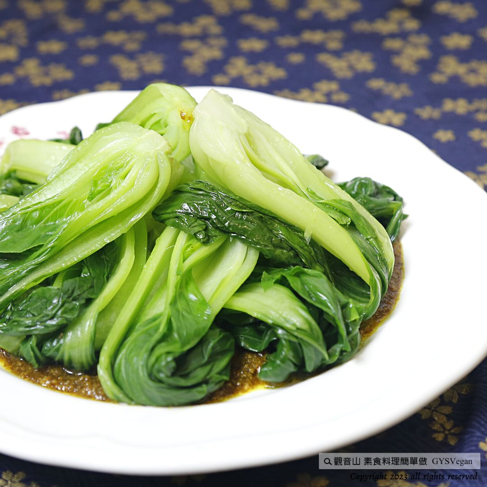

# 椰香咖哩燴青江

## 📋 基本資訊 / Recipe Overview
- **料理名稱**：椰香咖哩燴青江
- **原始標題**：家常料理｜椰香咖哩燴青江｜全素
- **素食流派 / Diet**：全素 Vegan
- **料理分類 / Category**：中式料理
- **來源平台 / Source**：[觀音山 · 素食料理簡單做](https://vegan.gys.org.tw/green-cabbage20230303/)

## 📖 食譜圖文詳情 (中英雙語對照)

家常料理 ★椰香咖哩燴青江★全素
餐桌上最受青睞的咖哩醬，濃郁的南洋天然辛香料風味，搭配新鮮飽滿、脆甜多汁的青江菜，吃出多層次的口感，是一道非常容易上手的滿分宴客菜單，可以添加不同的蔬菜做變化，快跟著觀音山主廚，一起素食料理簡單做吧！ ​ ​
​ ​
🔲食材及佐料〔Ingredients〕：(5人份)
▪️青江菜 ​ 5顆
▪️咖哩塊(或咖哩醬)、薑末 ​ 各20克
▪️椰漿、水、沙拉油 ​ 適量
▪️鹽 少許
​ ​
🔲烹飪步驟：
【刀工/前處理】
1.青江菜洗淨，將蒂頭稍微切平整備用
​
【調理作法】
1.準備一鍋水，將水煮沸，加入少許鹽，放入青江菜汆燙熟，瀝乾水份備用。
2.椰香咖哩醬；炒鍋加入油，加熱後放入薑末爆香，加入水、咖哩塊，煮滾後試味道並調味，最後倒入椰漿適量略煮即可。
3.將青江菜擺入盤中，再淋上椰香咖哩醬即可享用。
​
本食譜提供：台中觀音山蔬食館
​
​ ​​
▌慈悲的龍德上師 成立「觀音山蔬食館」提倡健康素食、慈悲護生，以”觀音山素食料理簡單做”的理念，提供多款素食食譜，讓您一學就會！
​
▌觀音山相關連結
➠
https://www.fazang.org/link/
​ ​
​
▌觀音山近期活動
3月8日 觀音薈供法會
✦登記「除障祿位 / 超薦蓮位」
https://bit.ly/3HXmCO7
✦護持「薈供供品」供養三寶
https://bit.ly/3bHzJ8H
【recipe】
​
The most well-known curry sauce on the table, rich in South China Sea natural spice flavor, mixed and march with fresh, full, crispy, sweet, and juicy green cabbage, it makes you a multi-layered taste. It is a very easy-to-cook with full credits banquet menu. You can add different vegetables. Let’s make simple vegetarian dishes with Chef Guanyinshan! ​
​ ​
🔲 Ingredients and condiments [Ingredients]: (5 servings)
▪️Green cabbages 5 pcs
▪️Curry block (or curry paste), 20 grams each of minced ginger and curry paste
▪️Appropriate amount of coconut milk, water, salad oil
▪️a pinch of salt
​ ​
🔲 Cooking steps:
【Knife/Pretreatment】
1. Wash the Green cabbages, cut the stem slightly flat and set aside
​
[conditioning method]
1. Prepare a pot of water, boil the water, add a pinch of salt, put in green cabbage until cooked, drain and set aside.
2. Coconut-flavored curry paste; add oil to the frying pan, heat it, add minced ginger, and saute them, add water and curry cubes, bring to a boil, taste and season, and finally pour in some coconut milk and cook for a few minutes.
3. Put Green cabbages on the plate, and then pour over the coconut curry sauce and enjoy it.
​
This recipe is provided by: Taichung Guanyinshan Vegetable Restaurant
​ ​
​ ​
—
歡迎轉載，請註明出處： 觀音山素食料理簡單做 GYSVegan 素食環保愛地球，健康營養無負擔，慈悲護生一起來~

---
*食譜歸檔時間：2026-08-20 · 來源：觀音山素食料理簡單做 (vegan.gys.org.tw)*