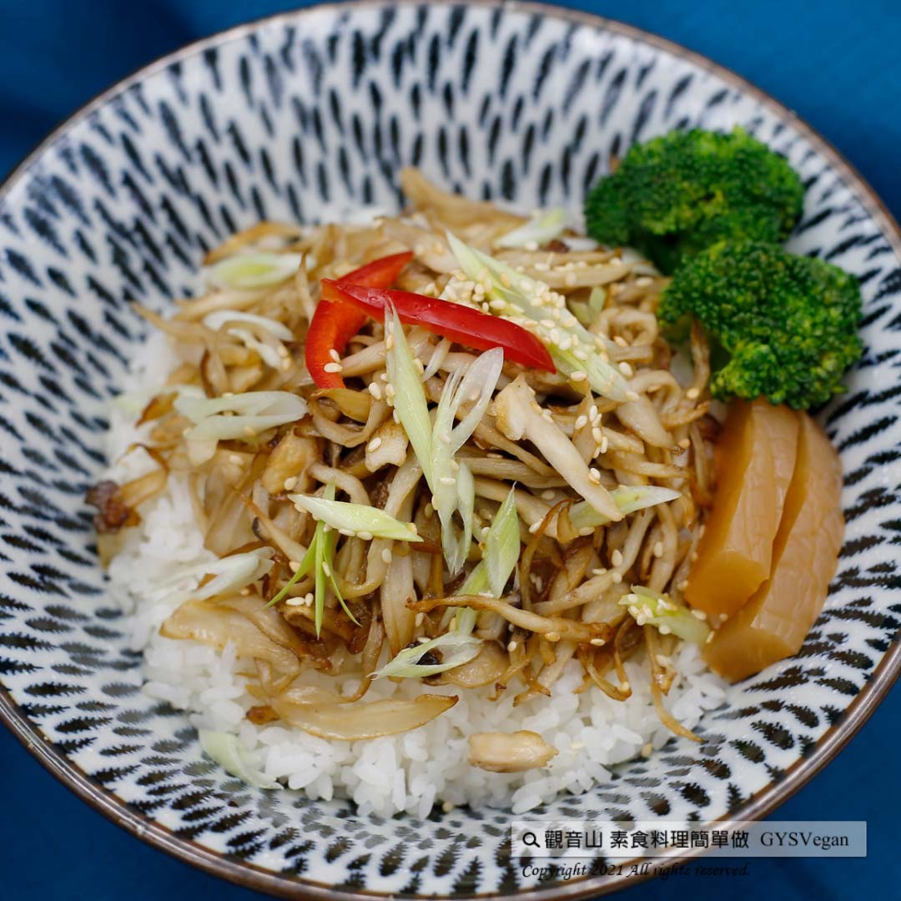

# 極簡G絲蓋飯

## 📋 基本資訊 / Recipe Overview
- **料理名稱**：極簡G絲蓋飯
- **原始標題**：日式料理｜極簡G絲蓋飯 ｜全素
- **素食流派 / Diet**：全素 Vegan
- **料理分類 / Category**：主食種類 / 米麵主食 (Staple Food)
- **來源平台 / Source**：[觀音山 · 素食料理簡單做](https://vegan.gys.org.tw/vegetarian-donburi20211224/)

## 📖 食譜圖文詳情 (中英雙語對照)

手撕杏鮑菇絲，慢火乾煸充分吸收香油的香氣，滑潤扎實的口感，撒上熟成芝麻、脆甜的碧玉筍，成為一道暖心的蓋飯料理，快跟著觀音山主廚，一起素食料理簡單做吧！​
​
?食材及佐料〔Ingredients〕：(1人份)​
▪️杏鮑菇 ​ 2條 ​
▪️白飯 ​ 200克 ​
▪️碧玉筍 ​ 1支 ​
▪️白芝麻、白胡椒粉 ​ 適量​
▪️日本或韓國香油、鹽 ​ 適量​
​
?烹飪步驟：​
【刀工/前處理】​
1.杏鮑菇剝成絲狀。​
2.碧玉筍斜切成細圈狀。​
​
【調理作法】​
1.1.杏鮑菇絲不加油，乾鍋煎上色，撒鹽、加入白胡椒粉、香油，繼續炒香。反覆添加香油再炒香，此步驟重複約2-3次，使杏鮑菇充分吸收香油香氣。​
2.白飯置於碗中，鋪上炒好的杏鮑菇，撒上芝麻、碧玉筍即可享用。​
​
【特別說明】​
1.菇類若要水洗，要迅速沖洗，切記不要泡在水中，以免吸收水分，菇的香氣就會流失。​
2.非常適合冬天的一道暖心料理。​
​
??本食譜提供：台中觀音山蔬食館​
​
✨慈悲的龍德上師 成立「觀音山蔬食館」提倡健康素食、慈悲護生，以”觀音山素食料理簡單做”的理念，提供多款素食食譜，讓您一學就會！?
​
​
★12月25日 地藏王菩薩節日：善惡業增長一億倍​
​
✨殊勝功德增長日✨​
觀音山邀請您於12月25日響應素食、廣修供養、戒殺護生、誦經修法、行持諸種善行，獲福無量。​
​
​
【recipe】​
​
? By shredding king oystery mushroom, stir-friying over low heat to fully absorbs the aroma of the sesame oil, this creates a smooth and firm vegetarian pulled pork tastes. Lastly, sprinkle with some sesame seeds, crispy sweet jasper shoots, and then a heart-warming vegetarian-don is provided. Follow the chef of Guanyinshan and let’s cook simple vegetarian dish together! ​ ​
​
?Ingredients : （For 1 people）​
▪️Two king oyster mushroom ​
▪️Rice ​ 200g​
▪️A daylily stem ​
▪️White sesame、White pepper ​ ​ , adequate amount​
▪️Japanese ​ or Korean sesame oil 、Salt , adequate amount​
​
?Instructions:​
【Cutting/ PREP-Ahead】​
1. The thick stem of king oyster mushroom shreds into filaments. ​
2. Cut the daylily stems obliquely. ​ ​
​
【Cooking Steps】 ​
1. Fry king oystery mushroom in a pan without adding any oil. Sprinkle salt, add white pepper, sesame oil, and continue to fry until fragrant. Repeatedly add sesame oil and fry until fragrant. Repeat this step about 2-3 times so that the king oystery mushroom shreds can fully coated in the aroma of the sesame oil. ​
2. In a bowl of rice, topping with the fried king oyster mushroom shreds, sprinkle with sesame seeds and daylily stems. Then, enjoy! ​
​
[Special instructions] ​
1. Rinse king oyster mushrooms over water quickly instead of soaking them in water to avoid losing the fragrance of mushrooms.​
2. This is heart-warming recipe very suitable for winter.​
​
​
?  觀音山 素食料理簡單做  ?  ​
◎Facebook ｜好文按讚​
http://www.facebook.com/GYSVegan​
​
◎lnstagram ｜料理追蹤​
http://www.instagram.com/gysvegan/​
​
◎Youtube ｜加入訂閱​
https://reurl.cc/q8VEqy​
​
◎Telegram ｜頻道推薦​
https://t.me/GYSVegan​
​
—​
? 歡迎轉載，請註明出處： 觀音山 素食料理簡單做 GYSVegan 素食環保愛地球，健康營養無負擔，慈悲護生一起來~?

---
*食譜歸檔時間：2026-08-20 · 來源：觀音山素食料理簡單做 (vegan.gys.org.tw)*