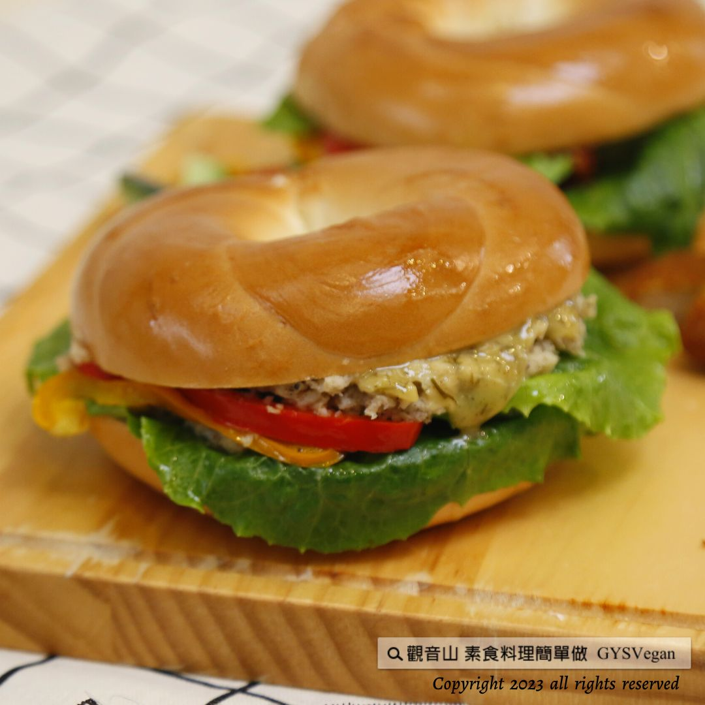

# 母親節料理特輯

## 📋 基本資訊 / Recipe Overview
- **料理名稱**：母親節料理特輯
- **原始標題**：母親節料理特輯
- **素食流派 / Diet**：全素 Vegan
- **來源平台 / Source**：[觀音山 · 素食料理簡單做](https://vegan.gys.org.tw/mothers-day20230512/)

## 📖 食譜圖文詳情 (中英雙語對照)

【母親節料理特輯】
五月是個充滿感恩的月份，一年一度的母親節即將到來，也是對母親表達感謝的最佳時刻。
​
慈悲 龍德上師開示：孝道是人世間最強，最吉祥的力量！【觀音山素食料理簡單做】敬邀您在報母恩的節日，以戒殺護生功德迴向至親至愛的母親， 祈願媽媽能延壽增福、身心安樂！用素食來照顧母親身體健康，用心備辦活力養生早餐【蒔蘿芥末素鮪魚貝果+堅果莓果盅】，迎接周末即將到來的母親節假期！
​ ​
✨蒔蘿芥末素鮪魚貝果✨
◎食材及佐料〔Ingredients〕：(5人份)
▪️全素鮪魚 ​ 100克
▪️貝果 ​ 5個
▪️蘿美生菜、甜椒 ​ 各1顆 ​ ​ ​
▪️茴香葉、美式芥末醬 ​ 各50克
▪️全素美奶滋 ​ 70克
​
◎烹飪步驟：
【刀工/前處理】
1.蘿美生菜洗淨，手撕對半備用。
2.甜椒洗淨去籽，切條備用。
3.茴香葉洗淨瀝乾，切碎備用。
【調理作法】
1.貝果電鍋蒸熱備用。
2.素鮪魚拌入適量的粗黑胡椒備用。
3.茴香芥末醬:取一個乾淨容器，放入芥末醬、美奶
​ 滋、茴香、糖適量，拌勻備用。
4.貝果底部抹茴香芥末醬，依序擺上素鮪魚→蘿美生
​ 菜→甜椒→茴香芥末醬，即可擺盤享用！
​
​
✨堅果莓果盅✨
◎食材及佐料〔Ingredients〕：(5人份)
▪️草莓 ​ 10顆
▪️新鮮藍莓 ​ 15顆
▪️綜合堅果 ​ 150克 ​ ​ ​
▪️草莓果醬 ​ 適量
​
◎烹飪步驟：
【刀工/前處理】
1. 草莓、藍莓洗淨備用。
【調理作法】
1. 準備一個喜歡的小容器。
2. 依序擺入:草莓、草莓醬、堅果、藍莓。擺盤完成即可享用!
​
本食譜提供：台中 觀音山蔬食館
​
​ ​
▌慈悲的 龍德上師 成立「觀音山蔬食館」提倡健康素食、慈悲護生，以”觀音山素食料理簡單做”的理念，提供多款素食食譜，讓您一學就會！
​
觀音山相關連結
➠
https://www.fazang.org/link/
​ ​
▌觀音山近期活動
2023母親節 搶救懷孕的海鱺媽媽
➠
https://bit.ly/3JHM33x
​ ​
​ ​
—
歡迎轉載，請註明出處： 觀音山素食料理簡單做 GYSVegan 素食環保愛地球，健康營養無負擔，慈悲護生一起來~

---
*食譜歸檔時間：2026-08-20 · 來源：觀音山素食料理簡單做 (vegan.gys.org.tw)*