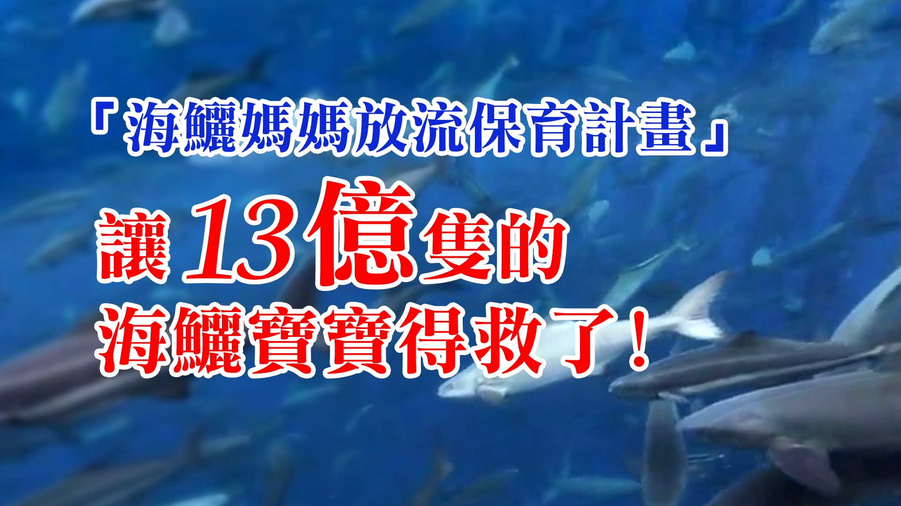

# 民視新聞-放流懷孕海鱺，給地球最好的母親節禮物

## 📋 基本資訊 / Recipe Overview
- **料理名稱**：民視新聞-放流懷孕海鱺，給地球最好的母親節禮物
- **原始標題**：民視新聞-放流懷孕海鱺，給地球最好的母親節禮物
- **素食流派 / Diet**：全素 Vegan
- **來源平台 / Source**：[觀音山 · 素食料理簡單做](https://vegan.gys.org.tw/peoples-tv20210429/)

## 📖 食譜圖文詳情 (中英雙語對照)

【民視新聞】孕育海洋新生命 觀音山 龍德嚴淨仁波切放流懷孕海鱺 給地球最好的母親節禮物​
​
每年四、五月為海鱺的繁殖季節，每隻成年的海鱺約有300萬顆的魚卵，可孕育相當多的新生命，但不幸的是海鱺為饕客的最愛，過度捕撈導致海鱺數量大幅減少。​
​
觀音山 中華大悲法藏佛教會特別選在母親節前夕，邀請民眾一同至澎湖放生懷孕的海鱺媽媽，期待孕育出更多新生命，也是送給地球最好的母親節禮物。​
​
搶救懷孕的海鱺媽媽 愛護海洋‧保育放流活動​
➤
https://www.fazang.org/liferelease/​
​
您的護生善行，拯救萬千生靈，功德無量！​
​
每年五月是母海鱺的繁殖季節，觀音山 中華大悲法藏佛教會和澎湖漁民合作，進行保育放流，只見漁網裡的海鱺用力擺動身體、這是開心的時刻，因為不是要被載去魚市場，而是即將回到大海的家。​
專家認為這是一堂寶貴的生命課程，因為一隻母海鱺，就有300萬顆左右的魚卵。​
國立澎湖科技大學副教授方祥權指出，「15-25公斤的母海鱺，可以生產300萬顆的受精卵，所以就海洋生態保育的角度看來，放流實在是很有意義的活動。」​
成群的海鱺被載到安全的海域，漁網一打開、魚兒立刻游回熟悉的大海。​
這兩年在澎湖不少漁民將海鱺、龍虎斑、龍膽石斑、嘉鱲、黃錫鯛等高經濟價值魚種，飼養在大型箱網中，形成「海洋牧場」的特殊景觀，只是過度捕撈，威脅海鱺的生態，觀音山希望透過放流，讓新生命回歸大海。​
觀音山佛教會 龍德嚴淨仁波切說，「搶救海麗媽媽的保育放流活動，就是要表達對大自然，絕對的友善絕對的敬畏，發揮我們佛教徒平等大愛的精神，希望能夠孕育海洋生生不息。」​
觀音山與澎湖漁民合作，第一波在澎湖外海所做的保育放流母海鱺，等同拯救了約13億顆魚卵的生命回歸海洋。​
適逢母親節釋放海鱺媽媽，代表送給大地之母一份最誠摯的母親節禮物。​
​
2021母親節 搶救懷孕的海鱺媽媽 系列活動：​
【為摯愛的母親祈福─度母四壇供祛病祈福法會】​
法會時間：5月2日星期日 下午2:00 (GMT+8)​
◕為母親恭立「祛病增福祿位」▸​
https://bit.ly/39EGzHM​
​
藏傳佛教四大教派都奉度母為主要的本尊，觀音山特別在母親節前夕舉辦「度母四壇供」法會，祝福天下母親、如母有情眾生都能獲得健康長壽、福慧增長、諸事吉祥。​
​
【溫馨五月─愛護海洋‧保育放流活動 】​
◕加入「搶救懷孕的海鱺媽媽」▸​
https://bit.ly/3ucvUMa​
​
今年施放的種類包含海鱺、魚苗…等急需救助的生靈，將舉辦四場放流，海洋生態復育活動：​
① 5月上旬 │ 台中 麗水港​
② 5月中旬 │ 高雄 中芸沙灘​
③ 5月中旬 │ 台南 安平漁港附近​
④ 5月下旬 │ 台北 沙崙海灘​
恭請慈悲 龍德上師於5月23日(日)「全球護生•保育放流 消災延壽護生法會」主法迴向。​
​
更多請見「觀音山 全球資訊網」​
http://www.fazang.org/index.php?ID=92​
—————————————​
​
歡迎轉載，請註明出處：​
觀音山 法藏吉祥洲-好文分享​
​
按讚設定搶先看，天天看，天天分享，心轉變好吉祥! (Be free to use with remarks for developing Buddhism. Amitabha.)​
​
—————————————​
◎吉祥​洲TG 立即訂閱文章​
https://t.me/gysfazang​
[/vc_column_text][/vc_column][/vc_row]

---
*食譜歸檔時間：2026-08-20 · 來源：觀音山素食料理簡單做 (vegan.gys.org.tw)*