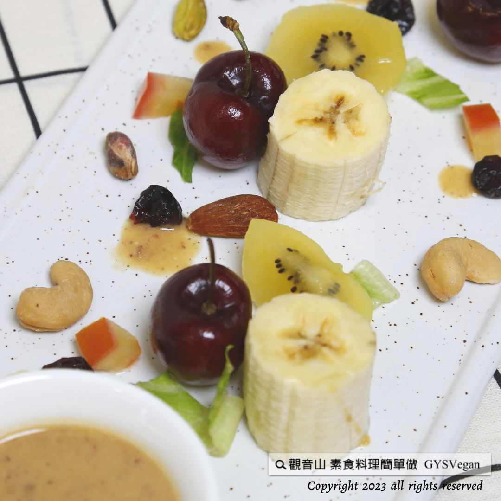

# 沙拉料理 椰橙水果沙拉

## 📋 基本資訊 / Recipe Overview
- **料理名稱**：沙拉料理 椰橙水果沙拉
- **原始標題**：沙拉料理｜椰橙水果沙拉｜全素
- **素食流派 / Diet**：全素 Vegan
- **來源平台 / Source**：[觀音山 · 素食料理簡單做](https://vegan.gys.org.tw/fruit-salad20230707/)

## 📖 食譜圖文詳情 (中英雙語對照)

沙拉料理 ✨椰橙水果沙拉✨全素
口感與營養兼顧的一道輕食，吃得到多種水果的鮮甜滋味，搭配椰橙水果醬的清新香氣、撒上果乾，跟著時令季節變化不同水果；柑橘類、葡萄、奇異果都能降低膽固醇、維護心血管健康，並富含維他命C可以增強免疫力，一道「抗氧化能力」滿分的料理，快跟著觀音山主廚，一起素食料理簡單做吧！
​ ​
◎食材及佐料〔Ingredients〕：
▪️柑橘類水果 ​ 2顆
▪️涼拌豆腐 ​ 2盒
▪️香蕉 ​ 2條
▪️葡萄 ​ 10顆
▪️奇異果 ​ 3顆
▪️椰漿 30cc
▪️綜合果乾、檸檬汁、糖 ​ 適量
​
◎烹飪步驟：
【前製作業】
1.香蕉去皮，切塊備用。
2.奇異果去皮，切片備用。
3.葡萄洗淨，備用。
4.將柑橘水果去皮，取果肉備用。
​
【調理作法】
1.椰橙水果醬:
​ 準備果汁機，洗淨擦乾後，加入柑橘果肉、豆腐、 ​
​ 椰漿、少許糖、檸檬汁適量，打勻備用。
2.準備一個盤子，將香蕉、葡萄、奇異果擺盤。淋上
​ 椰橙水果醬、撒上果乾即可享用。
​
【特別說明】
依喜好調整水果種類，亦可搭配生菜沙拉。
​
​
本食譜提供：台中 觀音山蔬食館
​
​
▌慈悲的 ​ 龍德上師 成立「觀音山蔬食館」提倡健康素食、慈悲護生，以”觀音山素食料理簡單做”的理念，提供多款素食食譜，讓您一學就會！
​
觀音山相關連結
➠
https://www.fazang.org/link/
​ ​
​
▌觀音山近期活動
7月19日 釋迦牟尼佛‧如珍寶加持總集薈供法會
✦ 登記「超薦蓮位、除障祿位」
https://bit.ly/3bH7Z46
✦ 護持「薈供供品」推廣素食愛心公益
https://bit.ly/3bHzJ8H
(登記至7月19日晚上7:00截止)
​ ​
​ ​
—
​ 歡迎轉載，請註明出處： ​ 觀音山素食料理簡單做 GYSVegan 素食環保愛地球，健康營養無負擔，慈悲護生一起來~

---
*食譜歸檔時間：2026-08-20 · 來源：觀音山素食料理簡單做 (vegan.gys.org.tw)*