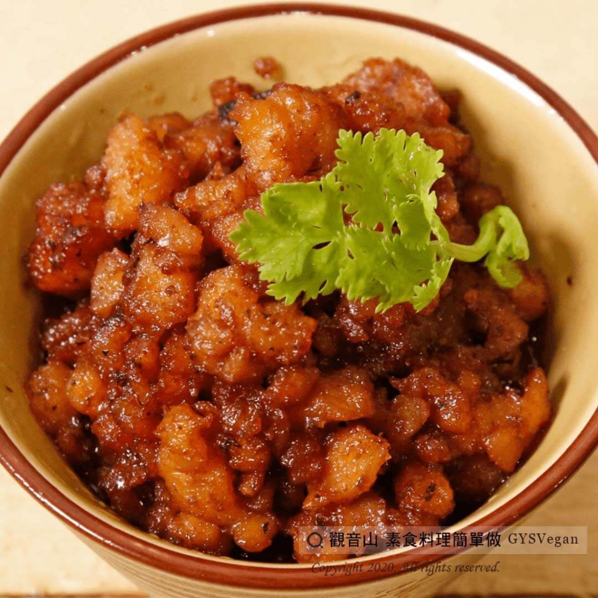

# 沙茶素燥

## 📋 基本資訊 / Recipe Overview
- **料理名稱**：沙茶素燥
- **原始標題**：沙茶素燥｜全素
- **素食流派 / Diet**：全素 Vegan
- **料理分類 / Category**：中式料理
- **來源平台 / Source**：[觀音山 · 素食料理簡單做](https://vegan.gys.org.tw/%e6%b2%99%e8%8c%b6%e7%b4%a0%e7%87%a5/)

## 📖 食譜圖文詳情 (中英雙語對照)

素燥是一道簡單必學的家常料理，自己製作不油膩又健康，可以用來拌飯、拌麵，開胃又下飯！​
快跟著觀音山主廚，一起素食料理簡單做吧！​
​
?食材及佐料〔Ingredients〕：(3人份)​
▪素肉粒 300克​
▪沙茶醬 1大匙​
▪胡椒粉 少許​
​
?烹飪步驟：​
1.將素碎肉用水浸泡約一小時至軟，擠乾水分。​
2.將素碎肉倒入油鍋炸好後，取出備用。​
3.加入素沙茶醬炒香，將素肉粒拌炒均勻。​
4.倒入黑胡椒，轉小火煮10分鐘即可。​
​
??本食譜提供：台中 #觀音山蔬食館 主廚 樂卿​
​
?慈悲的 龍德上師成立「觀音山蔬食館」提倡健康素食、慈悲護生，以”觀音山素食料理簡單做”的理念，提供多款素食食譜，讓您一學就會！?​
​
​
?觀音山 素食料理簡單做 ​ Follow us?​
Facebook ｜好文按讚
http://www.facebook.com/GYSVegan​
Instagram ｜料理追蹤
http://www.instagram.com/gysvegan/​
Youtube ​ ​ ​ ｜加入訂閱
https://reurl.cc/q8VEqy​
Telegram ​ ｜頻道推薦
https://t.me/GYSVegan​
​
​
? 歡迎轉載，請註明出處： ​ ​ 觀音山 素食料理簡單做GYSVegan按讚、留言設定搶先看! 素食環保愛地球，健康營養無負擔，慈悲護生一起來~?

---
*食譜歸檔時間：2026-08-20 · 來源：觀音山素食料理簡單做 (vegan.gys.org.tw)*