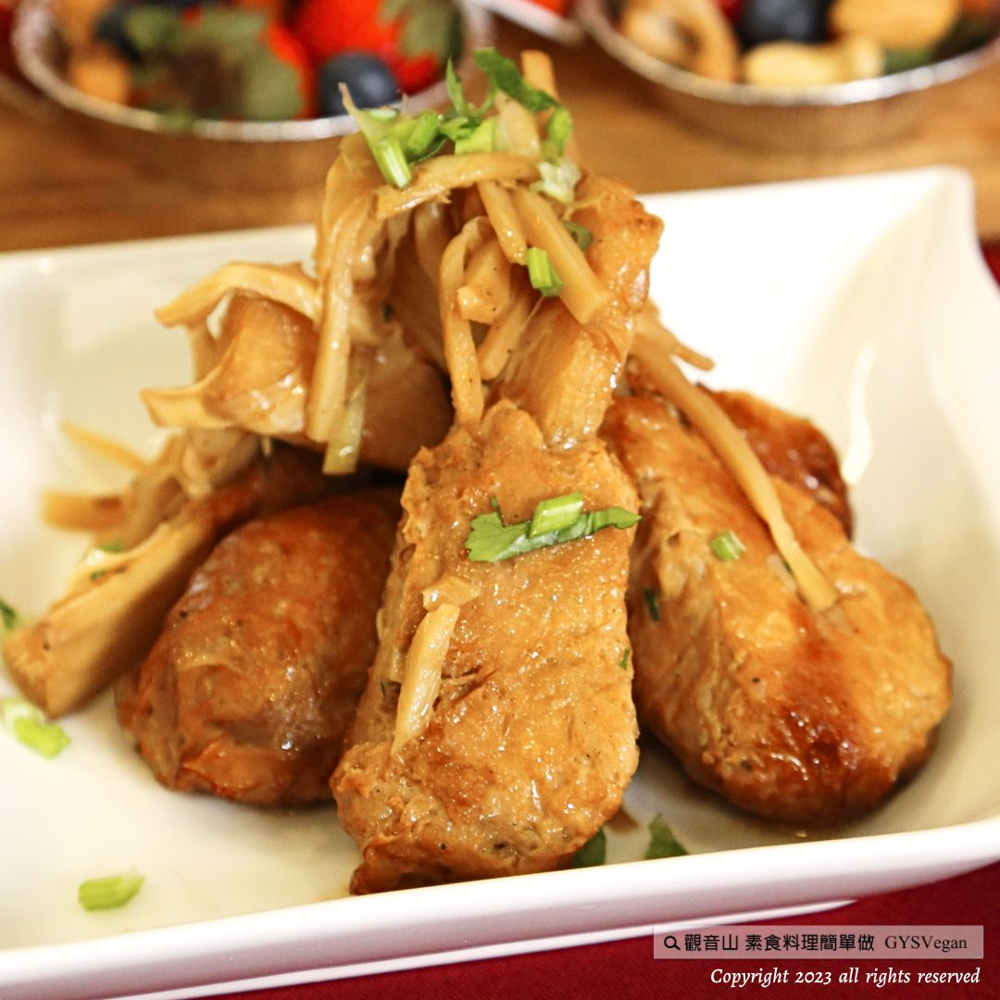

# 油筍棒棒ㄊㄨㄟˇ

## 📋 基本資訊 / Recipe Overview
- **料理名稱**：油筍棒棒ㄊㄨㄟˇ
- **原始標題**：家常料理｜油筍棒棒ㄊㄨㄟˇ｜全素
- **素食流派 / Diet**：全素 Vegan
- **料理分類 / Category**：中式料理
- **來源平台 / Source**：[觀音山 · 素食料理簡單做](https://vegan.gys.org.tw/bangbang-legs20231124/)

## 📖 食譜圖文詳情 (中英雙語對照)

家常料理✨油筍棒棒ㄊㄨㄟˇ✨全素
素食便當主菜總是缺乏變化嗎？ 只需幾個簡單的步驟，就能完成這道香氣四溢的素食佳餚—「油筍棒棒ㄊㄨㄟˇ」，簡單地翻炒，帶出油筍的鮮美脆嫩，配上棒棒腿紮實的口感，入口嫩香多汁，忍不住多添一碗飯，簡易地擺盤，立即成為餐桌上的一大亮點，快跟著觀音山主廚，一起素食料理簡單做吧！
​
​
◎食材及佐料〔Ingredients〕：
▪️素食棒棒腿 ​ ​ ​ ​ ​ ​ 10支
▪️醃漬油筍 ​ ​ ​ ​ ​ ​ ​ ​ ​ ​ 200克
▪️薑片 ​ ​ ​ ​ ​ ​ ​ ​ ​ ​ ​ ​ ​ ​ ​ ​ ​ 30克
▪️素蠔油 ​ ​ ​ ​ ​ ​ ​ ​ ​ ​ ​ ​ ​ 少許
▪️沙拉油 ​ ​ ​ ​ ​ ​ ​ ​ ​ ​ ​ ​ ​ 適量
▪️水 ​ ​ ​ ​ ​ ​ ​ ​ ​ ​ ​ ​ ​ ​ ​ ​ ​ ​ ​ ​ 適量 ​
​
◎烹飪步驟：
【調理作法】
1.炒鍋倒入油加熱，放入薑片炒香，加入油筍、棒棒腿、素蠔油、少許水，拌勻後小火悶煮約10分鐘，即完成。 ​ ​ ​ ​ ​
​
【特別說明】
1.醃漬油筍時常做成罐頭或真空包裝，拆封即可食用，於超市、食品材料行可以購得。 ​
​ ​ ​ ​ ​ ​ ​ ​ ​ ​ ​ ​ ​ ​ ​ ​ ​ ​ ​ ​ ​ ​ ​ ​ ​ ​ ​ ​ ​ ​ ​ ​ ​ ​ ​ ​ ​ ​ ​ ​ ​ ​ ​ ​ ​ ​ ​ ​ ​ ​ ​ ​ ​ ​ ​ ​ ​ ​ ​ ​ ​ ​ ​ ​ ​ ​ ​ ​ ​ ​ ​ ​ ​ ​ ​ ​ ​ ​ ​ ​ ​ ​ ​ ​ ​ ​ ​ ​ ​ ​ ​ ​ ​ ​ ​ ​ ​ ​ ​ ​ ​ ​ ​ ​ ​ ​ ​ ​ ​ ​ ​ ​ ​ ​ ​ ​ ​ ​ ​ ​ ​ ​ ​ ​ ​ ​ ​ ​ ​ ​ ​ ​ ​ ​ ​ ​ ​ ​ ​ ​ ​ ​ ​ ​ ​ ​ ​ ​ ​ ​ ​ ​ ​ ​ ​ ​ ​ ​ ​ ​ ​ ​ ​ ​ ​ ​ ​ ​ ​ ​ ​ ​ ​ ​ ​ ​ ​ ​ ​ ​ ​ ​ ​ ​ ​ ​ ​ ​ ​ ​ ​ ​ ​ ​ ​ ​ ​ ​ ​ ​ ​ ​ ​ ​ ​ ​ ​ ​ ​ ​ ​ ​ ​
​
本食譜提供：台中 觀音山蔬食館
​
​
▌慈悲的 龍德上師 成立「觀音山蔬食館」提倡健康素食、慈悲護生，以”觀音山素食料理簡單做”的理念，提供多款素食食譜，讓您一學就會！
​
📣觀音山相關連結
➠
https://www.fazang.org/link/
​ ​
​
▌觀音山近期活動
12月2日 三寶總集薈供法會
✦ 超薦蓮位、除障祿位、護持薈供供品
https://reurl.cc/K3Lden
​ ​
​ ​
—
歡迎轉載，請註明出處： 觀音山素食料理簡單做 GYSVegan 素食環保愛地球，健康營養無負擔，慈悲護生一起來~

---
*食譜歸檔時間：2026-08-20 · 來源：觀音山素食料理簡單做 (vegan.gys.org.tw)*