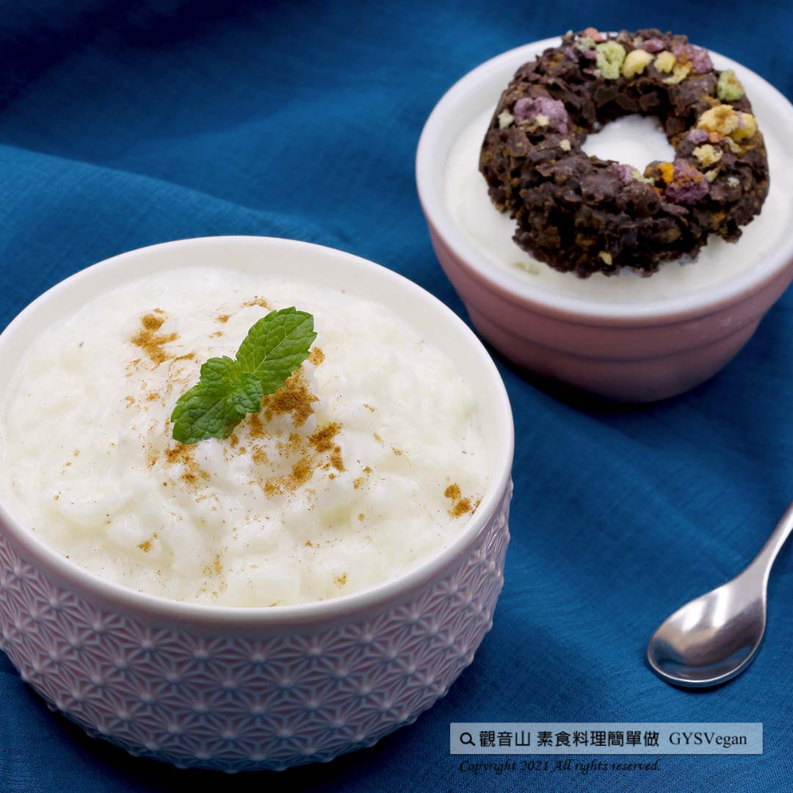

# 法式米布丁

## 📋 基本資訊 / Recipe Overview
- **料理名稱**：法式米布丁
- **原始標題**：電鍋料理 ｜法式米布丁｜奶素
- **素食流派 / Diet**：奶素 Lacto-Vegetarian
- **料理分類 / Category**：主食種類
- **來源平台 / Source**：[觀音山 · 素食料理簡單做](https://vegan.gys.org.tw/rice-pudding20211210/)

## 📖 食譜圖文詳情 (中英雙語對照)

經典歐式甜點法式米布丁，濃郁奶香、綿密且多層次的口感，搭配香草冰淇淋，味蕾大升級！一道省時、簡易又樂活的經典歐式甜點，快跟著觀音山主廚，一起素食料理簡單做吧！​
​
?食材及佐料〔Ingredients〕：(3人份)​
▪️白飯 ​ 100克 ​ ​ ​ ​ ​ ​ ​ ​ ​ ​ ​ ​ ​ ​ ​ ​ ​ ​ ​ ​
▪️牛奶 ​ 300克​
▪️香草冰淇淋 ​ 適量 ​ ​
​
?烹飪步驟：​
1.將所有食材混和拌勻。​
2.開小火加熱，加熱過程中必須持續攪拌，避免煮燒焦。​
3.煮到半凝固的狀態時，裝到容器裡，外鍋加水約50毫升，用電鍋蒸約10分鐘。​
4.冷卻後冰冰箱，享用時可加香草冰淇淋一起享用!​
​
【特別說明】​
1.亦可搭配喜歡的水果或添加肉桂粉享用。​
2.全素者可以豆漿或植物奶替代牛奶，冰淇淋可選用純素冰淇淋替代。​
​
??本食譜提供：台中觀音山蔬食館 ​
​
✨慈悲的 龍德上師成立「觀音山蔬食館」提倡健康素食、慈悲護生，以”觀音山素食料理簡單做”的理念，提供多款素食食譜，讓您一學就會！?
​
​
【recipe】​
​
? Classic European-style Riz au Lait is creamy, dense and with multi-layered tastes. With some a couple scoops of vanilla ice cream on top, it creates an incredibly amazing sensational taste. This traditional European dessert is easy, timesaving, and LOHAS! Let’s join the chef of Guanyinshan and cook simple vegetarian dish together!​
​
?Ingredients : （For 3 people）​
▪️Rice ​ 100g ​ ​ ​ ​ ​ ​ ​ ​ ​ ​ ​ ​ ​ ​ ​ ​ ​ ​ ​ ​
▪️Milk ​ 300g​
▪️Vanilla ice cream ​ ​ , adequate amount​
​
?Instructions:​
【Cutting/ PREP-Ahead】​
1. Mix all the ingredients well.​
2. Turn on a low heat to heat it up. Keep a constant stir while cooking to avoid scorching.​
3. When the mixture is partly thicken up, remove it in a container for the rice cooker. Add about 50ml of water to the outer pot of the rice cooker, and steam for about 10 minutes.​
4. After cooling down, refrigerate it. Enjoy it with a scoop of vanilla ice cream on top if you desire.​
​
【Special Notes】​
1.This can be served with the preferred fruits or add cinnamon powder.​
2. For vegans, plant milk or soybean milk is an alternative for milk. Ice cream can be replaced by vegetarian version.​
​
??This recipe is provided by #Guanyinshan Green Restaurant, Taichung.​
​
​
?  觀音山 素食料理簡單做 ?​
◎Facebook ｜好文按讚​
http://www.facebook.com/GYSVegan​
​
◎lnstagram ｜料理追蹤​
http://www.instagram.com/gysvegan/​
​
◎Youtube ｜加入訂閱​
https://reurl.cc/q8VEqy​
​
◎Telegram ｜頻道推薦​
https://t.me/GYSVegan​
​
​
—​
? 歡迎轉載，請註明出處： 觀音山 素食料理簡單做 GYSVegan 素食環保愛地球，健康營養無負擔，慈悲護生一起來~?​

---
*食譜歸檔時間：2026-08-20 · 來源：觀音山素食料理簡單做 (vegan.gys.org.tw)*