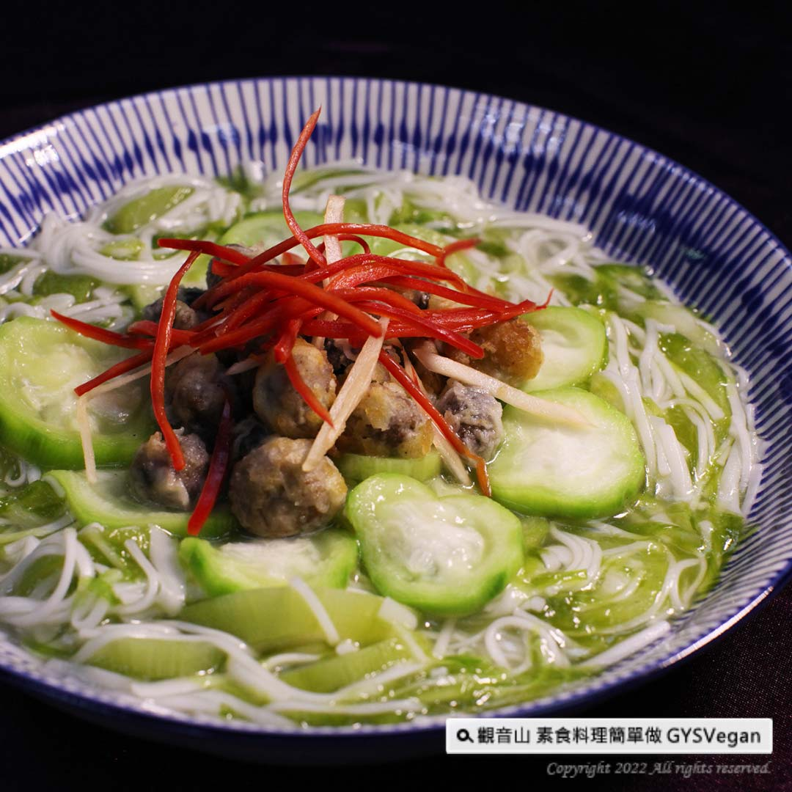

# 海味絲瓜蚵仔麵線

## 📋 基本資訊 / Recipe Overview
- **料理名稱**：海味絲瓜蚵仔麵線
- **原始標題**：地方特色美食｜海味絲瓜蚵仔麵線｜全素
- **素食流派 / Diet**：全素 Vegan
- **來源平台 / Source**：[觀音山 · 素食料理簡單做](https://vegan.gys.org.tw/loofah-rice-noodles20220715/)

## 📖 食譜圖文詳情 (中英雙語對照)

夏季盛產，獨特的澎湖絲瓜，口感清甜、有嚼勁，用它搭配麵線，絲瓜的甜度提升麵線整體香氣，不用添加調味料，再鋪上炸至金黃色的素蚵仔，立即學會一道澎湖特色佳餚，快跟著觀音山主廚，一起素食料理簡單做吧！​
​
◎食材及佐料〔Ingredients〕：(3人份)​
▪️澎湖絲瓜 ​ 1條​
▪️海藻、素蚵仔、手工麵線 ​ 各100克​
▪️薑絲 ​ 30克​
▪️鹽、香油 ​ 適量​
​
◎烹飪步驟：​
【刀工/前處理】​
1.絲瓜去皮切片。​
​
【調理作法】​
1.將絲瓜、海藻、薑絲放入電鍋內鍋中，加入少許鹽備用。​
2.電鍋外鍋放一杯水，將內鍋放入蒸約10分鐘，打開電鍋將麵線，平均鋪在內鍋絲瓜上 ，再繼續蒸大約10 分鐘。​
3.油鍋加熱至180度，放入素蚵仔炸至金黃色。​
4麵線蒸好取出內鍋，稍微攪拌均勻，盛入盤中，淋上少許香油提味。擺上炸好的素蚵仔，即可享用!​
​
本食譜提供：澎湖觀音山蔬食館​
​
慈悲的 龍德上師 成立「觀音山蔬食館」提倡健康素食、慈悲護生，以”觀音山素食料理簡單做”的理念，提供多款素食食譜，讓您一學就會！
​
◎觀音山相關連結​
➠
https://www.fazang.org/link/​
​
​
【recipe】​
​
Summer loofah has a sweet taste and chewy texture, specially those Penghu produce. Cooking it with rice noodles, the sweetness of loofah is fully being absorbed in and no extra seasonings is needed. After putting in fried vegetarian oysters, this local specialty is done. Quickly follow the chef of Guanyinshan to cook vegetarian dishes together!​
​
◎Ingredients : （For 3 people)​
▪️A loofah of penghu ​
▪️Seaweed、Vegan oyster、Handmade vermicelli ​ 100g​
▪️Shredded ginger ​ 30g​
▪️Salt、 Sesame oil ​ ​ ​ , adequate amount​
​
◎
Instructions:​
【Cutting/ PREP-Ahead】​
1. Peel and slice the loofah.​
​
【Cooking Steps】​
1. Put loofah, seaweed and shredded ginger into the inner pot of the rice cooker, add a pinch of salt for later use.​
2. Add a cup of water in the outer pot of the rice cooker, place the inner pot in to steam for about 10 minutes. Then, open the lid of rice cooker and spread rice noodles evenly on the loofah to steam for another 10 minutes.​
3. Heat up the pan to 180 degrees and fry the vegetarian oysters until golden brown.​
4. Bring out the noodles from inner pot; stir a bit and place it on a plate. Drizzle a little sesame oil to enhance the fragrance. Top with the fried vegetarian oysters and enjoy!​
​
This recipe is provided by: Penghu Guanyinshan Green Restaurant​
​
​
​
—​
歡迎轉載，請註明出處： 觀音山 素食料理簡單做 GYSVegan 素食環保愛地球，健康營養無負擔，慈悲護生一起來~

---
*食譜歸檔時間：2026-08-20 · 來源：觀音山素食料理簡單做 (vegan.gys.org.tw)*