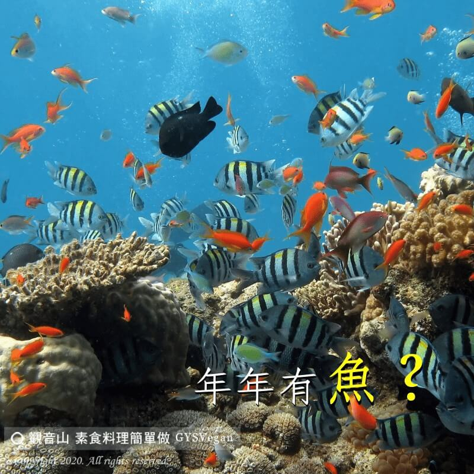

# 海洋危機 年年有「魚」！_

## 📋 基本資訊 / Recipe Overview
- **料理名稱**：海洋危機 年年有「魚」！_
- **原始標題**：【海洋危機】年年有「魚」！?
- **素食流派 / Diet**：全素 Vegan
- **來源平台 / Source**：[觀音山 · 素食料理簡單做](https://vegan.gys.org.tw/ocean-crisis20221210/)

## 📖 食譜圖文詳情 (中英雙語對照)

年年有「魚」?！?​
​
全球每年有80.4噸的魚類被捕撈上岸，聯合國報告指出，有3/4的魚場遭到過度捕撈、捕撈殆盡，或因過度捕撈而造成枯竭的狀態。​
​
科學家預測?‍?，若我們再不意識到此問題，並採取行動的話，到西元2048年之前，海洋的魚就會被捕撈殆盡。?​
​
現代漁業，為了滿足人類每年9000噸魚的需求，主要捕捉方式，是使用大型魚網，平均每磅漁獲所伴隨的意外打撈物種，例如海豚?、海龜、鯨魚?、鯊魚?…等，竟達五磅之多，就是所謂的誤捕。​
​
目前全球的海洋資源，已約有85%面臨耗竭和嚴重汙染。生物多樣性的消失??????，不僅會讓生態失衡、氣候失調，更深一層會威脅到糧食安全，最後造成人類社會嚴重且無法彌補的生命損失。​
​
為了避免海洋資源枯竭，你該蔬食??！​
全民吃素救地球，請一起加入素食愛地球的行列。​
​
✨慈悲的 龍德上師成立「觀音山蔬食館」提倡健康素食、慈悲護生，以”觀音山素食料理簡單做”的理念，提供多款素食食譜，讓您一學就會！?​
​
​
?觀音山 素食料理簡單做 Follow us?​
Facebook ｜好文按讚
http://www.facebook.com/GYSVegan​
Instagram ｜料理追蹤
http://www.instagram.com/gysvegan/​
Youtube ｜加入訂閱
https://reurl.cc/q8VEqy​
Telegram ｜頻道推薦
https://t.me/GYSVegan​
​
​
—​
? 歡迎轉載，請註明出處： 觀音山 素食料理簡單做 GYSVegan 素食環保愛地球，健康營養無負擔，慈悲護生一起來~?

---
*食譜歸檔時間：2026-08-20 · 來源：觀音山素食料理簡單做 (vegan.gys.org.tw)*