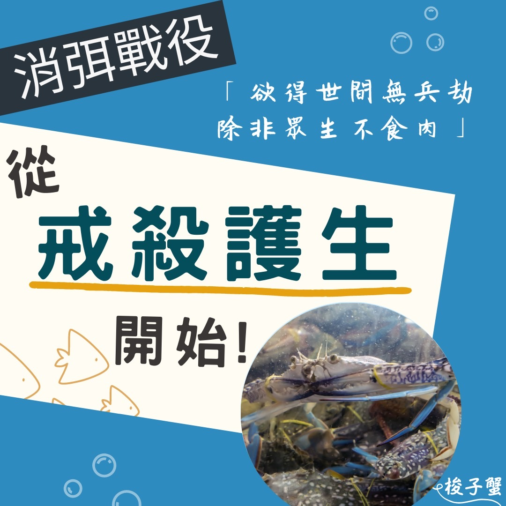

# 消弭戰役，從戒殺護生開始！ 海洋保育放流​

## 📋 基本資訊 / Recipe Overview
- **料理名稱**：消弭戰役，從戒殺護生開始！ 海洋保育放流​
- **原始標題**：消弭戰役，從戒殺護生開始！｜海洋保育放流​
- **素食流派 / Diet**：全素 Vegan
- **來源平台 / Source**：[觀音山 · 素食料理簡單做](https://vegan.gys.org.tw/battle20220321/)

## 📖 食譜圖文詳情 (中英雙語對照)

古云：「欲知世上刀兵劫，但聽屠門夜半聲」，現今戰爭就發生在我們身邊，每天都可以在新聞中瞥見逝去的生命，看到這些死傷人數，數字背後代表的是無數個傷心和破碎的家庭。​
​
▎看到戰爭的可怕，我們可以做些什麼
​
「欲得世間無兵劫，除非眾生不食肉」，戰爭是殘忍屠殺、冷酷無情的，猶如動物被宰殺時，同樣也是被無情的對待；我們每天坐在餐廳，吃著精緻、美味的食物，你可曾想過，為了味蕾享用的一餐，對很多動物來說，是牠們痛苦的一生換來的。​
​
若不想要戰爭造成的痛苦，也別將痛苦加諸在動物身上，若能茹素一餐，即可讓物命眾生遠離受擒受抓、失去自由，被殺被砍的痛苦！​
​
▎放生，可消災免難。​
​
天地萬物眾生與我，在無始以來的輪迴中，皆曾互為父母親眷。故今朝放生，等於拯救自己前世的親人，若見物命如見到自己父母手足妻女般，發起慈悲心，守住當下第一念的慈悲，予以救贖，還其自由，可解冤釋仇，消災免難。邀請您一起響應觀音山春季保育放流！
​
✨慈悲的龍德上師 成立「觀音山蔬食館」提倡健康素食、慈悲護生，以”觀音山素食料理簡單做”的理念，提供多款素食食譜，讓您一學就會！?​
​
​
★3月21日 【神變節．觀世音菩薩聖誕】 善惡增長10億X1千萬倍​
​
✨殊勝功德增長日✨​
觀音山邀請您於今日響應素食、廣修供養、戒殺護生、誦經修法、行持諸種善行，獲福無量。​
────────────────​
​
▌觀音山近期活動 ▌​
2022神變月──春季保育放流​
►
https://bit.ly/33IiD5W​
​
臺灣薩迦寺​
護持「 9公尺大悲救苦觀音建設」​
►
https://bit.ly/3tbg4DY​
​
觀音山 3月薈供法會──欣逢神變月 十萬善惡業緣增盛月​
①登記「除障祿位」、「超薦蓮位」​
►
https://reurl.cc/akXWYY​
②護持「薈供供品」供養三寶·愛心公益​
►
https://bit.ly/3JaUAwT​
​
​
? 觀音山 素食料理簡單做 ?​
◎Facebook ｜好文按讚​
http://www.facebook.com/GYSVegan​
​
◎lnstagram ｜料理追蹤​
http://www.instagram.com/gysvegan/​
​
◎Youtube ｜加入訂閱​
https://reurl.cc/q8VEqy​
​
◎Telegram ｜頻道推薦​
https://t.me/GYSVegan​
​
—​
?歡迎轉載，請註明出處： 觀音山 素食料理簡單做 GYSVegan 素食環保愛地球，健康營養無負擔，慈悲護生一起來~?​

---
*食譜歸檔時間：2026-08-20 · 來源：觀音山素食料理簡單做 (vegan.gys.org.tw)*