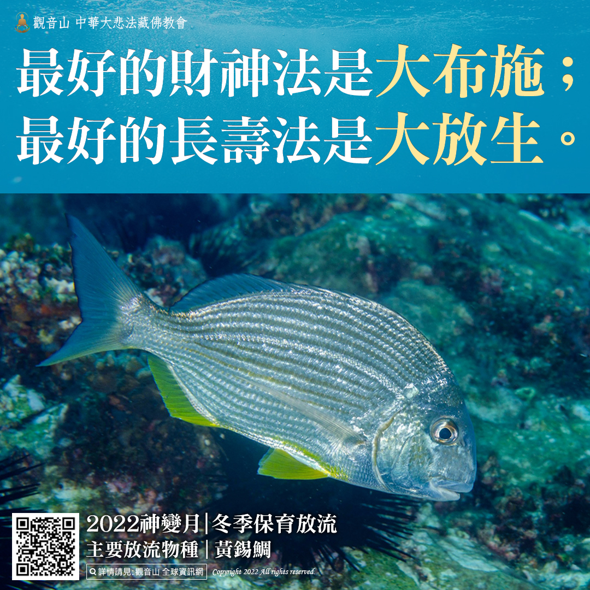

# 消災延壽護生法會─金鯧魚、鰻魚、嘉鱲放流活動集錦​

## 📋 基本資訊 / Recipe Overview
- **料理名稱**：消災延壽護生法會─金鯧魚、鰻魚、嘉鱲放流活動集錦​
- **原始標題**：消災延壽護生法會─金鯧魚、鰻魚、嘉鱲放流活動集錦​
- **素食流派 / Diet**：全素 Vegan
- **來源平台 / Source**：[觀音山 · 素食料理簡單做](https://vegan.gys.org.tw/release20220123/)

## 📖 食譜圖文詳情 (中英雙語對照)

【 1月23日 地藏王菩薩1億倍 功德殊勝節日】​
消災延壽護生法會─金鯧魚、鰻魚、嘉鱲放流活動集錦​
觀音山特別於此殊勝日，在澎湖外海施放金鯧魚、錢鰻、嘉鱲，放流活動吉祥圓滿！​
​
響應放流活動的法友分享，小時候因為家業的關係， 需要幫忙殺魚、賣魚， 學佛之後才明瞭自己因無明而造作了許多的殺業，因為值遇上師、道場才知道開立專案的方法，不但能處理自身的殺業，也能改變自身和家裡的命運。​
​
觀音山海內外各地道場長期推動戒殺、素食、合法地區保育放流，歡迎有相同理念者一同推廣，共同拯救更多刀口下的生靈，功德無量。​
​
觀音山 2022神變月──冬季保育放流​
共同響應「保育放流」施放海膽、小丑魚、黃錫鯛：​
https://bit.ly/33IiD5W
​(開放登記至2/28晚上12點前截止)​
​
更多請見「觀音山 全球資訊網」​
https://www.fazang.org/info/events.php​
—————————————​
歡迎轉載，請註明出處： 觀音山 法藏吉祥洲-好文分享 按讚設定搶先看，天天看，天天分享，心轉變好吉祥! (Be free to use with remarks for developing Buddhism. Amitabha.)​
—————————————​
◎觀音山吉祥洲官方部落格​
https://news.gys.org.tw/

---
*食譜歸檔時間：2026-08-20 · 來源：觀音山素食料理簡單做 (vegan.gys.org.tw)*