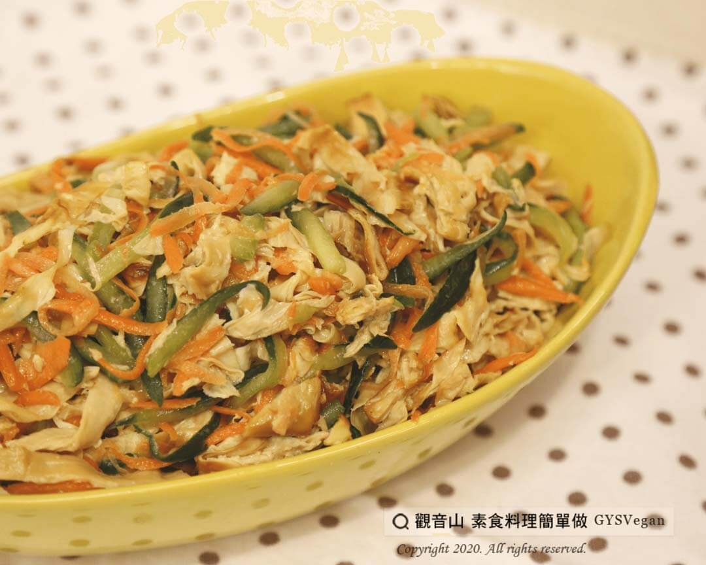

# 涼拌煙燻豆包絲

## 📋 基本資訊 / Recipe Overview
- **料理名稱**：涼拌煙燻豆包絲
- **原始標題**：涼拌煙燻豆包絲｜全素
- **素食流派 / Diet**：全素 Vegan
- **來源平台 / Source**：[觀音山 · 素食料理簡單做](https://vegan.gys.org.tw/smoked-bean-buns20201020/)

## 📖 食譜圖文詳情 (中英雙語對照)

軟嫩金黃的煙燻豆包絲，搭配小黃瓜和紅蘿蔔的清脆口感，蔬菜與豆包的完美結合，只要簡單調味，就可以組合出清新爽口的滋味，不論是單吃或是配飯都非常合適呢!
​
◎
食材與佐料：(5人份)​
▪️ 煙燻豆包絲 200g​
▪️ 小黃瓜　　 1條​
▪️ 紅蘿蔔 1條​
▪️ 鹽 少許​
▪️ 香油 少許​
​
◎
烹飪步驟：​
1. 紅蘿蔔、小黃瓜等量切絲，混和加鹽抓醃30分鐘入味。​
2. 待抓醃出水，擠乾水份，備用。​
3. 將小黃瓜絲、紅蘿蔔絲、煙燻豆包絲混和拌勻。​
4. 淋上香油調味，完成!!!✅​
​
特別說明：​
1.如醃漬的小黃瓜、紅蘿蔔太鹹，可以冷開水略為沖洗。​
2.可依個人喜好，添加香菜、辣椒絲，呈現不同風味。​
​
本食譜提供：埔里 觀音山蔬食團 主廚 樂心​
​
慈悲的 龍德上師成立「觀音山蔬食館」提倡健康素食、慈悲護生，以”觀音山素食料理簡單做”的理念，提供多款素食食譜，讓您一學就會！
​
​
觀音山 素食料理簡單做 ​ Follow us
Facebook ｜好文按讚
http://www.facebook.com/GYSVegan
​
Instagram ｜料理追蹤
http://www.instagram.com/gysvegan/​
Youtube ​ ​ ​ ｜加入訂閱
https://reurl.cc/q8VEqy​
Telegram ​ ｜頻道推薦
https://t.me/GYSVegan​
​
​
歡迎轉載，請註明出處： ​ ​ 觀音山 素食料理簡單做GYSVegan按讚、留言設定搶先看! 素食環保愛地球，健康營養無負擔，慈悲護生一起來~

---
*食譜歸檔時間：2026-08-20 · 來源：觀音山素食料理簡單做 (vegan.gys.org.tw)*