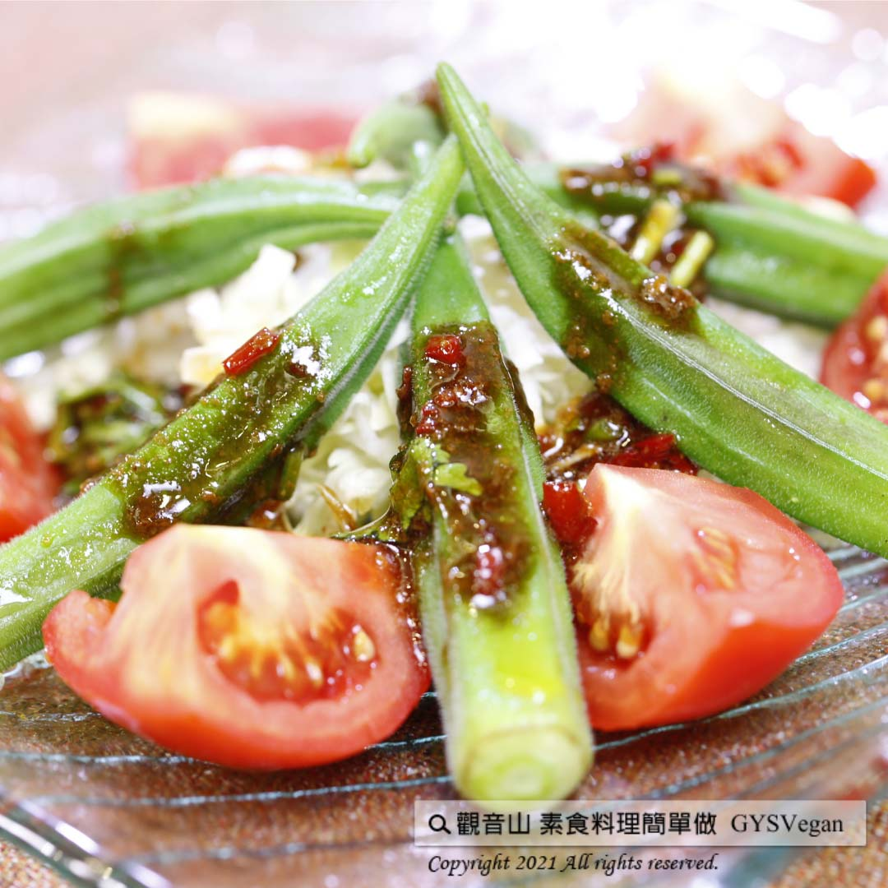

# 涼拌秋葵

## 📋 基本資訊 / Recipe Overview
- **料理名稱**：涼拌秋葵
- **原始標題**：涼拌秋葵 ｜全素
- **素食流派 / Diet**：全素 Vegan
- **料理分類 / Category**：中式料理
- **來源平台 / Source**：[觀音山 · 素食料理簡單做](https://vegan.gys.org.tw/%e6%b6%bc%e6%8b%8c%e7%a7%8b%e8%91%b5/)

## 📖 食譜圖文詳情 (中英雙語對照)

5月-9月是臺灣秋葵盛產季?秋葵的營養價值高，熱量低，含有豐富的膳食纖維，對消化、腸道十分有益?，更是保護胃壁的熱門養生食材?。​
這道 觀音山蔬食館 主廚提供的『✨涼拌秋葵✨』，簡單易做，非常適合忙碌的上班族及媽媽們烹調，現在就趕快一起來動手做看看吧~?​
​
?準備食材與佐料(3人份)​
秋葵12條、紅辣椒1條、素蠔油40克、沙茶10克、糖10克、香菜適量。​
​
?#素食料理簡單做，開始：​
1. 首先將辣椒洗淨，去籽切末；香菜洗淨切末，備用。​
2. 取素蠔油、糖、沙茶、辣椒末、香菜末混和調味，製成醬汁。​
3. 將秋葵洗淨，取鍋滾水川燙1分鐘後，再以冰水冰鎮。​
4. 將秋葵去蒂頭擺盤後，淋上醬料~ 簡單又美味的料理就完成啦~~?​
​
?特別說明：​
秋葵川燙後冰鎮，可以維持秋葵的翠綠及口感喔！?​
​
?‍?本食譜提供：台中 #觀音山蔬食館 主廚 樂敏​
​
✨慈悲的 龍德上師成立「觀音山蔬食館」提倡健康素食、慈悲護生，以”觀音山素食料理簡單做”的理念，提供多款素食食譜，讓您一學就會！?​
​
​
?觀音山 素食料理簡單做 ​ Follow us?​
Facebook ｜好文按讚
http://www.facebook.com/GYSVegan​
Instagram ｜料理追蹤
http://www.instagram.com/gysvegan/​
Youtube ​ ​ ​ ｜加入訂閱
https://reurl.cc/q8VEqy​
Telegram ​ ｜頻道推薦
https://t.me/GYSVegan​
​
​
? 歡迎轉載，請註明出處： ​ ​ 觀音山 素食料理簡單做GYSVegan按讚、留言設定搶先看! 素食環保愛地球，健康營養無負擔，慈悲護生一起來~?

---
*食譜歸檔時間：2026-08-20 · 來源：觀音山素食料理簡單做 (vegan.gys.org.tw)*