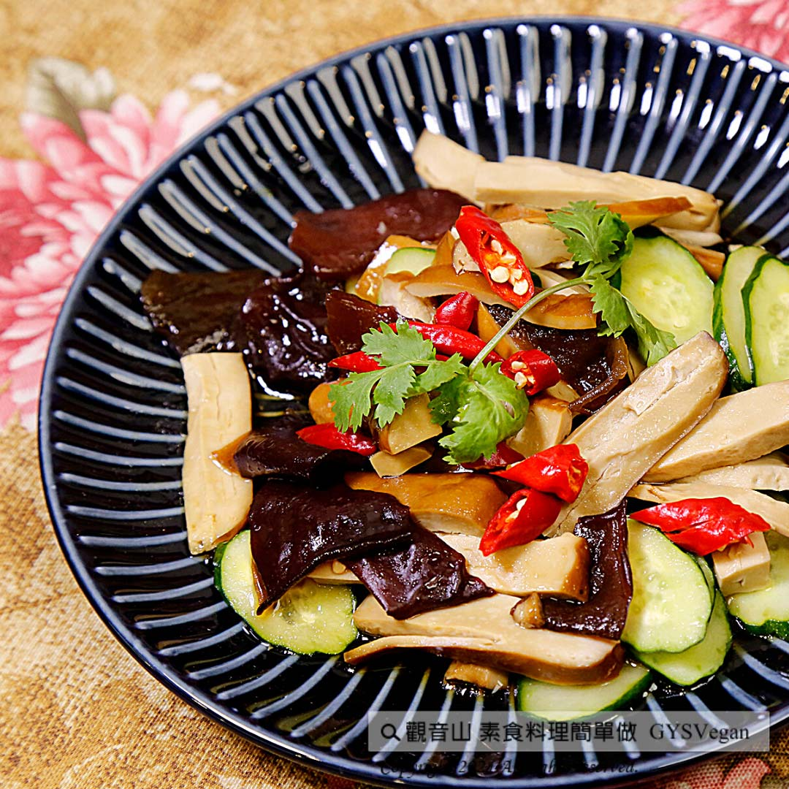

# 涼拌素雞

## 📋 基本資訊 / Recipe Overview
- **料理名稱**：涼拌素雞
- **原始標題**：涼拌素雞｜全素
- **素食流派 / Diet**：全素 Vegan
- **料理分類 / Category**：家常料理
- **來源平台 / Source**：[觀音山 · 素食料理簡單做](https://vegan.gys.org.tw/134-2/)

## 📖 食譜圖文詳情 (中英雙語對照)

鮮甜清脆的小黃瓜及木耳，搭配略有嚼勁的「滷素雞」，醬料鹹甜爽口的滋味，豐富的口感，滿足您的味蕾。​
在炎熱的天氣，做為開胃小菜最合適不過了！​
​
?食材及佐料〔Ingredients〕：(4人份)​
▪️滷素雞捲 100g​
▪️木耳 100g​
▪️小黃瓜 100g​
▪️香菜 1株​
▪️紅辣椒 1條​
​
?調味料〔Seasoning 〕：​
▪️醬油膏 10g​
▪️糖 5g​
▪️醋 3g​
▪️香油 1g​
​
?烹飪步驟：​
1. 素雞卷切薄片；小黃瓜切片；香菜切小段；紅辣椒切片，備用。​
2. 木耳切片川燙，備用。​
3. 將所有調味料混合調勻，加入素雞卷、木耳、小黃瓜拌勻調味。​
4. 盛盤放上香菜、紅辣椒片，完成!!!✅​
​
?本食譜提供：台中 #觀音山蔬食館 主廚 樂卿​
​
?慈悲的 龍德上師成立「觀音山蔬食館」提倡健康素食、慈悲護生，以”觀音山素食料理簡單做”的理念，提供多款素食食譜，讓您一學就會！?​
​
​
?觀音山 素食料理簡單做 ​ Follow us?​
Facebook ｜好文按讚
http://www.facebook.com/GYSVegan​
Instagram ｜料理追蹤
http://www.instagram.com/gysvegan/​
Youtube ​ ​ ​ ｜加入訂閱
https://reurl.cc/q8VEqy​
Telegram ​ ｜頻道推薦
https://t.me/GYSVegan​
​
​
? 歡迎轉載，請註明出處： ​ ​ 觀音山 素食料理簡單做GYSVegan按讚、留言設定搶先看! 素食環保愛地球，健康營養無負擔，慈悲護生一起來~?

---
*食譜歸檔時間：2026-08-20 · 來源：觀音山素食料理簡單做 (vegan.gys.org.tw)*