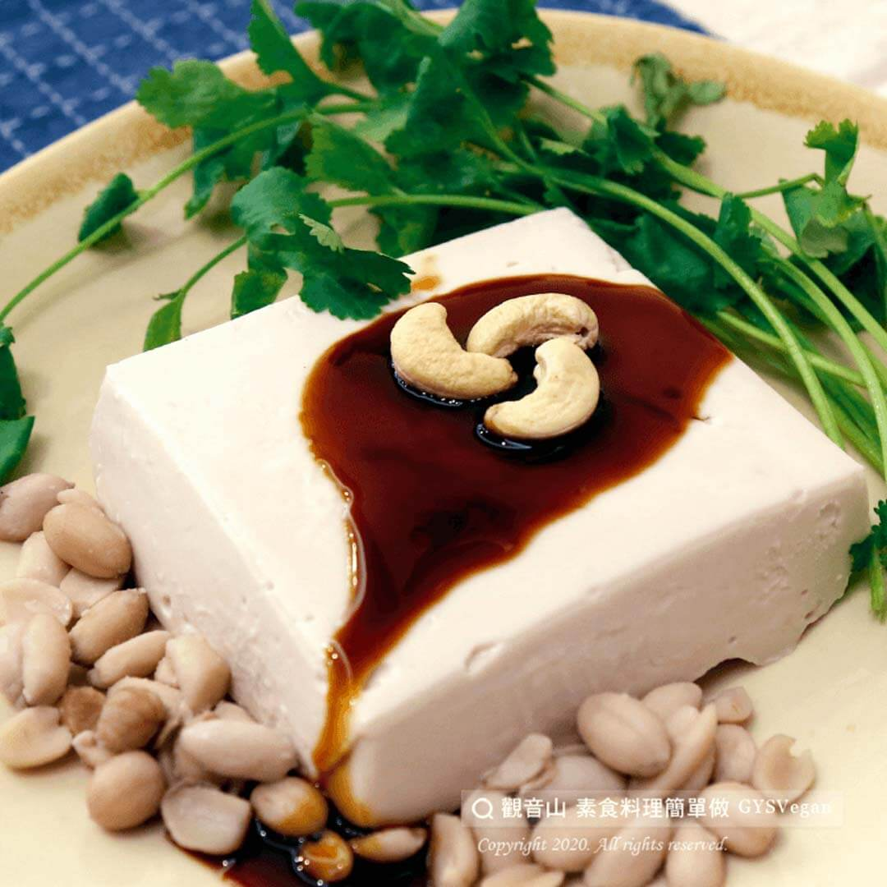

# 涼拌花生豆腐

## 📋 基本資訊 / Recipe Overview
- **料理名稱**：涼拌花生豆腐
- **原始標題**：涼拌花生豆腐｜全素
- **素食流派 / Diet**：全素 Vegan
- **來源平台 / Source**：[觀音山 · 素食料理簡單做](https://vegan.gys.org.tw/%e6%b6%bc%e6%8b%8c%e8%8a%b1%e7%94%9f%e8%b1%86%e8%85%90%ef%bd%9c%e5%85%a8%e7%b4%a0/)

## 📖 食譜圖文詳情 (中英雙語對照)

炎熱的季節裡，來盤充滿濃郁花生香氣的花生豆腐，搭配豆腐的綿密，令人難忘的滋味！ ​
快跟著觀音山蔬食館主廚，一起素食料理簡單做吧!​
​
?食材及佐料〔Ingredients〕：（4人份）​
▪在來米粉 32克​
▪玉米粉 25克​
▪生花生 200克​
▪鹽巴 適量​
▪水 600 ml​
​
?料理步驟：​
1.將花生洗淨，泡在600C.C.的水中4小時。​
2.將泡了4小時的花生跟水，放入果汁機中打成汁，用濾網過濾花生渣。​
3.將在來米粉、玉米粉加入花生汁中，攪拌均勻。​
4.可加入適量鹽巴調味。​
5.將攪拌好的食材，全程用小火煮，不斷攪拌，攪拌到濃稠(勾芡狀)。​
6.呈現勾芡狀就可以裝到容器中。​
7.約5分鐘後成形，擺盤完成！​
​
【特別說明】​
1.攪拌至黏稠狀關火後，要趕快倒入合適容器中，避免結塊。​
2.容器可選用想要呈現的形狀，如圓形、方形等。​
3.可依個人口味變化，加入各種料理或醬汁，例如淋上醬油膏當冷盤，或加入翡翠醬汁(菠菜打碎過油)，變成翡翠白玉羹。​
4.可冷藏後食用。​
​
??本食譜提供：台南 #觀音山蔬食館 主廚 嚴鳳​
​
✨慈悲的 龍德上師成立「觀音山蔬食館」提倡健康素食、慈悲護生，以”觀音山素食料理簡單做”的理念，提供多款素食食譜，讓您一學就會！?​
​
​
?觀音山 素食料理簡單做 ​ Follow us?​
Facebook ｜好文按讚
http://www.facebook.com/GYSVegan​
Instagram ｜料理追蹤
http://www.instagram.com/gysvegan/​
Youtube ​ ​ ​ ｜加入訂閱
https://reurl.cc/q8VEqy​
Telegram ​ ｜頻道推薦
https://t.me/GYSVegan​
​
​
? 歡迎轉載，請註明出處： ​ ​ 觀音山 素食料理簡單做GYSVegan按讚、留言設定搶先看! 素食環保愛地球，健康營養無負擔，慈悲護生一起來~?

---
*食譜歸檔時間：2026-08-20 · 來源：觀音山素食料理簡單做 (vegan.gys.org.tw)*