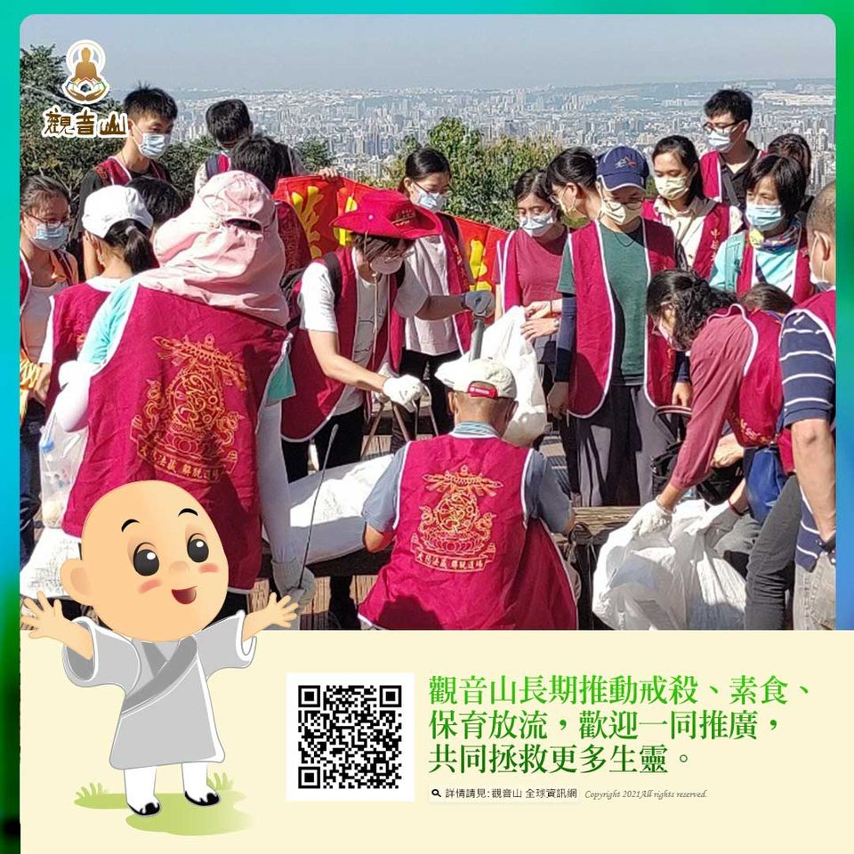

# 淨山．淨心──看見更好的世界

## 📋 基本資訊 / Recipe Overview
- **料理名稱**：淨山．淨心──看見更好的世界
- **原始標題**：淨山．淨心──看見更好的世界
- **素食流派 / Diet**：全素 Vegan
- **來源平台 / Source**：[觀音山 · 素食料理簡單做](https://vegan.gys.org.tw/world20211113/)

## 📖 食譜圖文詳情 (中英雙語對照)

淨山．淨心──看見更好的世界​
​
「惜福環保感恩心，蔬食善念利他行」​
觀音山義工舉辦淨山活動，以實際行動 「淨山」來愛護地球，期望能為「地球暖化、氣候變遷」盡一份心力。活動的過程中，不只是淨山的行為，而是對大眾做示範的作用，從你、我做起。​
​
淨山過程中，每位義工齊心協力，希望將不屬於山林的垃圾撿起，還大自然一個健康的環境；沿路上的登山客，看到義工們的行動，紛紛隨喜稱讚佛教會的善行，讓義工們心裡有一股股的暖流，原來善行可以感染周圍的人；一次次彎腰撿起地上的垃圾，心中的感動油然而生，原來彎腰可以看見更好的世界。​
​
透過淨山活動，義工能夠了解自身對於環境可以做出什麼貢獻，同時也反思人們所製造的垃圾對於生態環境的負面影響，對動物的棲息地與生態危害，這些都是值得我們再三省思的面向。​
​
11月初，全球128國家領袖在聯合國氣候變遷大會(COP26)承諾減碳。可見，這是多麼刻不容緩的一件事。​
​
一個人的改變，可以感動周遭的人，一群人的善行，可以改變大眾的心、影響世界，讓自己成為更好的人，讓地球更加的美麗。​
​
吃素、資源循環再利用都是環保；實踐觀音山所推動的「惜福環保感恩心，蔬食善念利他行」為守護地球不遺餘力，我們長期推動蔬食環保、淨灘、海洋保育放流等一系列活動，以實際行動來實踐，吃素、戒殺、護生、環保、為動物創造友善環境而努力。​
​
為慶讚12月20日阿彌陀佛聖誕，觀音山將於12月分在宜蘭海域舉辦一場九孔放流活動。此活動是與政府相關單位「海漁基金會」共同配合政府政策，透過海漁基金會與專家學者共同規劃及技術指導，來保育及健全海洋生態系。​
​
九孔因無法自行翻轉，必須附著在石頭上才能移動進食，所以這場放流我們會請專業潛水員下海協助將九孔放置在礁岩石縫中，使其順利附著生長，是一場非常難得值遇的護生放流活動。​
​
歡迎十方大眾藉此殊勝因緣共同護持保育放流。以慈悲心看待世間的一切，從而在生活中戒殺茹素，護生助人，諸惡莫作，眾善奉行。​
​
✨慈悲的 龍德上師成立「觀音山蔬食館」提倡健康素食、慈悲護生，以”觀音山素食料理簡單做”的理念，提供多款素食食譜，讓您一學就會！?​
​
? 觀音山 素食料理簡單做 ?​
◎Facebook ｜好文按讚​
http://www.facebook.com/GYSVegan​
​
◎lnstagram ｜料理追蹤​
http://www.instagram.com/gysvegan/​
​
◎Youtube ｜加入訂閱​
https://reurl.cc/q8VEqy​
​
◎Telegram ｜頻道推薦​
https://t.me/GYSVegan​
​
​
—​
?歡迎轉載，請註明出處： 觀音山 素食料理簡單做 GYSVegan 素食環保愛地球，健康營養無負擔，慈悲護生一起來~?

---
*食譜歸檔時間：2026-08-20 · 來源：觀音山素食料理簡單做 (vegan.gys.org.tw)*