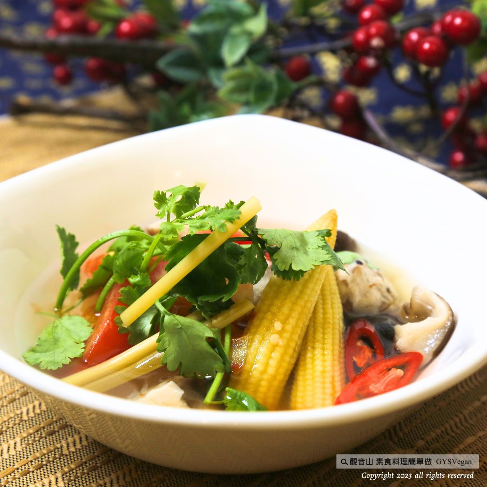

# 湯品料理 清香香茅湯

## 📋 基本資訊 / Recipe Overview
- **料理名稱**：湯品料理 清香香茅湯
- **原始標題**：湯品料理｜清香香茅湯｜全素
- **素食流派 / Diet**：全素 Vegan
- **料理分類 / Category**：湯品系列
- **來源平台 / Source**：[觀音山 · 素食料理簡單做](https://vegan.gys.org.tw/lemongrass-soup20231027/)

## 📖 食譜圖文詳情 (中英雙語對照)

湯品料理✨清香香茅湯✨全素
新鮮的香茅有一種類似檸檬的香氣，能讓湯頭變得更加清爽開胃，由香茅、檸檬葉、牛番茄等食材熬煮出自爽口獨特的香氣，搭配當季的新鮮食材，品嚐不一樣的風味，健康又美味，快跟著觀音山主廚，一起素食料理簡單做吧！
​
◎食材及佐料〔Ingredients〕：
▪️新鮮香茅 ​ ​ ​ ​ ​ ​ ​ ​ 2支
▪️牛番茄 ​ ​ ​ ​ ​ ​ ​ ​ ​ ​ ​ ​ 2顆
▪️新鮮香菇 ​ ​ ​ ​ ​ ​ ​ ​ 5朵
▪️玉米筍 ​ ​ ​ ​ ​ ​ ​ ​ ​ ​ ​ 5支
▪️素丸子 ​ ​ ​ ​ ​ ​ ​ ​ ​ ​ ​ 5顆
▪️紅蘿蔔 ​ ​ ​ ​ ​ ​ ​ ​ ​ ​ ​ 50克
▪️乾燥檸檬葉 ​ ​ ​ ​ 5片 ​
▪️水 ​ ​ ​ ​ ​ ​ ​ ​ ​ ​ ​ ​ ​ ​ ​ ​ ​ ​ 適量
​
◎烹飪步驟：
【調理作法】
1.準備湯鍋放入食材：香茅、檸檬葉、香菇、玉米筍、紅蘿蔔、水（稍微蓋過食材的量）煮滾後，轉中小火煮約10分鐘，再放入番茄、丸子煮滾，即可調味。
2.調味：鹽、砂糖、放入香菜末，即可享用。 ​ ​ ​ ​ ​ ​ ​ ​ ​ ​ ​ ​ ​ ​ ​ ​ ​ ​ ​ ​ ​ ​ ​ ​ ​ ​ ​ ​ ​ ​ ​ ​ ​ ​ ​ ​ ​ ​ ​ ​ ​ ​ ​ ​ ​ ​ ​ ​ ​ ​ ​ ​ ​ ​ ​ ​ ​ ​ ​ ​ ​ ​ ​ ​ ​ ​ ​ ​ ​ ​ ​ ​ ​ ​ ​ ​ ​ ​ ​ ​ ​ ​ ​ ​ ​ ​ ​ ​ ​ ​ ​ ​ ​ ​ ​ ​ ​ ​ ​ ​ ​ ​ ​ ​ ​ ​ ​ ​ ​ ​ ​ ​ ​ ​ ​
​
【特別說明】
可依個人口味喜好加入辣椒，調整辣椒的量。
​
​
本食譜提供：台中 觀音山蔬食館
​
​
▌慈悲的 龍德上師 成立「觀音山蔬食館」提倡健康素食、慈悲護生，以”觀音山素食料理簡單做”的理念，提供多款素食食譜，讓您一學就會！
​
📣觀音山相關連結
➠
https://www.fazang.org/link/
​ ​
​
▌觀音山近期活動
殊勝三節日，響應蔬食合天心
✦ 我要響應▸
https://forms.gle/u4fNcRZzd4PfauLy
2023年10月28日(六)「佛允天降日」
2023年11月2日(四)「觀世音菩薩出家紀念日」
2023年11月4日(六) 「佛陀天降日」
​
▍11月4日 佛陀天降日
本師 釋迦牟尼佛薈供法會
✦ 登記「除障祿位、超薦蓮位、護持薈供供品」
https://bit.ly/3PsY3uR
​
──────────────
觀音山 2023年佛陀天降日系列活動
詳細介紹：
https://bit.ly/463BG69
──────────────
​ ​
​ ​
—
歡迎轉載，請註明出處： 觀音山素食料理簡單做 GYSVegan 素食環保愛地球，健康營養無負擔，慈悲護生一起來~
https://youtu.be/Y4xrfbRSjrwsi=ztJcXKJ4tZo0vKth

---
*食譜歸檔時間：2026-08-20 · 來源：觀音山素食料理簡單做 (vegan.gys.org.tw)*