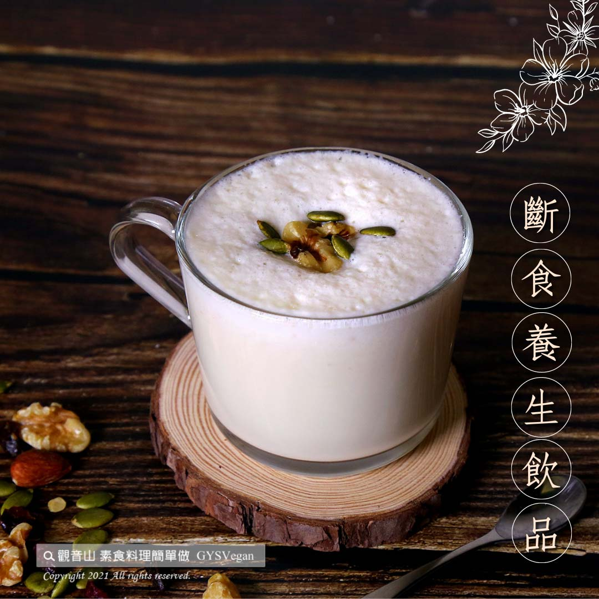

# 溫梨豆奶

## 📋 基本資訊 / Recipe Overview
- **料理名稱**：溫梨豆奶
- **原始標題**：溫梨豆奶｜全素
- **素食流派 / Diet**：全素 Vegan
- **來源平台 / Source**：[觀音山 · 素食料理簡單做](https://vegan.gys.org.tw/soy-milk20210924/)

## 📖 食譜圖文詳情 (中英雙語對照)

梨子有「百果之宗」的美稱，具有豐富的蛋白質、維生素B群等多種維生素，有潤肺、止咳之效，特別適合秋燥所引起的不適，搭配富有完全蛋白質的豆漿，絕對是斷食養生 的好飲品，加上些許薑末，從內到外溫暖你的心，快跟著觀音山主廚，一起素食料理簡單做吧！​
​
◎食材及佐料〔Ingredients〕：(1人份)​
▪️梨子 ​ 1顆​
▪️薑末 ​ 15~20克​
▪️豆漿 ​ 500C.C ​ ​
​
◎烹飪步驟：​
【刀工/前處理】​
1. 梨子去皮切片。​
​
【調理作法】​
1.將食材放入果汁機中攪打均勻。​
2.倒入鍋中加熱，即可享用。​
​
​
本食譜提供：台中觀音山蔬食館 主廚 樂敏​
​
​
✨慈悲的龍德上師 成立「觀音山蔬食館」提倡健康素食、慈悲護生，以”觀音山素食料理簡單做”的理念，提供多款素食食譜，讓您一學就會！
【recipe】​
​
Pears earn a good reputation of “the origin of all fruits” by the ancients since they are fresh, juicy and felicitous. They are rich in protein, vitamin B complex and other vitamins. They have the effect of moistening the lungs, relieving coughs, and been considered as a suitable cure for autumn dryness. Moreover, in this recipe, soy milk is full of protein, which definitely makes a healthy good drink for #fasting. Add a final touch of ginger that warms your body and heart. Quickly follow the chef of Guanyinshan, let’s cook simple vegetarian dishes together! ​ ​
​
◎Ingredients : （For 1 people）​
▪️A pear​
▪️Ginger ​ 15~20g​
▪️Soy milk ​ 500C.C ​ ​
​
◎Instructions: ​
【Cutting/PRE-Ahead】​
1. Peel and slice pears. ​ ​
​
【Directions】​
1. Put the ingredients in a blender and process until smooth. ​
2. Heat it up in a pot and then enjoy. ​
​
This recipe is provided by Chef Le Min, Taichung # Guanyinshan Green Restaurant
​
​
☆ 觀音山 素食料理簡單做 ​☆
Facebook ｜好文按讚
http://www.facebook.com/GYSVegan​
Instagram ｜料理追蹤
http://www.instagram.com/gysvegan/​
Youtube ｜加入訂閱
https://reurl.cc/q8VEqy​
Telegram ｜頻道推薦
https://t.me/GYSVegan​
​
​
—​
歡迎轉載，請註明出處： 觀音山 素食料理簡單做 GYSVegan 素食環保愛地球，健康營養無負擔，慈悲護生一起來~

---
*食譜歸檔時間：2026-08-20 · 來源：觀音山素食料理簡單做 (vegan.gys.org.tw)*