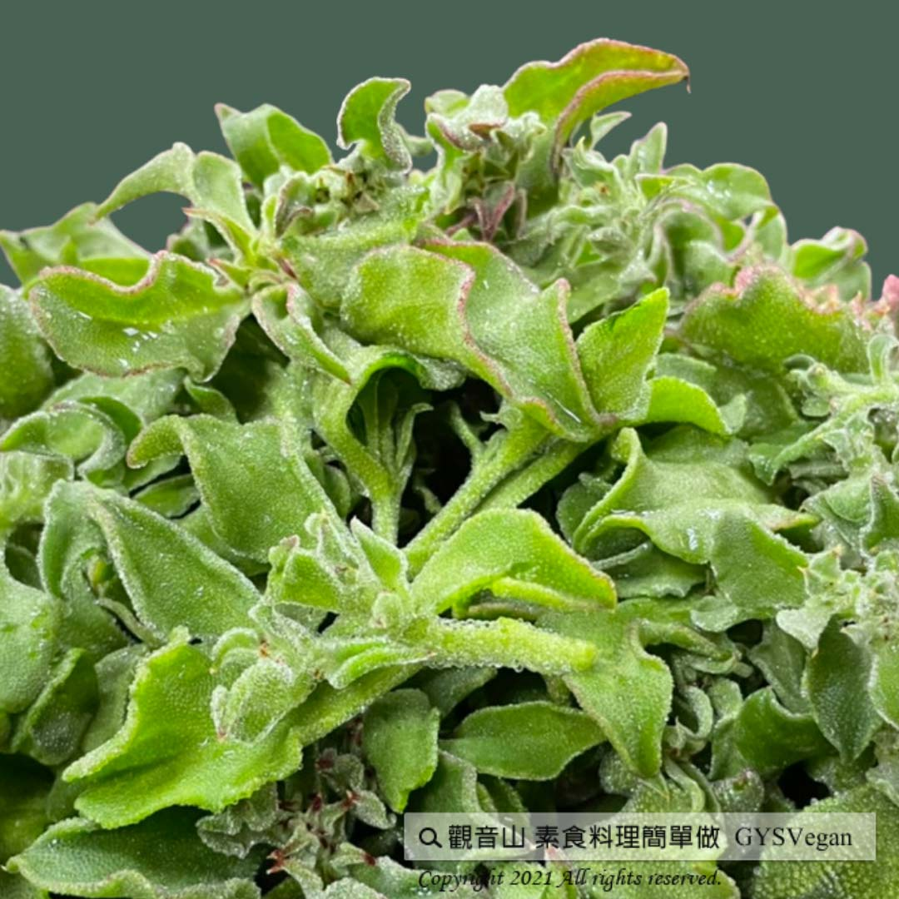

# 澎湖冰花

## 📋 基本資訊 / Recipe Overview
- **料理名稱**：澎湖冰花
- **原始標題**：澎湖冰花｜全素
- **素食流派 / Diet**：全素 Vegan
- **料理分類 / Category**：中式料理
- **來源平台 / Source**：[觀音山 · 素食料理簡單做](https://vegan.gys.org.tw/ice-flower20210528/)

## 📖 食譜圖文詳情 (中英雙語對照)

來自於非洲的植物「冰花」，葉面上結滿鹽晶顆粒，如同冰晶一般，故被譽為「鑽石花」，屬高經濟價值的蔬菜，而澎湖獨特的天候與空氣中的鹽分，非常適合其生長；冰花可以直接食用、做成沙拉、甚至打成果汁都很美味，其口感清爽，帶有天然的鹹味，是營養價值很高的養生蔬菜，快跟著觀音山主廚，一起素食料理簡單做吧！​
​
​
? 食材及佐料〔Ingredients〕：(6人份)​
▪新鮮冰花 ​ 600克​
▪千島醬或藍莓醬 ​ 適量​
​ ​ （依個人喜好準備） ​ ​ ​ ​ ​ ​ ​
​
​
? 烹飪步驟：​
1.將冰花洗淨。​
2.可依個人喜好，直接單吃，或者淋上千島醬、藍莓醬一起吃。​
​
​
??本食譜提供：澎湖觀音山蔬食館 主廚 樂珍​
​
​
✨慈悲的 龍德上師成立「觀音山蔬食館」提倡健康素食、慈悲護生，以”觀音山素食料理簡單做”的理念，提供多款素食食譜，讓您一學就會！?
​
​
【recipe】​
​
?”Ice Plant” originated from Africa has salt particles on its leaves and stems glittering like ice crystals, so it is known as “Diamond Flower”. Penghu’s unique weather and salt air is very suitable for its growth. It is a vegetable with high economic value. Ice plant can be eaten raw, made into salads, or even juice. It’s refreshing and gentle marine-like salinaty renders it a versatile culinary ingredient. ​ It is a healthy vegetable with high nutritional value. Follow the chef of Guanyinshan, let’s cook simple vegetarian dish together!​
​
​
?Ingredients : (For 10 people)​
▪Ice plant. 600g​
▪Thousand island sauce or blueberry sauce. ​ ​ , adequate amount​
​
? Cooking instructions:​
1. Wash the ice plant. ​
2. According to personal preference, it can be eaten raw, or dressed with Thousand Island sauce or blueberry sauce.
​
​
??This recipe is provided by Chef Le Zhen, Penghu #Guanyinshan Green Restaurant​
​
​
? 觀音山 素食料理簡單做 ?​
◎Facebook ｜好文按讚​
https://www.facebook.com/GYSVegan​
​
◎Instagram ｜料理追蹤​
https://www.instagram.com/gysvegan/​
​
◎Youtube ​ ​ ​ ｜加入訂閱​
https://reurl.cc/q8VEqy​
◎官方Blog ​ ​ ｜網站推薦​
​https://t.me/GYSVegan
​
—​
?歡迎轉載，請註明出處： 觀音山 素食料理簡單做 GYSVegan 素食環保愛地球，健康營養無負擔，慈悲護生一起來~?

---
*食譜歸檔時間：2026-08-20 · 來源：觀音山素食料理簡單做 (vegan.gys.org.tw)*