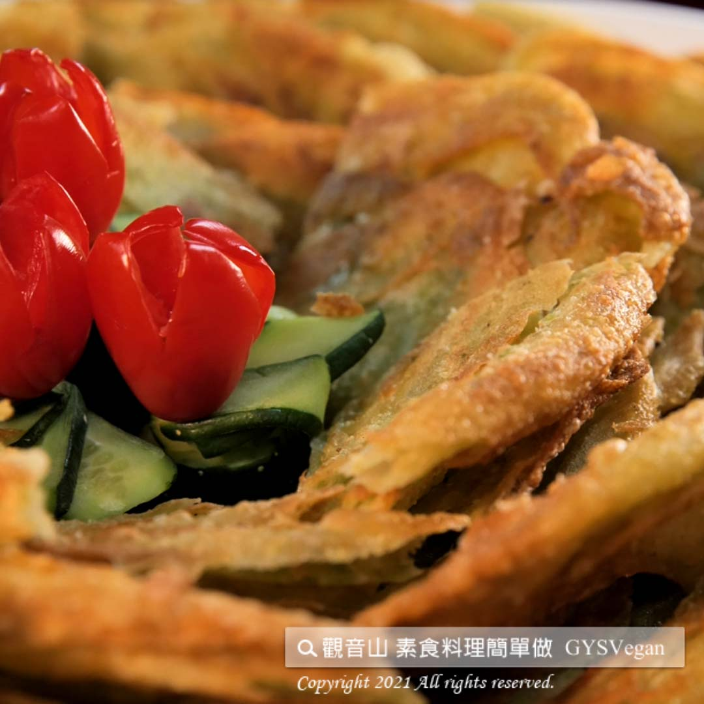

# 澎湖海菜煎餅

## 📋 基本資訊 / Recipe Overview
- **料理名稱**：澎湖海菜煎餅
- **原始標題**：澎湖海菜煎餅｜全素
- **素食流派 / Diet**：全素 Vegan
- **料理分類 / Category**：主食種類 / 米麵主食 (Staple Food)
- **來源平台 / Source**：[觀音山 · 素食料理簡單做](https://vegan.gys.org.tw/pancakes20210611/)

## 📖 食譜圖文詳情 (中英雙語對照)

內Q外酥的綠色餅皮，內含天然的野生海菜，一口咬下，濃郁的藻香味充滿口中，低熱量、豐富的膳食纖維，最適合全家人一起享用，快跟著觀音山主廚，一起素食料理簡單做吧！​
​
?食材及佐料〔Ingredients〕：​
▪中筋麵粉 ​ 300克​
▪太白粉 ​ 200克​
▪海菜 ​ 300克​
▪油 ​ 少許​
▪胡椒粉 ​ 適量​
​
?烹飪步驟：​
【刀工/前處理】​
1.將海菜洗淨切碎，備用。​
2.將中筋麵粉、太白粉、切碎海菜，加入適量開水搓揉均勻，直到麵團不黏手後，加入少許油揉勻。​
3.將麵團平均分塊、桿平。​
​
【調理作法】​
1.熱油鍋，將海菜煎餅先用中火油炸。​
2.炸至有點黃金色時，轉至大火稍微炸一下，使其表面酥脆就起鍋。​
3. 瀝油後，灑上少許胡椒粉即可食用。​
【特別說明】
桿好的餅皮中間可隔一層保鮮膜，避免黏在一起，可放冷凍庫保存。
​
??本食譜提供：澎湖 觀音山蔬食館 主廚 樂祺​
​
​
✨慈悲的 龍德上師成立「觀音山蔬食館」提倡健康素食、慈悲護生，以”觀音山素食料理簡單做”的理念，提供多款素食食譜，讓您一學就會！?
​
​
?  Follow us觀音山 素食料理簡單做 Follow us ?​
◎Facebook ｜好文按讚
https://www.facebook.com/GYSVegan​
◎Instagram ｜料理追蹤
https://www.instagram.com/gysvegan/
​
◎Youtube ​ ​ ​ ｜加入訂閱
https://reurl.cc/q8VEqy​
◎官方Blog ​ ​ ｜網站推薦
https://vegan.gys.org.tw/​
​
​
【recipe】​
​
? The green crispy crust of the pancake in this recipe contains seaweed. Each bite can taste fine sea flavor. It is low-calorie and rich in dietary fiber. It is most suitable for the whole family to enjoy. Quickly follow the chef of Guanyinshan. Let’s make vegetarian dishes together!​
​
​ 【Cutting/PREP ahead】 ​
1. Wash and chop the seaweed and set aside. ​
2. Add all-purpose flour, cornstarch, chopped seaweed, an appropriate amount of drinking water and knead evenly until the dough is not sticky. Then add a little oil and knead again.​
3. Divide the dough into even pieces and pat them flat. ​
​
【Cooking steps】​
1. Heat pan & add oil, and then fry the pancake doughs over medium heat.​
2. When they are slightly golden, turn to high heat and fry a bit more to make the surface crispy.​
3. After draining the oil off, sprinkle the pancakes with a little pepper.​
​
【Special Notes】​
If needed to store in the freezer, place a layer of food wrap in between the pancake doughs to avoid sticking together.​
​
??This recipe is provided by Chef Le Qi, Penghu. #Guanyinshan Green Restaurant​
​
​
—​
? 歡迎轉載，請註明出處：觀音山 素食料理簡單做 GYSVegan 素食環保愛地球，健康營養無負擔，慈悲護生一起來~?

---
*食譜歸檔時間：2026-08-20 · 來源：觀音山素食料理簡單做 (vegan.gys.org.tw)*