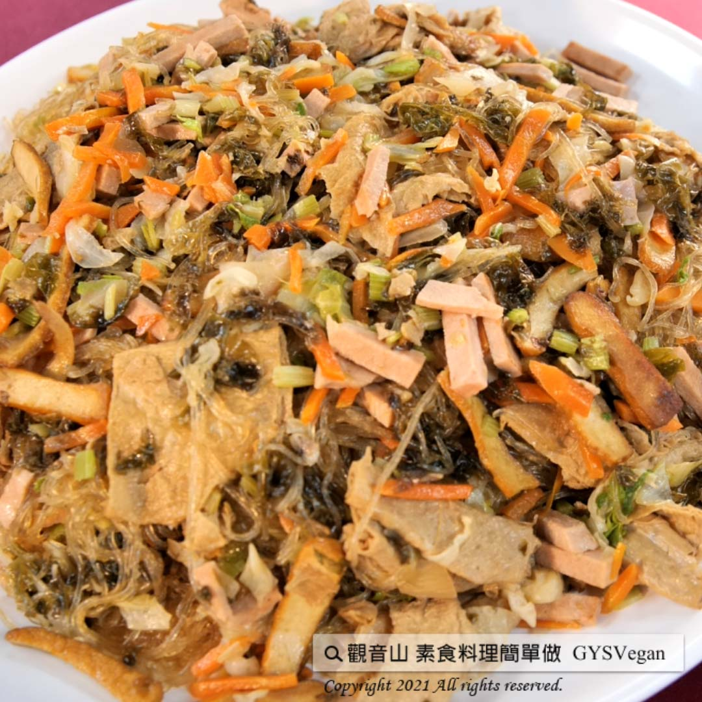

# 澎湖紫菜冬粉

## 📋 基本資訊 / Recipe Overview
- **料理名稱**：澎湖紫菜冬粉
- **原始標題**：澎湖紫菜冬粉｜全素
- **素食流派 / Diet**：全素 Vegan
- **料理分類 / Category**：主食種類 / 米麵主食 (Staple Food)
- **來源平台 / Source**：[觀音山 · 素食料理簡單做](https://vegan.gys.org.tw/seaweed20210604/)

## 📖 食譜圖文詳情 (中英雙語對照)

紫菜是澎湖海洋生態的天然資源，具有非常高的營養價值，含有豐富的維生素及礦物質，清香的紫菜被冬粉吸收，QQ嫩嫩的滋味，多樣化的配料，就是道一百分的料理，快跟著觀音山主廚，一起素食料理簡單做吧！​
​
​
?食材及佐料〔Ingredients〕：(5人份)​
▪素食​​​​​,全素,純素​​​​​,蔬食,家常料理,素食料理​,純素料理,全素料理,蔬食料理,素食食譜,全素食譜,蔬食食譜,純素食譜,食譜,Vegan​​​​​,Vegetarian​​​​​,精進料理,觀音山蔬食館​​​​​​​​​​,龍德上師,龍德嚴淨仁波切 ​ 6粒​
▪高麗菜 ​ 600克​
▪紅蘿蔔 ​ 200克​
▪芹菜 ​ 1小把​
▪素火腿 ​ 120克​
▪豆干 ​ 200克​
▪濕紫菜 ​ 200克​
▪水 ​ 3碗​
▪鹽 ​ 1小匙​
▪糖、鮮味炒手 ​ 1小匙​
▪白胡椒粉、醬油 ​ 少許​
?烹飪步驟：​
【刀工/前處理】​
1.紫菜先用油爆過，冬粉用水稍微沖過，備用。​
2.將豆干、素火腿、高麗菜、胡蘿蔔切條狀，芹菜切珠狀，備用。​
​
【調理作法】​
1.熱油鍋將豆干放入，爆炒至表面呈金黃色，放入素火腿，稍微翻炒。​
2.將高麗菜、紅蘿蔔炒軟後，放入紫菜、水，可以再多加1-2碗以免水不夠。​
3.加入調味料: 鹽1小匙、糖、鮮味炒手各1小匙，白胡椒粉、醬油少許。​
4.放入冬粉，轉小火稍作翻炒，蓋上鍋蓋，悶1分鐘後，開鍋蓋再稍微翻炒一下，若水未乾，則蓋上鍋蓋繼續悶​
5.悶到水收乾冬粉是軟的狀態時，灑上芹菜珠，蓋上鍋蓋關火，悶一下即可起鍋。​
​
【特別說明】​
1.冬粉悶到水收乾時，若冬粉還有點硬就要再加水煮一下，繼續悶到冬粉軟。​
2.1粒冬粉放半碗水。​
​
??本食譜提供：澎湖  觀音山蔬食館 主廚 ​ 春梅​
✨慈悲的 龍德上師成立「觀音山蔬食館」提倡健康素食、慈悲護生，以”觀音山素食料理簡單做”的理念，提供多款素食食譜，讓您一學就會！?
​
​​
​
【recipe】​
​ ?  Laver is a natural resource of Penghu’s marine ecology. It has very high nutritional value which rich in vitamins and minerals. In this dish, the sea fragrance of the laver is melding into glass noodles. The tender taste of laver with diversified ingredients make this dish a perfect cuisine. Quickly follow the chef of Guanyinshan, let’s cook simple vegetarian dishes together!
?Cooking instructions:​
【Cutting/PRE ahead】
1. Stir fry the laver with oil first; rinse the glass noodles in water, and set aside.
2. Cut dried bean curd, vegetarian ham, cabbage and carrot into strips, and cut celery into beads, and set aside.
【Cooking steps】
1. Heat the wok with oil and stir-fir dried tofu until the surface is golden brown; add in the vegetarian ham & stir-fry slightly.
2. Sauté cabbage and carrots until softened, and then add seaweed laver and water. Adding 1-2 more bowls of water to avoid getting too dry.
3. Seasonings: 1 tsp of salt, sugar, Umami Sauce; a pinch of white pepper, and a little soy sauce.
4. Put in the glass noodles, turn to a low heat and stir for a while. Cover the wok. After 1 minute of simmering, open the pot and stir fry again. If the water has not dried yet, cover the wok and keep it simmering longer.
5. When the water is almost dry and glass noodles soften, sprinkle with celery beads, and cover the wok and turn off the heat.
【Special Notes】
1. If the glass noodles are still a bit hard, add more water to cook until soft.
2. Usually 1 piece of glass noodles needs half bowl of water.
?  Follow us觀音山 素食料理簡單做 Follow us​?
◎Facebook ｜好文按讚
https://www.facebook.com/GYSVegan​
◎Instagram ｜料理追蹤
https://www.instagram.com/gysvegan/​
◎Youtube ​ ​ ​ ｜加入訂閱
https://reurl.cc/q8VEqy​
◎官方Blog ​ ​ ｜網站推薦
https://vegan.gys.org.tw/​
—​
? 歡迎轉載，請註明出處：觀音山 素食料理簡單做 GYSVegan 素食環保愛地球，健康營養無負擔，慈悲護生一起來~?

---
*食譜歸檔時間：2026-08-20 · 來源：觀音山素食料理簡單做 (vegan.gys.org.tw)*