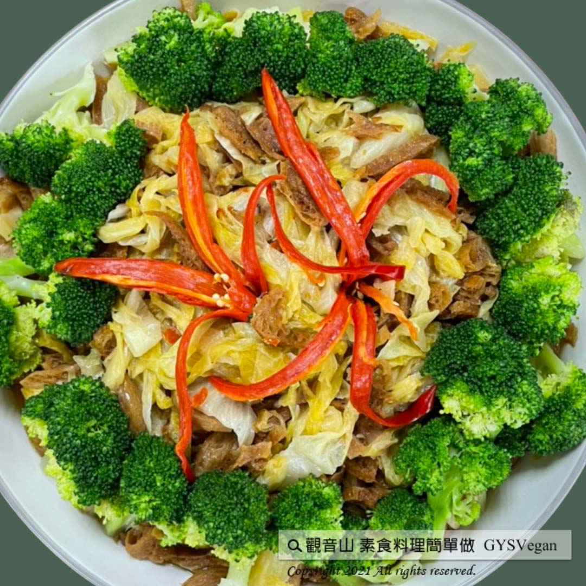

# 澎湖高麗菜酸

## 📋 基本資訊 / Recipe Overview
- **料理名稱**：澎湖高麗菜酸
- **原始標題**：澎湖高麗菜酸｜全素
- **素食流派 / Diet**：全素 Vegan
- **來源平台 / Source**：[觀音山 · 素食料理簡單做](https://vegan.gys.org.tw/cabbage-acid20210521/)

## 📖 食譜圖文詳情 (中英雙語對照)

澎湖最天然的海味「澎湖高麗菜酸」，是以當地的高麗菜為主要食材，經過澎湖冬天的太陽以及特殊鹹水煙的風乾曝曬，口感爽脆甘甜，辣味提升整體食材的層次，酸鹹滋味更讓人食指大動，是一道具有保健的好料理，快跟著觀音山主廚，一起素食料理簡單做吧！​
​
​
?食材及佐料〔Ingredients〕：(10人份)​
▪澎湖高麗菜酸 ​ 1斤​
▪麵輪 ​ 20片​
▪綠花椰菜 ​ 適量​
▪生辣椒 ​ 1條​
▪辣椒醬 ​ 1小匙​
▪糖 ​ 7大匙​
▪味精 ​ 2匙​
▪鹽、香油 ​ 適量​
​
​
?烹飪步驟：​
【刀工/前處理】​
1.麵輪泡水泡軟後，切成條狀。​
2.高麗菜酸用水清洗後，切成條狀。​
3.辣椒用水清洗後，切片。​
4.將花椰菜汆燙，備用。​
​
​
【調理作法】​
1.油鍋中加入適量的油，加入辣椒，稍做翻炒。​
2.加入麵輪後持續翻炒，炒至油已滲進麵輪，麵輪亦​
呈酥脆狀態，看起來油油亮亮。​
3.再加入高麗菜酸，與麵輪一起翻炒均勻呈油亮狀，加入糖、香油、味精、辣椒醬(視個人口味)、鹽巴調味，試菜的口感是否有滋潤、鹹鹹甜甜、辣度可接受後，即可起鍋。​
4.擺盤完成！​
​
​
【特別說明】​
1.此道菜的油量要多，否則會不夠好吃，高麗菜酸若吃起來澀，表示油不夠。​
2.鹽巴的量，可先試整體菜的鹹度再適量添加，因高麗菜酸本身就有鹹度。烹煮調味可依個人喜好調整。​
​
​
⭐ 高麗菜酸製作⭐​
將6顆風乾過的高麗菜、精鹽半包，放入煮過地瓜籤1斤的水（還有一點微溫），將水淹過高麗菜，最上面放一顆大石頭，防止高麗菜浮起來。若酸菜要用來炒，可以醃10天。若用來煮湯，可以多醃幾天，醃越久味道越酸。​
​
​
??本食譜提供：澎湖  觀音山蔬食館 主廚 明赫​
​
​
✨慈悲的 龍德上師成立「觀音山蔬食館」提倡健康素食、慈悲護生，以”觀音山素食料理簡單做”的理念，提供多款素食食譜，讓您一學就會！?
​
​
【recipe】
? One of Penghu’s most featured dish is “Penghu sour cabbage” which uses local cabbage. After winter sun-dried and special brining process, this sour cabbage tastes crispy, concentrated, and sweet. In this dish, the spiciness enhances the overall tastes of each ingredients while the sour and salty taste is very appetizing. It is also a healthy dish. Quickly follow the chef of Guanyinshan and cook vegetarian dishes together.
?Cooking instructions:​
【Cutting/PRE Ahead】
1. Soak Miàn Lún (a round & fried flour product) in water. When it tuns soft, cut it into strips.
2. Washing the sour cabbage and then cut it into strips.
3. Slice chili after washing.
4. Blanche cauliflowers and set aside.
【Cooking Steps】
1. Add appropriate amount of oil to a wok; put chili & stir fry for a while.
2. After adding Miàn Lún, continue to stir fry until the oil has soaked into Miàn Lún. It will be crispy and looks oily and shiny.
3. Add sour cabbage & stir fry together with Miàn Lún to make it evenly shiny. And then add sugar, sesame oil, gourmet powder, salt, and chili sauce (depending on personal taste). Try whether the taste is moist, salty and sweet. Once the spiciness is acceptable, the dish is ready to be served.
4. Dish up & complete!
【Special Notes】
1. The amount of oil should be enough, otherwise it will not taste good. If the sour cabbage tastes astringent, it means that the oil is not enough.
2. Since the sour cabbage is salty itself, the amount of salt should adjust depending on personal preference.
【Sour Cabbage Instructions】
Put 6 outdoor dried cabbages and half a bag of refined salt into 1 kg of lukewarm sweet potato water. (note: the water cooked shredded sweet potato first) Submerge the cabbage with a large rock on the top to prevent the cabbage from floating. If the sour cabbage is to be used for frying, marinated it for 10 days. If it is to be used in cooking soup, it can be fermented for a few more days. The longer it is kept in brine, the stronger sourness it tastes.
??This recipe is provided by Chef Ming He, Penghu #Guanyinshan Green Restaurant
? Follow us觀音山 素食料理簡單做 Follow us​ ?
◎Facebook ｜好文按讚
https://www.facebook.com/GYSVegan​
◎Instagram ｜料理追蹤
https://www.instagram.com/gysvegan/​
◎Youtube ​ ​ ​ ｜加入訂閱
https://reurl.cc/q8VEqy​
◎官方Blog ​ ​ ｜網站推薦
https://vegan.gys.org.tw/​
​
—​
? 歡迎轉載，請註明出處：觀音山 素食料理簡單做 GYSVegan 素食環保愛地球，健康營養無負擔，慈悲護生一起來~?

---
*食譜歸檔時間：2026-08-20 · 來源：觀音山素食料理簡單做 (vegan.gys.org.tw)*