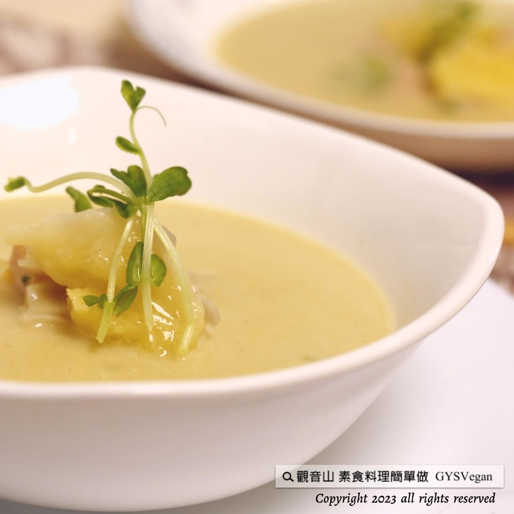

# 濃湯料理  樹薯玉米濃湯

## 📋 基本資訊 / Recipe Overview
- **料理名稱**：濃湯料理  樹薯玉米濃湯
- **原始標題**：濃湯料理 ｜樹薯玉米濃湯｜全素
- **素食流派 / Diet**：全素 Vegan
- **來源平台 / Source**：[觀音山 · 素食料理簡單做](https://vegan.gys.org.tw/tapioca-corn-chowder20230526/)

## 📖 食譜圖文詳情 (中英雙語對照)

濃湯料理 ✨樹薯玉米濃湯✨全素
每一口都能吃出自然的甜味，樹薯的綿密口感與玉米粒的甜美完美融合，搭配素火腿、西洋芹和義式香草，豐富了湯品的層次，細細地品嘗每一口都能帶來滿足感，快跟著觀音山主廚，一起素食料理簡單做吧！
​ ​
食材及佐料〔Ingredients〕：(5人份)
▪️樹薯 ​ 600克
▪️玉米粒 ​ 150克
▪️西洋芹 2支
▪️素火腿 100克
▪️月桂葉 5片
▪️義式香草、水、沙拉油 ​ 適量
▪️粗黑胡椒粒、糖、鹽 ​ 適量
​
烹飪步驟：
【刀工/前處理】
1.樹薯洗淨去皮切成塊狀備用。
2.西洋芹洗淨切丁，素火腿切丁備用。
​
【調理作法】
1.炒鍋加熱倒入油，將西洋芹、火腿依序炒香備用
2.準備湯鍋，放入食材:樹薯、西洋芹、素火腿、玉米粒、月桂葉，加入水(淹過食材約5公分)，中小火將食材煮軟。
3.將做法2熄火稍微放涼，並將月桂葉取出。
4.準備果汁機將湯料分次打成濃稠狀，依喜好可以多加水調整濃稠度。
5.打好的濃湯倒入湯鍋中小火加熱至滾，最後調味:糖、鹽、粗黑胡椒粒、義式香草，即可享用!
​
【特別說明】
亦可加入椰漿、植物奶提味。
​
本食譜提供：台中觀音山蔬食館
​
​
▌慈悲的 龍德上師 成立「觀音山蔬食館」提倡健康素食、慈悲護生，以”觀音山素食料理簡單做”的理念，提供多款素食食譜，讓您一學就會！
​
觀音山相關連結
➠
https://www.fazang.org/link/
​ ​
​
▌觀音山近期活動
5月27日 釋迦牟尼佛‧如珍寶加持總集薈供法會
✦登記「除障祿位 / 超薦蓮位」
https://bit.ly/3HXmCO7
✦護持「薈供供品」供養三寶
https://bit.ly/3bHzJ8H
​ ​
​ ​
—
歡迎轉載，請註明出處： 觀音山素食料理簡單做 GYSVegan 素食環保愛地球，健康營養無負擔，慈悲護生一起來~

---
*食譜歸檔時間：2026-08-20 · 來源：觀音山素食料理簡單做 (vegan.gys.org.tw)*