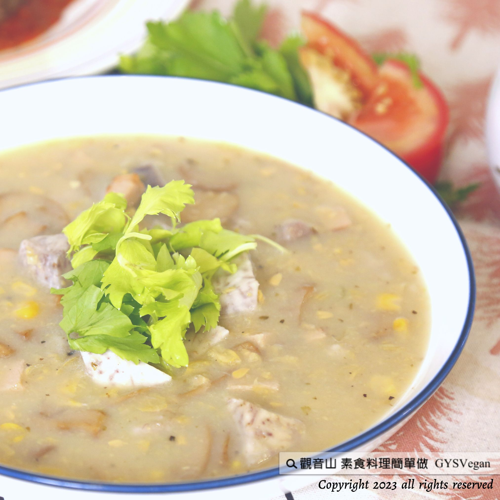

# 濃湯料理  芋香玉米濃湯

## 📋 基本資訊 / Recipe Overview
- **料理名稱**：濃湯料理  芋香玉米濃湯
- **原始標題**：濃湯料理 ｜芋香玉米濃湯｜全素
- **素食流派 / Diet**：全素 Vegan
- **料理分類 / Category**：湯品系列
- **來源平台 / Source**：[觀音山 · 素食料理簡單做](https://vegan.gys.org.tw/taro-flavored-corn-soup20230915/)

## 📖 食譜圖文詳情 (中英雙語對照)

濃湯料理 ✨芋香玉米濃湯✨全素
餐桌上最受歡迎的料理名單，一定有玉米濃湯在其中，觀音山 蔬食館主廚今日要跟大家分享「芋香玉米濃湯」，在熟悉的味道中添加芋頭的香氣；芋頭含有大量的膳食纖維，能增加飽足感，其抗性澱粉的特性適合作為主食，幫助減重，富含的鉀，能排除體內多餘的鈉，並促進血壓的降低，想要趕快搶先品嚐嗎？快跟著觀音山主廚，一起素食料理簡單做吧！
​
◎食材及佐料〔Ingredients〕：
▪️芋頭 ​ 2顆 ​ ​ ​ ​ ​ ​ ​ ​ ​ ​ ​ ​ ​ ​
▪️玉米粒、玉米醬 ​ 各1罐
▪️素火腿、西洋芹 ​ 各70克 ​ ​ ​ ​ ​ ​ ​ ​ ​ ​ ​ ​
▪️月桂葉 ​ 3片
▪️鮮香菇 ​ ​ 5朵
▪️沙拉油、粗胡椒粉、義式香草 ​ 適量
▪️鹽、砂糖、水 ​ 適量
​
◎烹飪步驟：
【刀工/前處理】
1.芋頭洗淨去皮切2公分塊狀備用。
2.素火腿、西洋芹切0.7公分丁。
3.鮮香菇切片。
​
【調理作法】
1.平底鍋加油加熱，放入香菇、火腿、西洋芹依序炒香備用。
2.將芋頭、玉米粒、玉米醬作法1材料、月桂葉、義式香草放入湯鍋中，加入水(稍微淹過食材即可)，煮至芋頭軟化。
3.煮好的湯加入調味料:黑胡椒粉、鹽、砂糖調味即可享用。
​
​
本食譜提供：台中 觀音山蔬食館
​
​
▌慈悲的 龍德上師 成立「觀音山蔬食館」提倡健康素食、慈悲護生，以”觀音山素食料理簡單做”的理念，提供多款素食食譜，讓您一學就會！
​
📣觀音山相關連結
➠
https://www.fazang.org/link/
​ ​
​
▌觀音山近期活動
💎10月7日 三寶總集薈供法會
✦ 登記「超薦蓮位、除障祿位」，護持「薈供供品」推廣素食愛心公益
https://reurl.cc/q0gmV3
(登記至2023年10月07日(六)晚上7:00截止)
Soup dishes
Taro-flavored corn soup Vegan
The list of most popular dishes on the table must include corn chowder. Today, the chef of Guanyin Mountain Vegetarian Restaurant will share with you the “Taro-flavored corn chowder,” which adds the aroma of taro to the familiar taste; taro contains a large amount of dietary fiber can increase the feeling of satiety. Its resistant starch properties are suitable as a staple food to help with weight loss. It is rich in potassium, which can eliminate excess sodium from the body and reduce blood pressure. Do you want to try it first? Come and follow the chef of Guanyinshan to make simple vegetarian dishes!
​
◎Ingredients and condiments 【Ingredients】:
Taro ​ 2 ​ ​ ​ ​ ​ ​ ​ ​ ​ ​ ​ ​ ​
Corn kernels and corn paste one can each
Vegetarian ham and parsley 70 grams each
Three bay leaves
Five fresh mushrooms
Salad oil, coarse pepper, Italian herbs ​ , appropriate amount
Salt, sugar, water ​ reasonable amount
​
◎Cooking steps:
【Knife craftsmanship/pre-processing】
1. Wash and peel the taro, cut into 2 cm pieces, and set aside.
2. Cut vegetarian ham and celery into 0.7 cm cubes.
3. Slice fresh mushrooms.
​
【Conditioning Method】
1. Heat oil in a pan, add mushrooms, ham, and celery in sequence and saute until fragrant. Set aside.
2. Put taro, corn kernels, corn paste recipe one ingredients, bay leaves, and Italian herbs into a soup pot, add water 【just enough to cover the ingredients slightly】, and cook until the taro softens.
3. Add seasonings to the cooked soup: black pepper, salt, sugar and enjoy
​ ​
​
—
歡迎轉載，請註明出處： 觀音山素食料理簡單做 GYSVegan 素食環保愛地球，健康營養無負擔，慈悲護生一起來~

---
*食譜歸檔時間：2026-08-20 · 來源：觀音山素食料理簡單做 (vegan.gys.org.tw)*