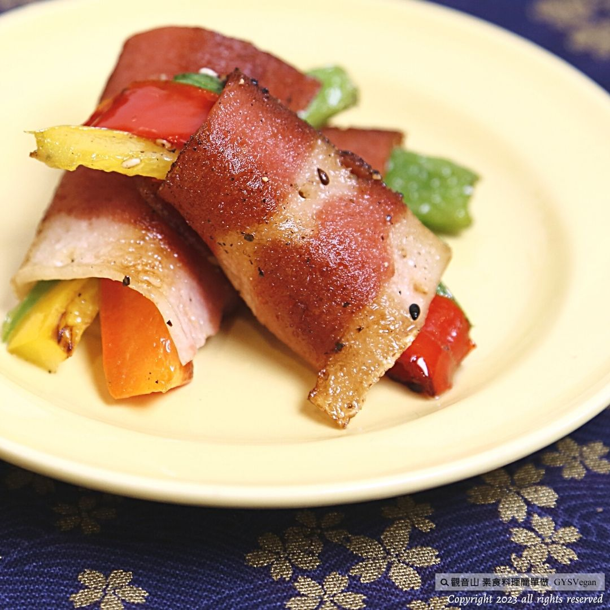

# 炙燒料理 炙燒培根時蔬捲

## 📋 基本資訊 / Recipe Overview
- **料理名稱**：炙燒料理 炙燒培根時蔬捲
- **原始標題**：炙燒料理｜炙燒培根時蔬捲｜全素
- **素食流派 / Diet**：全素 Vegan
- **來源平台 / Source**：[觀音山 · 素食料理簡單做](https://vegan.gys.org.tw/grilled-bacon-vegetable-rolls20230929/)

## 📖 食譜圖文詳情 (中英雙語對照)

炙燒料理✨炙燒培根時蔬捲✨全素
中秋節烤蔬不烤肉，最佳的中秋應景料理「炙燒培根時蔬捲」，將素食培根與川燙過的紅椒、黃椒、蘆筍、西洋芹等豐富時蔬搭配，煎至黃金色，撒上香料，一盤搶手的中秋素烤料理立即完成，中秋月圓，讓動物也能團圓，讓中秋佳節團聚更圓滿，快跟著觀音山主廚，一起素食料理簡單做吧！
​
◎食材及佐料〔Ingredients〕：
▪️全素培根 ​ ​ ​ ​ ​ ​ ​ ​ 10片
▪️紅甜椒 ​ ​ ​ ​ ​ ​ ​ ​ ​ ​ ​ ​ 1/2顆
▪️黃甜椒 ​ ​ ​ ​ ​ ​ ​ ​ ​ ​ ​ ​ 1/2顆 ​ ​
▪️綠蘆筍 ​ ​ ​ ​ ​ ​ ​ ​ ​ ​ ​ ​ 10支
▪️西洋芹 ​ ​ ​ ​ ​ ​ ​ ​ ​ ​ ​ ​ 50克
▪️橄欖油或沙拉油 ​ ​ 適量 ​ ​ ​ ​ ​ ​ ​ ​ ​ ​ ​ ​ ​ ​ ​ ​ ​ ​ ​ ​ ​ ​ ​ ​ ​ ​ ​ ​ ​ ​ ​ ​ ​ ​ ​ ​ ​ ​ ​ ​ ​ ​ ​ ​ ​ ​ ​ ​ ​ ​ ​ ​ ​ ​ ​ ​ ​ ​ ​ ​ ​ ​ ​ ​ ​ ​ ​ ​ ​ ​ ​ ​ ​ ​
​
◎烹飪步驟：
【刀工/前處理】
1.紅黃甜椒去籽切3×0.8公分條狀。
2.綠蘆筍對半切。
3.西洋芹刨去粗纖維，切成3×0.8公分條狀。
​
【調理作法】
1.準備一鍋滾水，將紅黃甜椒、蘆筍、西洋芹依序川燙備用。
2.取一片素培根，擺上紅黃甜椒各一條、蘆筍一支、西洋芹一條，捲起來用牙籤固定。
3.準備平底鍋或炙燒烤盤，加熱後，倒入適量的油，擺入培根捲，中小火煎上色，撒上黑胡椒粉、義大利香草，即可起鍋擺盤。
​
​
本食譜提供：台中 觀音山蔬食館
​
​
▌慈悲的 龍德上師 成立「觀音山蔬食館」提倡健康素食、慈悲護生，以”觀音山素食料理簡單做”的理念，提供多款素食食譜，讓您一學就會！
​
📣觀音山相關連結
➠
https://www.fazang.org/link/
​ ​
​
▌觀音山近期活動
觀音山 10月7日三寶總集薈供法會
✦ 超薦蓮位、除障祿位、護持薈供供品
https://bit.ly/3Z79OeT
​ ​
​ ​
Grilled dishes
Grilled Bacon Vegetable Rolls Vegan
Roast vegetables during the Mid-Autumn Festival instead of grilling meat. The best Mid-Autumn occasion dish is “Grilled Bacon Vegetable Rolls.” Vegetarian bacon is paired with rich seasonal vegetables such as Sichuan red peppers, yellow peppers, asparagus, and celery. Fry until golden and sprinkle with the spices, and a plate of popular Mid-Autumn grilled vegetarian dishes is ready immediately. The full moon of the Mid-Autumn Festival allows animals to reunite, making the Mid-Autumn Festival reunion more complete. Come and follow the chef of Guanyinshan to make simple vegetarian dishes!
​
◎Ingredients and condiments 【Ingredients】:
Vegan Bacon                     10 slices
Red bell pepper                 1/2 piece
Yellow bell pepper ​ ​ ​ ​ ​ ​ ​ ​  ​ ​ ​ 1/2 piece ​
Green asparagus ten sticks
Parsley ​ ​ ​ ​ ​ ​ ​ ​ ​                      ​ 50g
Olive oil or salad oil, the appropriate amount
​
◎Cooking steps:
【Knife craftsmanship/pre-processing】
1. Remove seeds from red and yellow bell peppers and cut into 3×0.8 cm strips.
2. Cut green asparagus in half.
3. Remove the coarse fiber from the celery and cut it into 3×0.8 cm strips.
​
【Conditioning Method】
1. Prepare a pot of boiling water, blanch the red and yellow bell peppers, asparagus, and celery in sequence, and set aside.
2. Take a piece of plain bacon, place one red and yellow bell pepper, one asparagus, and one piece of celery, roll it up, and secure it with a toothpick.
3. Prepare a frying pan or grill pan. After heating, pour an appropriate amount of oil, place the bacon rolls, fry over medium-low heat until browned, sprinkle with black pepper and Italian herbs, and serve.
—
歡迎轉載，請註明出處： 觀音山素食料理簡單做 GYSVegan 素食環保愛地球，健康營養無負擔，慈悲護生一起來~

---
*食譜歸檔時間：2026-08-20 · 來源：觀音山素食料理簡單做 (vegan.gys.org.tw)*