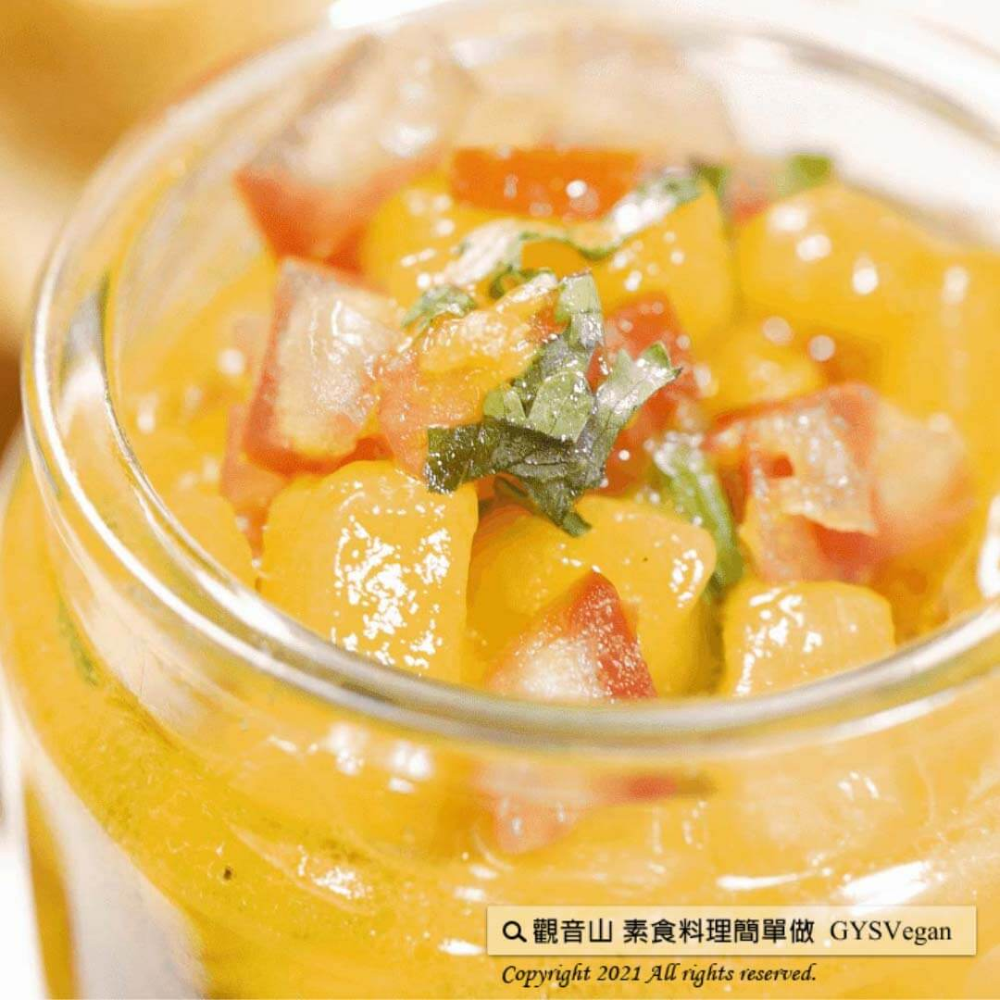

# 炙燒芒果莎莎醬

## 📋 基本資訊 / Recipe Overview
- **料理名稱**：炙燒芒果莎莎醬
- **原始標題**：炙燒芒果莎莎醬｜全素
- **素食流派 / Diet**：全素 Vegan
- **來源平台 / Source**：[觀音山 · 素食料理簡單做](https://vegan.gys.org.tw/%e7%82%99%e7%87%92%e8%8a%92%e6%9e%9c%e8%8e%8e%e8%8e%8e%e9%86%ac%ef%bd%9c%e5%85%a8%e7%b4%a0/)

## 📖 食譜圖文詳情 (中英雙語對照)

夏天腳步近了?，台灣夏天盛產的就是一顆顆黃澄澄、散發著濃厚果香，令人垂涎欲滴的「熱帶水果之王：芒果?」。​
芒果含有豐富「維生素A、膳食纖維、維生素B群、維生素C等多種人體必須營養素」，適量食用，對人體好處多多！?​
觀音山蔬食館主廚特別提供一道夏日打開食慾的特製醬料✨炙燒芒果莎莎醬✨! 芒果的酸甜多汁，伴隨著番茄及檸檬的微酸香甜，清新爽口又開胃，再搭配墨西哥餅皮、玉米脆片一起享用，實在讓人欲罷不能阿?！​
​
?準備食材與佐料：​
芒果(果肉) 150克、牛番茄1/4顆、檸檬汁40ml、橄欖油或涼拌油30ml、糖10克、辣椒少許、香菜少許、鹽適量​
​
?
#素食料理簡單做
​
，開始：​
1. 將芒果洗淨去皮切片；牛番茄洗淨去籽，切丁(約1×1公分)，備用。​
2. 香菜、辣椒洗淨切末，備用。​
3. 碳烤鍋熱鍋後，將切片的芒果兩面煎上微微的顏色，起鍋切丁(約1×1公分)，備用。​
4. 將所有的食材、佐料放入碗中，輕輕地攪拌均勻。​
​
這道特製的美味醬料就完成啦~~??​
​
?特別說明：​
1. 食材可以依個人喜好變化水果，如桃子、鳳梨、酪梨..等等皆很美味。​
2. 可依個人喜好決定，添加辣椒調味。?​
​
?‍?本食譜提供：台中
#觀音山蔬食館
主廚 淨雅​
​
✨慈悲的 龍德上師成立「觀音山蔬食館」提倡健康素食、慈悲護生，以”觀音山素食料理簡單做”的理念，提供多款素食食譜，讓您一學就會！?​
​
​
?觀音山 素食料理簡單做 ​ Follow us?​
Facebook ｜好文按讚
http://www.facebook.com/GYSVegan​
Instagram ｜料理追蹤
http://www.instagram.com/gysvegan/​
Youtube ​ ​ ​ ｜加入訂閱
https://reurl.cc/q8VEqy​
Telegram ​ ｜頻道推薦
https://t.me/GYSVegan​
​
​
? 歡迎轉載，請註明出處： ​ ​ 觀音山 素食料理簡單做GYSVegan按讚、留言設定搶先看! 素食環保愛地球，健康營養無負擔，慈悲護生一起來~?

---
*食譜歸檔時間：2026-08-20 · 來源：觀音山素食料理簡單做 (vegan.gys.org.tw)*