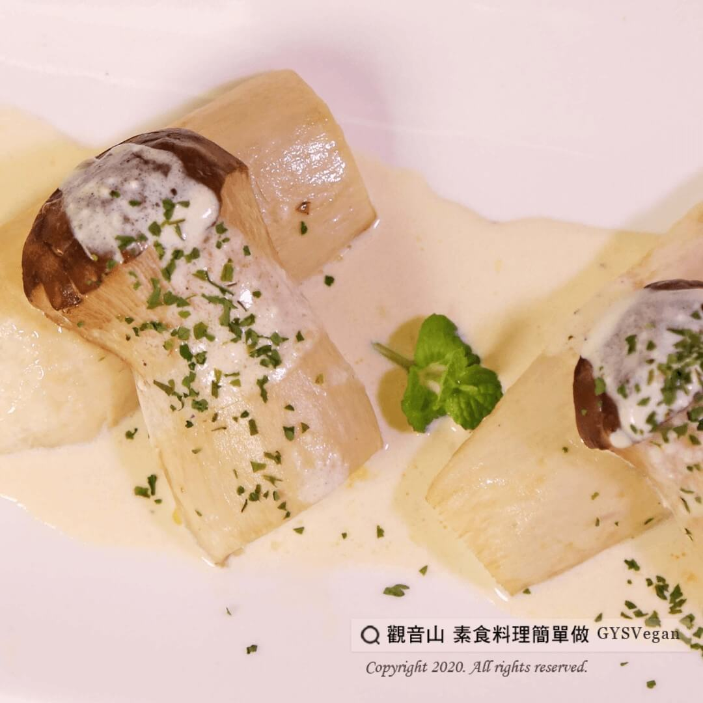

# 烤杏鮑菇佐檸檬奶油醬

## 📋 基本資訊 / Recipe Overview
- **料理名稱**：烤杏鮑菇佐檸檬奶油醬
- **原始標題**：烤杏鮑菇佐檸檬奶油醬｜奶素
- **素食流派 / Diet**：奶素 Lacto-Vegetarian
- **來源平台 / Source**：[觀音山 · 素食料理簡單做](https://vegan.gys.org.tw/pleurotus-eryngii20210123/)

## 📖 食譜圖文詳情 (中英雙語對照)

西式蔬食以烘烤方式取代油炸，保有食材原味及豐富的蛋白質、膳食纖維養份，少油、少鹽不過度烹調，料理簡單做～美味不減分！
快跟著觀音山主廚，一起素食料理簡單做吧！
?食材及佐料〔Ingredients〕：(5人份)
▪杏鮑菇 3條
▪黃紅彩椒 各1/2顆
▪火龍果 1塊
▪玉米筍 2條
▪檸檬 1顆
▪小番茄 2顆
▪綠花椰菜 1小朵
?檸檬奶油醬：
▪鮮奶油60cc
▪奶油30克
▪檸檬汁10cc
▪黑胡椒適量
▪玫瑰海鹽適量
▪巴西里 適量
?烹飪步驟：
1. 調醬：
（1）新鮮檸檬取10c.c。
（2）鮮奶油倒入鍋內。
（3）小火加熱，再放入奶油融化。
（4）加入新鮮檸檬汁、玫瑰海鹽、黑胡椒調味即可。
2. 杏鮑菇放入烤箱烘烤15分鐘 。
3. 將做法1.醬料淋上，灑上巴西里即可擺盤。
【特別說明】
巴西里坊間稱「洋香菜葉」，超市均可購買。
??本食譜提供：台中 觀音山蔬食館 主廚 樂敏
✨慈悲的 龍德上師成立「觀音山蔬食館」提倡健康素食、慈悲護生，以”觀音山素食料理簡單做”的理念，提供多款素食食譜，讓您一學就會！?
【recipe】
?  Western cuisine cooking usually tries to retain the original taste of food and if needed using baking instead of frying. It not only reserves the original flavor of the ingredients but keeps the rich protein and dietary fiber nutrients. This dish is simple, less oil, less salt, no over-cooking and very delicious! Quickly follow the chef of Guanyinshan, let’s cook simple vegetarian dishes together!
?Ingredients : (For 5 people)
▪Three loaf of King oyster mushroom
▪1/2 piece of Red and yellow peppers
▪A piece of Dragon fruit
▪Two ear of Baby corn
▪A Lemon
▪Two Tomatoes
▪A Broccoli
?Lemon butter sauce：
▪Whipping cream 60cc
▪Butter 30g
▪Lemon juice 10cc
▪Black pepper , adequate amount
▪Himalayan salt , adequate amount
▪Parsley , adequate amount
?Cooking steps:
1. Making lemon butter sauce:
(1) Take 10c.c of lemon juice from fresh lemons.
(2) Pour cooking cream into a pot.
(3) Heat on a low heat, then add butter to melt.
(4) Add fresh lemon juice, rose sea salt, black pepper
2. Put king oyster mushrooms in the oven and bake for 15 minutes.
3. Sprinkle lemon butter sauce and some parsley and then ready to serve.
【Special Note】
Parsley can be purchased in most supermarkets.
??This recipe is provided by: Chef Le Min Taichung Guanyinshan Green Restaurant
? 觀音山 素食料理簡單做 ?
Facebook ｜好文按讚
http://www.facebook.com/GYSVegan
​
Instagram ｜料理追蹤
http://www.instagram.com/gysvegan/
​
Youtube ｜加入訂閱
https://reurl.cc/q8VEqy
​
Telegram ｜頻道推薦
https://t.me/GYSVegan
? 歡迎轉載，請註明出處： 觀音山 素食料理簡單做 GYSVegan 素食環保愛地球，健康營養無負擔，慈悲護生一起來~?

---
*食譜歸檔時間：2026-08-20 · 來源：觀音山素食料理簡單做 (vegan.gys.org.tw)*