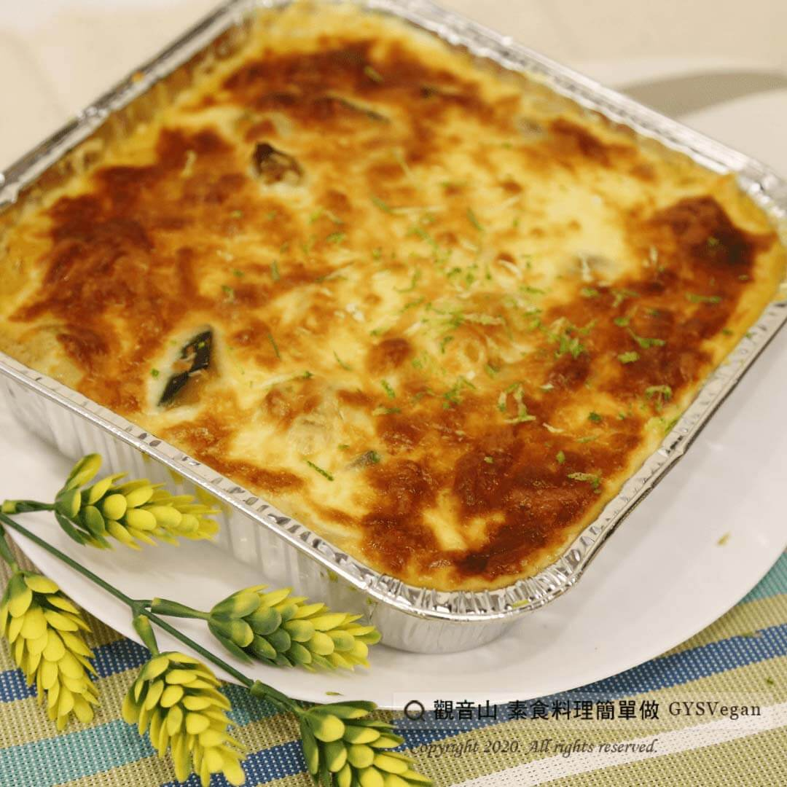

# 焗烤南瓜

## 📋 基本資訊 / Recipe Overview
- **料理名稱**：焗烤南瓜
- **原始標題**：焗烤南瓜｜奶素
- **素食流派 / Diet**：奶素 Lacto-Vegetarian
- **料理分類 / Category**：中式料理
- **來源平台 / Source**：[觀音山 · 素食料理簡單做](https://vegan.gys.org.tw/%e7%84%97%e7%83%a4%e5%8d%97%e7%93%9c%ef%bd%9c%e5%a5%b6%e7%b4%a0/)

## 📖 食譜圖文詳情 (中英雙語對照)

南瓜具有高膳食纖維，高鉀低鈉、高維生素Ａ、Ｅ、β胡蘿蔔素、類黃酮素等多種豐富元素的健康食材?。​
​
其中β-胡蘿蔔素和維生素A與眼睛色素形成有關，是很好的抗氧化劑✨，適度補充有助於保護眼睛?，修復眼睛的感光能力，預防疲勞、乾澀、視力模糊等眼睛不適。​
對配戴隱形眼鏡、注視電腦螢幕?、待在冷氣房的現代人來說，更是重要！?​
​
觀音山蔬食團主廚特別提供這道 『焗烤南瓜』，鬆軟鮮甜的南瓜，搭配誘人的焗烤做法，大人小孩都著迷?，一起來動手試做看看吧~?​
​
?準備食材與佐料：(6人份)​
臺灣南瓜400g、乾香菇20g、大白菜50g、洋菇50g、乳酪絲100g、鹽巴5g、糖10g、胡椒鹽1g、鮮奶100ml、水200ml、沙拉油15 ml。​
​
?#素食料理簡單做，開始：​
1. 乾香菇切粗條、洋菇對切、大白菜切片(約2cm長度)、南瓜切塊(約1.5cm厚度)，備用。​
2. 先將香菇入鍋小火爆香，再放入南瓜塊，炒至南瓜邊緣略呈現金黃色。​
3. 撒上胡椒鹽調味，並加入大白菜、洋菇大火快炒。​
4. 炒至胡椒香氣出來、大白菜及洋菇些許軟化，再加入鮮奶、水熬煮。​
5. 待南瓜熟透，湯汁呈現濃稠，即可盛盤並鋪上乳酪絲。​
6. 烤箱設定溫度200度，烘烤約10分鐘，即可完成。​
​
這道簡單又美味的料理就完成了~?​
​
?‍?本食譜提供：澎湖 #觀音山蔬食團 主廚 我軒​
​
✨慈悲的 龍德上師成立「觀音山蔬食館」提倡健康素食、慈悲護生，以”觀音山素食料理簡單做”的理念，提供多款素食食譜，讓您一學就會！?​
​
​
?觀音山 素食料理簡單做 ​ Follow us?​
Facebook ｜好文按讚
http://www.facebook.com/GYSVegan
​
Instagram ｜料理追蹤
http://www.instagram.com/gysvegan/​
Youtube ​ ​ ​ ｜加入訂閱
https://reurl.cc/q8VEqy​
Telegram ​ ｜頻道推薦
https://t.me/GYSVegan​
​
​
? 歡迎轉載，請註明出處： ​ ​ 觀音山 素食料理簡單做GYSVegan按讚、留言設定搶先看! 素食環保愛地球，健康營養無負擔，慈悲護生一起來~?

---
*食譜歸檔時間：2026-08-20 · 來源：觀音山素食料理簡單做 (vegan.gys.org.tw)*