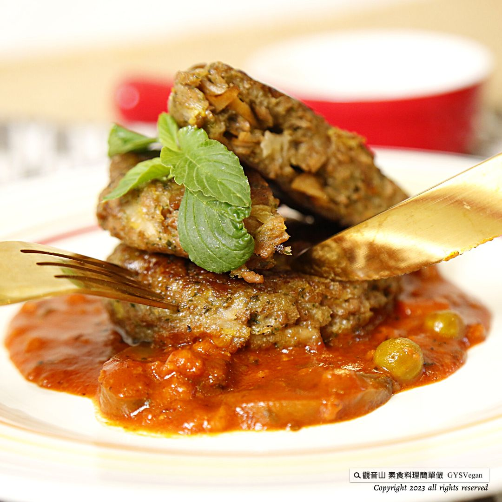

# 無肉蔬食漢堡排

## 📋 基本資訊 / Recipe Overview
- **料理名稱**：無肉蔬食漢堡排
- **原始標題**：素肉料理 ｜無肉蔬食漢堡排｜全素
- **素食流派 / Diet**：全素 Vegan
- **來源平台 / Source**：[觀音山 · 素食料理簡單做](https://vegan.gys.org.tw/burger-steak20230818/)

## 📖 食譜圖文詳情 (中英雙語對照)

素肉料理 ✨無肉蔬食漢堡排✨全素
植物肉排也可以自己做！宴會、派對上的必備美食—無肉蔬食漢堡排，兼具美味與口感，每一口都美味多汁，植物肉與多種配料的組合，加入炸至金黃色的杏鮑菇，提升漢堡排的扎實口感，在享受美味的同時，還能兼顧身體的飲食均衡。
​
自己動手做的最安心，多種組合變化，可製作成漢堡、三明治或搭配義大利麵，讓你沒有大口吃肉的負擔，蔬食料理讓你輕鬆照顧家人健康，快跟著觀音山主廚，一起素食料理簡單做吧！
​
​
◎食材及佐料〔Ingredients〕：
▪️素絞肉 ​ ​ ​ ​ ​ ​ ​ ​ ​ ​ ​ ​ ​ ​ 250克
▪️杏鮑菇 ​ ​ ​ ​ ​ ​ ​ ​ ​ ​ ​ ​ ​ ​ 50克
▪️山東大白菜 ​ ​ ​ ​ ​ ​ 100克 ​ ​
▪️粗麵包粉 ​ ​ ​ ​ ​ ​ ​ ​ ​ ​ 25克
▪️香椿醬 ​ ​ ​ ​ ​ ​ ​ ​ ​ ​ ​ ​ ​ 10克
▪️沙拉油、粗黑胡椒粉、義大利香草 ​ ​ ​ 適量
​
​
◎烹飪步驟：
【刀工/前處理】
1.杏鮑菇切片，過油至金黃色。
2.大白菜切粗絲，備用。
​
【調理作法】
1.大白菜炒軟，備用。
2.將素絞肉、杏鮑菇、大白菜、麵包粉、香椿醬、粗黑胡椒粉、義大利香草，拌勻備用。
3.作法2，用磅秤量一份漢堡排約70克，稍微搓圓備用。
4.平底鍋加熱，倒入油，放入漢堡排餡料，雙面小火慢煎熟即可。
​
【特別說明】
1.可製作成漢堡、三明治、或是搭配義大利麵一起享用。
2.可事先製作多份冷凍庫存，方便隨時取用。
​
​
本食譜提供：台中 觀音山蔬食館
​
​
▌慈悲的 龍德上師 成立「觀音山蔬食館」提倡健康素食、慈悲護生，以”觀音山素食料理簡單做”的理念，提供多款素食食譜，讓您一學就會！
​
📣觀音山相關連結
➠
https://www.fazang.org/link/
​ ​
​
▌觀音山近期活動
💎8月23日 蓮師薈供法會
✦ 登記「超薦蓮位、除障祿位」
https://bit.ly/3bH7Z46
✦ 護持「薈供供品」推廣素食愛心公益
https://bit.ly/3bHzJ8H
(登記至8月23日晚上7:00截止)
【recipe】
Vegetarian dishes
Meatless Vegetarian Burger Steak
Vegan
You can also make your plant-based steaks! A must-have delicacy at banquets and parties – meat-free vegetable hamburger steak, which is both delicious and textured. Every bite is delicious and juicy. The combination of plant-based meat and various ingredients and the addition of fried golden oyster mushrooms enhance the burger. With its solid texture, you can enjoy delicious food while maintaining a balanced diet for your body.
​
The most secure thing is to make it yourself. There are many combinations and changes. It can be made into burgers, sandwiches, or pasta, so you don’t have the burden of eating meat. Vegetarian dishes allow you to take care of your family’s health quickly. Follow the chef of Guanyinshan, and Let’s make simple vegetarian dishes together!
​
◎Ingredients and condiments:
Vegetarian ground pork ​ ​ ​ ​ ​ ​ ​ ​ ​ ​ ​ ​ ​ ​ ​ 250g
King oyster mushroom ​ ​ ​ ​ ​ ​ ​ ​ ​ ​ ​ ​ ​ ​ ​ ​ ​ ​ 50g
Shandong Chinese cabbage ​ ​ ​ ​ ​ ​ ​ 100g ​
Semolina 25g
Toon paste ​ ​ ​ ​ ​ ​ ​ 10g
Salad oil, coarsely ground black pepper, Italian vanilla ​ ​ ​ Appropriate amount
​
◎Cooking steps:
【Knife craftsmanship/pre-processing】
1. Slice the king oyster mushroom and fry in oil until golden brown.
2. Cut the Chinese cabbage into thick shreds and set aside.
​
【Conditioning Method】
1. Stir-fry the Chinese cabbage until soft and set aside.
2. Mix the vegetarian minced pork, king oyster mushrooms, Chinese cabbage, bread flour, toon sauce, coarse black pepper, and Italian herbs until well combined.
3. Method 2: Use a scale to measure a hamburger steak of about 70 grams, roll it into a round shape, and set it aside.
4. Heat the pan, pour in oil, add hamburger fillings, and fry slowly on both sides over low heat until done.
​
【Special Note】
1. Can be made into burgers, sandwiches, or enjoyed with pasta.
2. Multiple copies of frozen inventory can be made in advance for easy access.
​
Taichung Guanyin Mountain Vegetarian Restaurant provides this recipe
​ ​
​ ​
—
歡迎轉載，請註明出處： 觀音山素食料理簡單做 GYSVegan 素食環保愛地球，健康營養無負擔，慈悲護生一起來~

---
*食譜歸檔時間：2026-08-20 · 來源：觀音山素食料理簡單做 (vegan.gys.org.tw)*