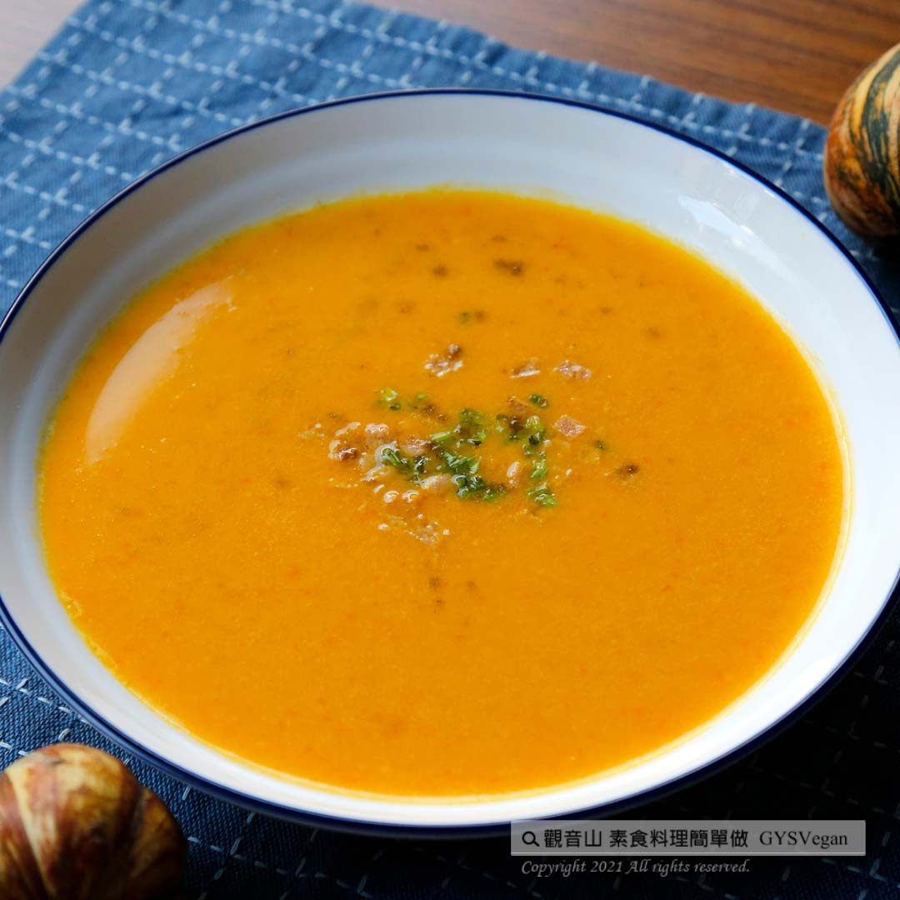

# 燕麥奶南瓜濃湯

## 📋 基本資訊 / Recipe Overview
- **料理名稱**：燕麥奶南瓜濃湯
- **原始標題**：燕麥奶系列｜燕麥奶南瓜濃湯｜全素
- **素食流派 / Diet**：全素 Vegan
- **來源平台 / Source**：[觀音山 · 素食料理簡單做](https://vegan.gys.org.tw/oatmilk-pumpkin-soup20220422/)

## 📖 食譜圖文詳情 (中英雙語對照)

世界地球日 (4/22)減碳愛地球的好料理！​
​
將三高剋星—燕麥，與護心、護眼的南瓜，調製成一道療癒湯品，搭配地瓜、紅蘿蔔、西芹等食材，味道豐富優雅，口中充滿濃醇的香氣，快跟著觀音山主廚，一起素食料理簡單做吧！​
​
◎食材及佐料〔Ingredients〕：(3人份)​
▪️燕麥奶 ​ 適量​
▪️南瓜 ​ 250克​
▪️地瓜 ​ 100克​
▪️紅蘿蔔、全素火腿 ​ 各50克​
▪️西芹 ​ 30克​
▪️水、砂糖、鹽 ​ 適量​
▪️孜然粉 ​ 少許​
​
◎烹飪步驟：​
【刀工/前處理】​
1.南瓜、地瓜去皮切片。​
2.紅蘿蔔去皮後切薄片。​
3.素火腿、西芹切薄片。​
​
【調理作法】​
1.火腿煎或炸至焦香、金黃色，切末備用。​
2. 取一湯鍋放入南瓜、地瓜、紅蘿蔔、西洋芹，加入水(稍微淹過食材），以中小火煮至食材軟化。​
3.用手持攪拌器將做法2的湯與食材打勻，呈現濃稠狀。​
4.繼續小火加熱，加入適量的燕麥奶(依個人喜好調整濃稠度)，糖、鹽、少許孜然粉調味，煮滾即可。​
5.將完成的濃湯盛裝入碗中，撒上火腿末即可享用。​
​
◎本食譜提供：台中觀音山蔬食館​
​
✨慈悲的龍德上師 成立「觀音山蔬食館」提倡健康素食、慈悲護生，以”觀音山素食料理簡單做”的理念，提供多款素食食譜，讓您一學就會！🥰
​
​
「觀音山 社群樹」一鍵快速前往觀音山 官方相關連結！​
➠
https://fazang.taplink.ws/​
​
​
【recipe】​
​
📖EarthDay(4/22) Cut food carbon footprint and eat sustainably​
​
The three highs nemesis -oatmeal cooks along with pumpkin that protects the heart and eyes making into this body healing soup. It is also cooked with sweet potatoes, carrots, celery and other ingredients. It tastes rich and elegant while the mouth is full of fresh aroma. Follow Guanyinshan Chef, let’s make vegetarian dishes together!​
​
◎Ingredients : （For 3 people）​
▪️Oat milk ​ , adequate amount​
▪️Pumpking ​ 250g​
▪️Sweet potato ​ 100g​
▪️Carrot、Vegan Ham ​ 50g​
▪️Celery ​ 30g​
▪️Water、Sugar、Salt ​ , adequate amount​
▪️Cumin powder ​ , a little​
​
◎ Instructions:​
【Cutting/ PREP-Ahead】​
1. Peel and slice the pumpkin and sweet potato.​
2. Peel carrots and cut them into thin slices.​
3. Slice vegetarian ham and celery into thin slices.​
​
【Cooking Steps】​
1. Fry or deep-fry the ham until fragrant and golden brown, finely chop it for later use.​
2. Take a talll pot putting in pumpkin, sweet potato, carrot, parsley, and add water (submerge the ingredients a little). Cook over medium-low heat until the ingredients soften.​
3. Mix the soup in step 2 with other ingredients by a hand blender until it becomes thick.​
4. Continue to heat over low heat, add an appropriate amount of oat milk (adjust the consistency according to personal preference), season with sugar, salt, and a little cumin powder, bring to a boil.​
5. Pour the soup into a bowl, sprinkle with minced ham and enjoy.​
​
◎This recipe is provided by: Taichung # Guanyinshan Green Restaurant​
​
​
🌱觀音山 素食料理簡單做🌱
◎Facebook ｜好文按讚​
https://www.facebook.com/GYSVegan​
​
◎Instagram ｜料理追蹤​
https://www.instagram.com/gysvegan/​
​
◎Youtube ​ ​ ​ ｜加入訂閱​
https://reurl.cc/q8VEqy​
​
◎官方Blog ​ ​ ｜網站推薦​
https://vegan.gys.org.tw/​
​
—​
👑歡迎轉載，請註明出處： 觀音山 素食料理簡單做 GYSVegan 素食環保愛地球，健康營養無負擔，慈悲護生一起來~😊​

---
*食譜歸檔時間：2026-08-20 · 來源：觀音山素食料理簡單做 (vegan.gys.org.tw)*