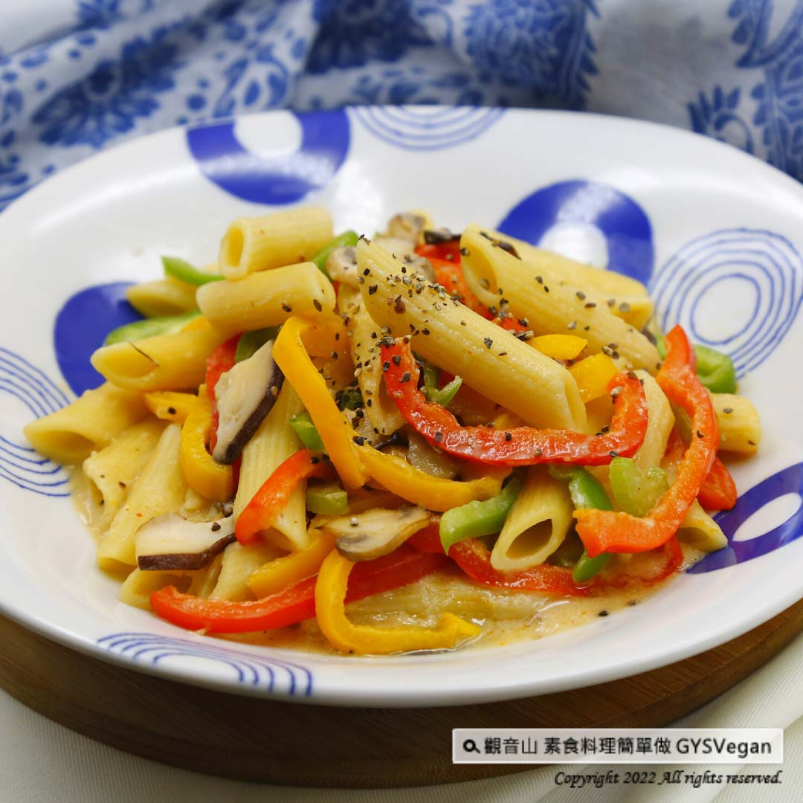

# 燕麥奶時蔬筆管麵

## 📋 基本資訊 / Recipe Overview
- **料理名稱**：燕麥奶時蔬筆管麵
- **原始標題**：燕麥奶系列｜燕麥奶時蔬筆管麵｜全素
- **素食流派 / Diet**：全素 Vegan
- **來源平台 / Source**：[觀音山 · 素食料理簡單做](https://vegan.gys.org.tw/oat-milk-veggan-penne20220325/)

## 📖 食譜圖文詳情 (中英雙語對照)

吸附滿滿燕麥奶精華的筆管麵，口感柔和滑順，搭配紅黃、青椒以及蘑菇等新鮮食材，完美的勾芡比例，每一口都可以吃出健康與滿足，最時尚的義式料理，深深擄獲你的味蕾，快跟著觀音山主廚，一起素食料理簡單做吧！​
​
?食材及佐料〔Ingredients〕：(1人份)​
▪️燕麥奶 200cc ​
▪️紅黃甜椒、青椒、西洋芹 各20克​
▪️鮮香菇 ​ 1朵​
▪️蘑菇 2朵​
▪️義大利筆管麵 ​ 80克​
▪️豆腐乳 ​ 1塊​
▪️地瓜粉、水 ​ 少許​
▪️砂糖、鹽、黑胡椒粒 ​ 適量​
▪️橄欖油、油 ​ 適量​
​
?烹飪步驟：​
【刀工/前處理】​
1.紅黃青椒去籽切絲。​
2.鮮香菇、蘑菇切片。​
3.西洋芹切0.5公分丁。​
​
【調理作法】​
1.取一鍋水煮沸，放入義大利麵煮大約5分鐘(7分熟狀態)，撈起來將水份瀝乾，淋上少許橄欖油預防沾黏，放涼備用。 ​
2.取一平底鍋，放入油將菇類炒香，依序加入西洋芹、紅黃青椒、豆腐乳略炒。 ​
3. 倒入燕麥奶、筆管麵繼續燒煮，稍微濃稠後，加入適量的糖、鹽及地瓜粉水，勾芡增加濃稠度，煮滾後加入黑胡椒粒提味，拌勻後即可享用。 ​
​
??本食譜提供：台中觀音山蔬食館​
​
✨慈悲的龍德上師 成立「觀音山蔬食館」提倡健康素食、慈悲護生，以”觀音山素食料理簡單做”的理念，提供多款素食食譜，讓您一學就會！?​
​​
★神變月2022年3月3日~4月1日：十萬善惡業緣增盛月​
​
✨殊勝功德增長日✨​
觀音山邀請您於2022年3月3日~4月1日響應素食、廣修供養、戒殺護生、誦經修法、行持諸種善行，獲福無量。​
​
​
【recipe】​
​
?The penne is coated with the essence of oat milk creating a soft and smooth taste. This perfect thickening ratio makes every bite healthy and satisfying. It matches fresh ingredients such as red and yellow, green peppers and mushrooms. In this most fashionable Italian cuisine recipe, it would tempt your taste buds. Follow the chef of Guanyinshan to cook simple vegetarian dishes together! ​
​
?Ingredients : （For 2 people）​
▪️Oat milk 200cc ​
▪️Red yellow bell pepper、Green pepper、Celery ​ 20g​
▪️A shiitake mushroom ​
▪️Two mushroom ​
▪️Penne ​ 80g​
▪️A piece of fermented tofu ​
▪️Sweet potato powder、Water ​ , a little​
▪️Sugar、Salt、Black pepper ​ , adequate amount​
▪️Olive oil、Oil ​ , adequate amount​
​
? Instructions:​
【Cutting/ PREP-Ahead】​
1. Remove the seeds and shred red, yellow and green peppers. ​
2. Slice fresh shiitake mushrooms and other mushrooms. ​
3. Cut celery into 0.5 cm cubes. ​ ​ ​
​
【Cooking Steps】 ​
1. Bring a pot of water to boil, put in the penne and cook for about 5 minutes (still chalky and tough), remove and drain, drizzle a little olive oil to prevent sticking, and let it cool for later use. ​ ​
2. Take a frying pan, add oil to fry the mushrooms until fragrant, add celery, red and yellow green peppers, and fermented bean curd and fry for a while. ​
3. Pour in oat milk and cooked penne to cook. After it thickens slightly, add an appropriate amount of sugar, salt and sweet potato powder solution to thicken and increase the consistency. After boiling, add black pepper to enhance the flavor, and mix well to enjoy. ​ ​ ​
​
??This recipe is provided by: TaichungGuanyinshan Green Restaurant​
​
​
? 觀音山 素食料理簡單做 ?​​
◎Facebook ｜好文按讚​
https://www.facebook.com/GYSVegan​
​
◎Instagram ｜料理追蹤​
https://www.instagram.com/gysvegan/​
​
◎Youtube ​ ​ ​ ｜加入訂閱​
https://reurl.cc/q8VEqy​
​
◎官方Blog ​ ​ ｜網站推薦​
https://vegan.gys.org.tw/​
—​
?歡迎轉載，請註明出處： 觀音山 素食料理簡單做 GYSVegan 素食環保愛地球，健康營養無負擔，慈悲護生一起來~?

---
*食譜歸檔時間：2026-08-20 · 來源：觀音山素食料理簡單做 (vegan.gys.org.tw)*